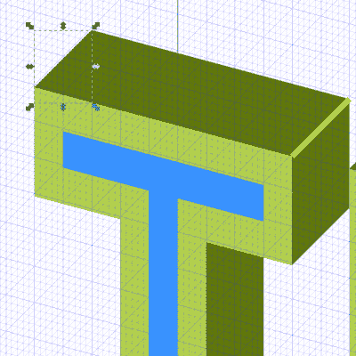
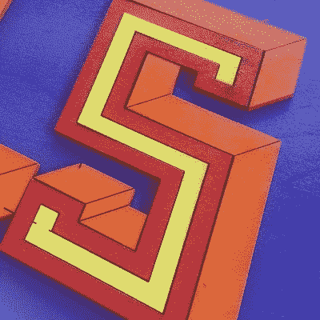

# 激光轴测图字体

> 原文：<https://hackaday.com/2017/08/18/lasering-axonometric-fonts/>

我是一个 Inkscape 迷。如果你不熟悉这个应用程序，它就像一个开源版本的 Adobe Illustrator。当我还是一名制作艺术家时，我是一名插画大师忍者，但四年过去了，我的技能已经生疏了。此外，Inkscape 在菜单和功能方面与众不同，这让我很难适应。

所以我在 Inkscape 和激光切割机的帮助下创建了一些木制字体，我将向你们展示我是如何做到的。如果你对这个项目感兴趣，你可以在 Hackaday.io 上找到它。

在使用 Inkscape 时，我注意到您可以创建各种网格，包括轴测网格。这个术语指的是正投影中的水平线。换句话说，通过提供透视线，它有助于使事物看起来是 3D 的。

### 字体播放

作为一名制作艺术家，我非常喜欢字体。尤其是自己做。我多年来一直在制作字体，包括一些不可原谅的 90 年代的怨恨字体，谢天谢地，它们从来没有出现在这个世界上。字体大多只是放入数据库的向量集，其中嵌入了跟踪和字距调整数据。

我一直在看 Jimmy Di Resta 在带锯上切割通道字母的视频——他做了一百万个标志项目——所以，当我看到轴测网格时，我有了制作一组 3D 外观的字母的想法，这些字母可以在激光切割机上切割出来，制成标志。也许可以试试 1/8 英寸的胶合板，不同的面涂上不同的颜色来增强透视效果。

然而，首先，我必须创建字母。我想从一个简单的项目开始，只使用块状形状来形成每个字母的各个部分，而不是创建性感的贝塞尔曲线。我开始画不同种类的字母，然后选定了一个又高又细的块状。我没有做完整个字母表，只做了足够的字母来感受一下。

### 第三维幻觉

下一步是在轴测网格的帮助下创建透视效果。网格上的每个点都由两条与垂直线相交的对角线组成。还记得美术课上的消失点吗？同样的事情。你可以用不同的角度来玩，但是他们最终的工作方式都差不多。

 每个造型的侧面都很容易打造。你所要做的就是创建一个有问题的字母的副本，放在底部，然后选择“路径>差异”来剪切掉被主字母覆盖的部分。你仍然需要绘制连接前后的三角形——你可以在上图中看到它们。

一旦你对你的设计有了一个概念，如果你打开了“网格对齐”，你就可以很容易地自由处理侧面板。

当我在画的时候，我画了更小的嵌入字母(用蓝色标记),这将有助于给我的标志增加一点视觉趣味。请记住，每一个较小的侧片将是自己的激光切割部分。我给它们标上颜色，让它们在我的脑海里保持直线，但最终它们会被喷上另一种颜色。

### 装饰性转弯

我还想为角落画些线条，纯粹是为了装饰——它们有助于创造 3D 效果。你可以在设计中看到它们，用粗黄线标出。真正的线条不会那么粗，我只是在设计过程中保持这种方式，这样我就不会忘记它们。

所以，创造了我的标志，是时候激光出来了。我把它的尺寸定为 24 英寸 x12 英寸的 1/8 英寸松木纸，我买了第二张纸，当字母从切割机出来并被涂上颜色时，我就把它们粘在上面。激光顺利进行，100%的速度和 100%的功率确保设计在不到 8 分钟内完成。唯一出错的是，我没能确保字体居中，所以我很难在黑板上对齐它。标记拐角的对角线以 1%的功率和 100%的速度通过。

我真的很高兴看到这个效果——现在我想为我的房子、我朋友的房子、街上随机出现的人做一些标志！这很简单，你可以自己做。房子周围有所有这些标志可能并不适合每个人，但是什么样的黑客空间、创客空间或办公空间不需要一些彩色的标志来点缀装饰呢？找几个朋友开始设计吧！