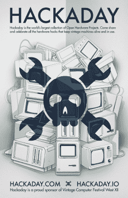

# 本周末:西部复古电脑节

> 原文：<https://hackaday.com/2017/08/01/this-weekend-vintage-computer-festival-west/>

下周末是在计算机历史博物馆举行的[老式计算机节西](http://vcfed.org/wp/festivals/vintage-computer-festival-west/)。Hackaday 再次荣幸地赞助此次活动，将推动信息革命的人员和硬件聚集在一起。[比尔·赫德]和[约书亚·瓦斯奎兹]将代表 Hackaday 剧组到场。

 今年的会谈展示了令人印象深刻的一批人。[Bil Herd]将和其他一批工程师一起登上舞台，他们确保了准将在历史上的地位。计算机历史博物馆有一个非常活跃的原始计算机硬件修复程序。哈卡代的朋友[Ken shiriff]一直致力于施乐 Alto 的[修复工作，并在小组中就该过程发表了演讲。为了突出另一个亮点，在你打开它之前，有一个关于系统调试的讲座——这个话题可以帮你避免因为非常古老的硬件而度过糟糕的一天。](http://hackaday.com/2016/06/26/restoring-the-groundbreaking-xerox-alto/)

VCF 的一大特色是，展品通常要么是动手操作，要么是演示，所以你可以实际操作大多数人从未见过的硬件。再加上计算机历史博物馆的收藏，加上他们为这次活动计划的一些额外的展览，你很可能在浏览完所有东西之前就没有时间了。

既然我们已经提到了计算机历史博物馆，我们也有一些即将到来的新闻。本月晚些时候，Hackaday 的自由撰稿人[Voja Antonic]受邀参观博物馆，记录他的口述历史，并向他们的收藏提供一台原始的[Galaksija](https://en.wikipedia.org/wiki/Galaksija_(computer))计算机——先是作为一个工具包，然后作为一台他 1983 年在南斯拉夫制造的人造计算机取得了巨大成功。祝贺你！