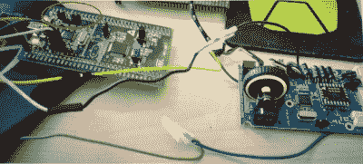

# 将代码注入鼠标固件应该是你的下一个目标

> 原文：<https://hackaday.com/2017/07/29/injecting-code-into-mouse-firmware-should-be-your-next-hack/>

这里有一个 DEF CON 演讲，它使用了您可能拥有的工具，应该是您的下一次黑客冒险。在他们周六上午的谈话中，[马克·威廉姆斯]和[罗布·斯坦利]讲述了给游戏鼠标添加他们自己的定制代码的过程。这个过程是一个速成班，在改变一个股票固件二进制，同时仍然保留原来的功能。

他们工作的出发点是电子竞技行业。近年来，电子竞技活动的范围越来越大。【2016 年国际锦标赛吸引了 17，000 名参与者，500 万人在线观看。2000 万美元的奖金池(其中 1900 万美元通过游戏内购买众筹)是获得竞争优势的巨大激励。参赛者可以带自己的外围设备，这就引出了一个问题:你能改变一个普通的游戏鼠标来做有趣的事情吗？

之所以选择[steel series sense](https://steelseries.com/gaming-mice/sensei)鼠标进行黑客攻击，是因为它有一个强大的微控制器:STM32F103CB。有了 128 KB 的闪存，研究人员猜测会有足够的额外空间来添加代码。STM32 芯片通过 ST-Link 编程，通过 ST Discovery 板可以非常便宜地获得。他们选择了大约 20 美元的 [STM32F4DISCOVERY](http://www.st.com/en/evaluation-tools/stm32f4discovery.html) 。

也许这个项目最大的飞跃是固件没有读保护。一旦电路板下侧的数据、时钟和接地焊盘连接到发现板，固件就很容易转储，真正的乐趣就开始了。

他们首先在二进制文件中寻找一大块表示闪存中未使用空间的零值。注入的固件被设计为枚举为 USB 键盘，打开记事本，然后键入、保存并执行 PowerShell 脚本，然后返回到普通固件(确保鼠标仍然可以用作鼠标)。基本上，这将一个 [USB 橡皮鸭](http://usbrubberducky.com/#!index.md)嵌入到普通鼠标固件中。

有几个有用的技能使这个项目成为一次有价值的学习经历。要正确编译您的自定义代码，您需要选择正确的偏移地址，以便它在粘贴到固件二进制文件中后能够结束。原始代码的向量表必须被重写以首先跳转到注入的代码，并且一旦它已经运行，它将需要跳转回鼠标执行。左边的程序流显示了这一点。这两种跳转都需要保存和恢复程序计数器和寄存器。ARM 堆栈是减法型的，需要更新地址才能处理增加的代码。

演讲以一个非常成功的现场演示结束。你可以[在 MDHomeBrew repo](https://bitbucket.org/mdhomebrew/usb_hid_keyboarddelivery_stm32f103cb) 中查看代码。在这种情况下，PowerShell 脚本为 DOOM 欺骗添加了键盘快捷键。但是就像我们之前说的，对于大多数人来说，使用固件二进制代码的体验是有价值的。凭借这一成功，你可以接受更困难的挑战，如[Sprite _ TM]的[游戏键盘黑客](http://hackaday.com/2014/11/23/sprite_tms-keyboard-plays-snake/)，其中固件不容易被转储，更新二进制文件相当过时。