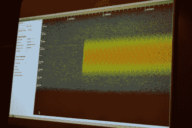
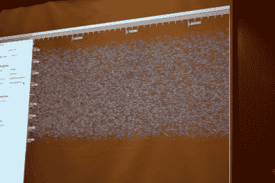
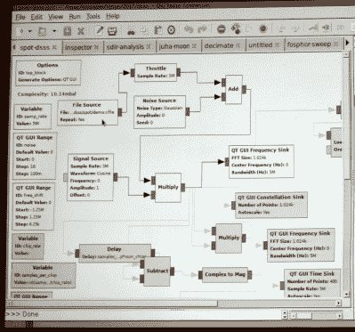
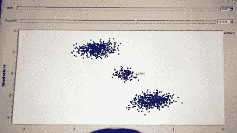
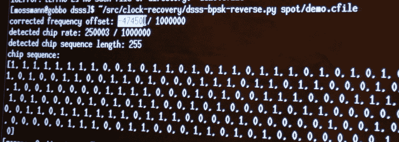

# 迈克尔·奥斯曼突然把 DSSS 拉了出来

> 原文：<https://hackaday.com/2017/07/29/michael-ossmann-pulls-dsss-out-of-nowhere/>

[迈克尔·奥斯曼]周五在 DEF CON 25 的无线黑客村对座无虚席的观众发表了讲话。还有一天半的演讲时间，但很难有什么能取代他的[逆向工程直接序列扩频](http://www.wirelessvillage.ninja/speakers.html#reverse_engineering_dsss) (DSSS)演讲，成为我最喜欢的骗局

DSSS 是一种用于在可能出现低信号强度和高噪声的地方传输可靠数据的技术。它用于 GPS 通信，在这种通信中，从卫星接收到的信号通常太小，以至于你无法在瀑布显示中看到。然而，我们知道地球上的每一部手机都在接收和解码数据。它还用于 WiFi 管理包、ZigBee，并用于专有系统，尤其是任何处理卫星通信的系统。

[Michael]真的用他的演示从帽子里变出了一只兔子，在看起来只有噪音的东西里检测到了 DSSS 信号参数。你可以在下面看到有无噪声的信号；后者作为一种信号用肉眼是完全看不出来的，但是可以用他的技术检测出来。

  Strong DSSS Signal, no noise  Same DSSS signal not apparent

## 用简单的数学方法检测 DSSS

[迈克尔]提到了简单的数学技巧，他不是在开玩笑。很容易假设，像他这样在射频领域经验丰富的人对“简单”的定义会与我们不同。但实际上，他用乘法和减法做了很多事情。

DSSS 将二进制值作为一个称为芯片的集合进行传输。数字 1 的芯片可能是 11100010010，而数字 0 是它的反码。您可以在本文顶部的幻灯片中看到这一点。正常的 DSSS 解码将信号与期望值进行比较，使用相关算法将两者相乘并给出分数。如果分数足够高，在这个例子中是 11，那么已经检测到一个比特。

要对此进行逆向工程，必须以正确的频率为中心，然后检测芯片编码。GNU radio 是处理来自 SPOT Connect 模块的 DSSS 捕获的首选工具，该模块用于将简单的消息推送到卫星通信网络。第一个数学技巧是将信号本身相乘，然后查看频谱分析，看是否有指示频率中心的明显尖峰。然后可以用一个偏移量对其进行调整，将会观察到两侧的较小尖峰。

 当在星座视图中可视化时，你开始观察一个中心和两个相对的星团。下一个数学技巧是对信号求平方(乘以它本身)，它会将那些相反的集群连接到一边。这实现的是揭示码片速率的强周期性分量(从中心到簇并再次返回的循环)。

检测芯片内的符号是另一个数学技巧。从最后一个值中减去信号中的每个连续值，您将最终得到零(高信号减去高信号等于零，等等)。但是每次信号达到峰值时，你会看到一个转变点，可视化开始看起来像示波器上描绘的逻辑。这种技术可以处理少量的噪声，但通过一点滤波就变得更加鲁棒。

这种对信号的探索既有趣又好玩。但是如果你真的想完成一些工作，你需要一个工具。[Michael]以 python 脚本的形式构建了自己的程序，拼凑出一个. cfile 文件，并输出频率偏移、码片速率、码片序列长度和解码后的码片序列。

运行他的样本文件，增加噪声水平，脚本在检测信号参数方面非常可靠。有趣的是，它甚至在检测到的码片速率值中测量发射机和接收机时钟之间的百万分之三的差异。不可靠的是实际的比特信息，它随着噪声的增加而开始退化。但是，仅仅建立所用协议的参数是这场战斗的最大部分，这是一个快速、自动完成这项工作的可靠解决方案。

可以试试剧本。这是[【迈克尔】时钟恢复回购](https://github.com/mossmann/clock-recovery/blob/master/dsss-bpsk-reverse.py)的一部分。这个演讲被录了下来，你应该把它添加到你的提醒列表中，以便在演讲结束后开始发表。为了让你坚持到那时，我们建议你看看[在 2015 年黑客日超级大会上举办的射频设计研讨会](http://hackaday.com/2016/03/23/michael-ossmann-makes-you-an-rf-design-hero/)。