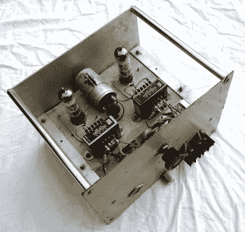
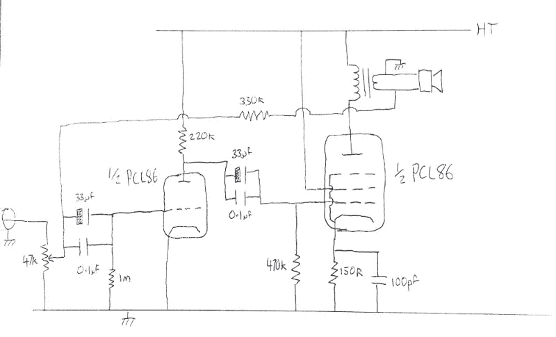
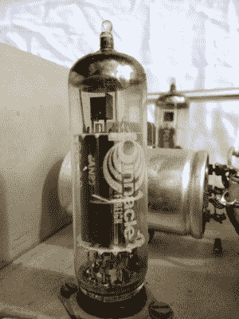
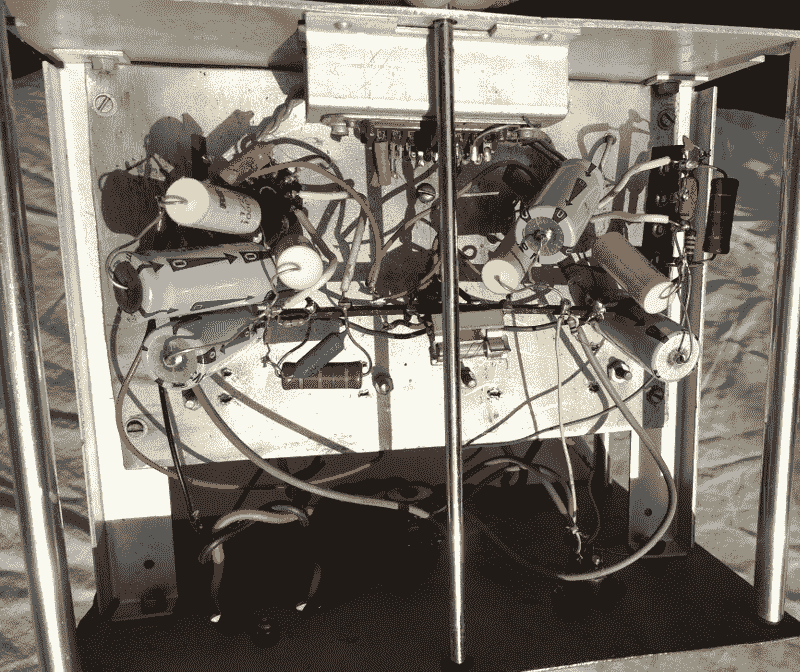

# 世界上最好的立体声电子管放大器

> 原文：<https://hackaday.com/2017/08/16/the-best-stereo-valve-amp-in-the-world/>

在电子世界里，很少有比一个刚刚发现高保真音响世界的电子工程学生更愚蠢的了。我曾经是电子工程专业的学生，以下是我的一个愚蠢的故事。顺便说一句，它教会了我很多关于我的手艺，我很感激地说，至少没花我多少钱。

Construction more suited to 1962 than 1992.

那一定是 1991/92 年冬天的某个时候，我沉浸在学生广播和声光之中，参加了一场类似受折磨者之间激烈的高保真军备竞赛。我的一些朋友有富裕的父母或兼职工作，因此可以买得起闪亮的功放之类的东西，但我没有这些东西，也没有一辆老款 Mini。因此，我唯一的选择就是发挥创造力，建造自己的产品。由于四分之一世纪前音频欲望的最终目标是电子管放大器，这就是我决定解决的问题。

如今，制造一个电子管放大器是一个令人惊讶的简单过程，因为有许多在线供应商会从世界的另一端卖给你一套零件。变压器制造商为您的 HT 电源和音频输出匹配生产现成的产品，因此在某种程度上，您选择放大器只是挑选您喜欢的电路并进行组装。然而，早在几十年前，电子世界就已经脱离了阀门的世界，所以接触这些元件是一个挑战。我用一个废弃的 Dymar Electronics 仪器外壳切断了电源，它有内置的 HT 和加热器轨道，但变压器和高压电容器的选择是一个挑战。

2017 年把放大器从仓库里拉出来，我是瞎进去的。我大致记得我做了什么，但细节已经被几十年来的其他关注掩盖了。因此，在一次与我勉强成年的自我的奇怪会面中，是时候看看我做了什么。我哪里做对了，我错得有多严重？

Lovingly hand-drawn from life, missing the PSU components.

放大器本身位于 Dymar 机箱的可移动部分，我不记得死仪器是什么，但 Dymar 生产了一系列仪器作为背板的模块。前面板是一块我自己切割的钢板，仍然被漆成英国莱兰香槟米色，那是老式 Mini 的颜色。它有一个音量控制器，一个 DIN 输入插座，这在 1992 年对我来说一定是很酷的，还有一个用于扬声器的邮局电话接线板。在机箱内部，放大器安装在一块铝板上，顶部是一对 PCL86 三极管/五极管阀、一对输出变压器和一个电源平滑电容器，下面是标签条上的所有较小组件。虽然这是我自己说的，但它比我记忆中的更整洁。

1969’s hot new device, already obsolete by 1980.

电路很简单，一个单端 A 类音频放大器，我从一台常见的(当时)报废 ITT 电视机上，连同 PCL86 和原始输出变压器一起提出来的。这些三极管/五极管是当时的集成放大器器件，在后来的几十年里，它们像 LM386 一样无处不在，包含一个三极管作为前置放大器和一个功率输出五极管，能够以合理的质量提供几瓦的音频，只需很少的外部元件。它们也非常便宜,“P”表示电视机中使用的 300mA 系列加热器链，比标准 6.3V 加热器的“E”版本要差得多。对我来说不成问题，因为 Dymar PSU 有一个 12V 的轨道，可以很高兴地给几个 PCL86s 每个 300mA。

我选择的部件必须仅限于我大学的 RS 交易柜台库存中具有所需工作电压的那些，并且是一个混合包，你不会远程分类为音频级。有几个巨大的 450V 33μF 电解电容和 250VAC 类 0.1μF 聚合物电容用于电源滤波器。我似乎遵循了并联使用一个小电容和一个大电容的想法，可能是为了一些关于频率响应的年轻 hi-fi 晦涩难懂的想法。否则，电阻看起来像碳膜元件，这在 20 世纪 90 年代初对我来说可能比现在更有意义。

在机箱顶部，从废旧电视机中取出的原始变压器质量如此之低，以至于它们往往在任何音量下都“唱歌”，所以我花钱买了一对当时我能找到的唯一的阀门音频输出变压器，这肯定是 rs 目录中一个过去时代的遗物。原来的阀门是一对旧电视的 PCL 86，但我用一对“匹配”的全新 PCL 86 替换了它们。我记得在一次无线电集会上，这些花了我 50 便士(92 年大约 90 英镑)，是在南斯拉夫制作的，日期代码是 1980 年 1 月。新的瓣膜没有带来任何变化，但它们让我感觉更好。

### 这个放大器表现如何，我从它身上*学到了什么*？

Under the hood, and it’s all a bit messy.

在第一个例子中，它发挥了 110%，因为我有一个电子管放大器，而其他人没有。这种最罕见的音频设备周围的神秘气氛巧妙地回避了这一事实，即它不是阀门放大器中最好的，但这并不重要。作为一个具有新组件的 A 类放大器，由于其电路拓扑结构，它以最低的理论失真参加了聚会。另一个我年轻时不要脸吹嘘的领域，但实际上这意味着它变得越来越热。

第一次开机时声音清脆，有咝咝声，但由于明显的频率响应问题，它是低音到中音，不是很好。这是我的第一次学习机会，我刚刚上了一堂实物课，内容是真实的音频变压器不像理论上的音频变压器那样工作。它有一个令人印象深刻的脉冲响应，方波通过它漂亮地出现在我破旧的望远镜上。

我只能听到这么远的高保真度的声音，可能有点高保真，但肯定不是高保真的。我的注意力转向了频率响应问题，由于我们刚刚完成了一系列关于负面反馈的讲座，我认为自己是这方面的专家，可以轻松解决这个问题。我用一个从输出到输入的反馈电阻克服了频率响应峰，摆弄数值，直到我发现 330K 左右是正确的。

### 世界上最好的立体声电子管放大器。是啊，没错。

这是我的第二次学习经历。我做了一个相当合理的放大器，它听起来相当不错，通过我的旧货店 Wharfedale Linton 扬声器和便宜的 Maplin 低音驱动器。我可以沉迷于我当时对乏味摇滚音乐的品味，假装我已经达到了高保真的境界。但是当然，我没有。我得到了平坦的频率响应，但我把相位响应搞砸了，因此我的脉冲响应具有英国铁路本地停车服务的所有时序。示波器显示方波最终会到达那里，但是天啊，他们花了很多时间。这声音有种说不清的模糊感，像钟声一样清晰，但咝咝声已经消失了。我对音频电路的复杂和意想不到的影响有了更多的了解，这超出了我的预期，我的放大器仍然有一些吹嘘的权利，但不是我希望的音频天才。

扩大器见证了我的学生时代，以及我在更广阔的世界里的最初几年。最终电容器在 Dymar PSU 出了故障，我买了一个剑桥音频放大器，一直用到了现在。电子管放大器孤零零地放在架子上，提醒着我过去的荣耀，也许有一天我会让它复活。也许我会给它一个 DSP 板来修复它的故障。幸运的是，我学生时代的其他项目更好地经受住了时间的考验。

所以。这是我年轻时的愚蠢，以及我从中学到的东西。你呢，你过去有没有什么项目在当时看起来比现在更好？