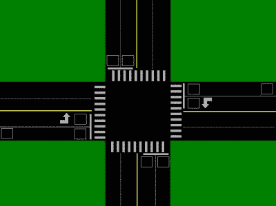
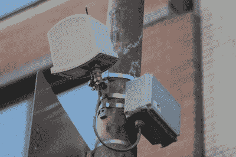
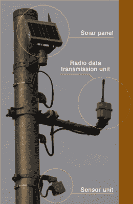

# 让你的通勤自动化的传感器

> 原文：<https://hackaday.com/2017/08/09/the-sensors-automating-your-commute/>

在一阵沮丧中，我最近意识到道路已经全部更新了——大多数人不知道怎么更新的——这有时会影响交通流量。当一个不幸的人在停车线之前停在左转车道上时，这种意识就发生了。车辆没有触发传感器，所以一个周期又一个周期过去了，交通系统从未给左转车道开绿灯，认为车道没有被占用。如果司机知道这些，世界会变得更好。智能自动化的第一步是感知，有多种方法可用于感知交通流量。

许多交通灯运行在定时器上，在一个循环中做同样的事情。起初它们是机电控制的，现在它们是数字化的。当传感技术到来时，它使系统足够智能，可以根据交通状况调整周期。左转车道上没人吗？不要在自行车上设置左转信号灯，这样可以节省几秒钟的时间，让交通更加顺畅。

## 感应回路

你可能见过它们，但从未考虑过它们是什么或它们是如何工作的。最常见的是在红绿灯处，但有时在红绿灯前，人行道上会有一个广场。这是道路被切断的地方，一圈电线被插入，然后被覆盖。线圈是一个感应器，旁边的一大块金属会感应出涡流，系统会测量到涡流。如果这块金属没有产生足够的涡流(比如来自自行车或摩托车)，系统将不会识别任何东西的存在。这也意味着，如果你开车越过停车线，使你的车不再在环路上，那么你可能不会被检测到，交通控制逻辑将在下一个周期跳过你。

电感线圈的好处是，如果你经历了一个完整的灯周期而没有转弯，很可能是因为你没有触发传感器。

Look for traffic loops at the stop lines of intersections and sometimes set back (on the East/West road here), or on highways.

如果这些环离灯很远，它们可以用来触发灯开始为你转动，所以你不需要停下来。当灯光不是基于时间循环，而是默认为一个方向的绿色，而你正从另一个方向靠近时，这很有用。如果系统在正常的绿色一侧没有看到任何交通，它会改变信号灯，这样你就可以不停车地滑行通过，然后变回默认状态。

如果你在一条车道上看到两个环路，通常是在高速公路上，一个紧接着另一个，那么你看到的是测量车辆行驶速度的东西。这通常是在高速公路或交通繁忙的道路上以较高的速度行驶，可用于一般的数据收集，或用于“8 分钟到达 I-80”的标志。如果硬件和固件都很好，那么可以很好地测量感应，从而计算出车辆的类型和轴数。半环形行驶会增加基线，在每个轴上有一个短的尖峰。

## 雷达

安装在纽约的 RTMS【via[invisible box es . info](http://www.invisibleboxes.info/remote-traffic-microwave-radar/)】

这些是交通灯上的小装置，它们使用微波雷达来检测移动车辆的存在和速度。雷达可以检测到接近停车线的车辆，当连接到交通信号系统时，可以知道车辆何时闯红灯，并可以开出罚单。这是有争议的，因为它与普遍认为的“绿色表示行驶，红色表示停止，黄色表示非常快”相冲突。也许并不奇怪，闯红灯罚单确实减少了某些十字路口事故，但事实证明它们也与追尾事故的增加有关。

当然，开罚单并不是交通技术武器库中唯一的雷达应用。远程交通微波传感(RTMS)是一项超越感应线圈传感器的技术。RTMS 通常位于路边，垂直于交通运动方向进行感知。像 Sx-300 这样的可用传感器拥有“在多达 12 个用户定义的检测区域中的每条车道存在以及音量、占用率、速度和分类信息”等功能。这里显示的图像是一辆 RTSM G4/K4 [安装在纽约市的街道上](http://www.invisibleboxes.info/remote-traffic-microwave-radar/)。感谢联邦通信委员会的备案[，你可以翻阅用户手册](https://fccid.io/document.php?id=1591677)，这很有趣。

## 红外线的

远红外车辆探测器【via [住友电气](http://global-sei.com/its/products/fivd.html)】

被动式红外传感器可以测量车辆的热信号，并利用它来检测车辆的存在和速度。但是，它们有一些局限性。具体来说，他们不喜欢大气中的湿气阻挡他们。在大雨或大雪中，传感器可能只能看到水而看不到车辆，所以当坐在红外传感器的正前方时，可能无法检测到。也有可能(通过拙劣的工程)在一年中的某些时候，红外传感器在日落或日出时朝向完全错误的方向，从而使其无用。

## 摄像机

你会在交通信号灯上方的灯杆上看到摄像头。这些可以是可见光摄像机或红外摄像机。与可见光摄像机相比，红外摄像机不受车辆前灯的影响，受降水的影响也较小，但它们的工作原理相同，即进行大量图像分析，以确定车辆的存在和速度。

## 电子 z pass/收费亭

我开车时的一个爱好是当我开车通过收费站摄像头时，在它们面前做鬼脸。我喜欢认为某个地方有一个数据库，里面有我每次开车通过收费站时附带的照片。事实是，它可能在几天后就被清除了，我会无缘无故地做鬼脸，但它确实让我车上的其他人参与进来了。

这些标签是 915Mhz 的有源 RFID 应答器，从电池中消耗的电流非常少。[我们过去已经介绍过一点 E-ZPass](https://hackaday.com/tag/e-zpass/) 。摄像机在那里捕捉牌照并验证牌照的通过，或者对没有电子标签的人收费。通行证在收费站外也很有用，因此其他地方的扫描仪也可以用来设置旅行时间标志。

## 道路管道

这些是穿过马路延伸到基站的橡胶管。一辆经过它的汽车短暂地压缩管子，压力的变化在这个站被测量。车轴的数量被检测到，通过一些复杂的算法，车辆的数量被计算出来。对于同时驶过它的汽车、有 2 个以上车轴的车辆或其他复杂情况，这可能很困难，因此错误率可能高达 10%。当你看到两个管子以固定的距离彼此相邻，那么它就能够更精确地计算，它可以给出速度和方向。

据我所知，路管只是数据记录器，还没有实时上传信息，所以你不需要担心路管被用作实时测速陷阱。

## 先占

当紧急车辆接近时，有时十字路口会有传感器检测到这一情况，并改变交通状况，以便信号灯允许他们通过。这些传感器可以是声学的，可以监听特定的警笛触发，可以是光敏的，可以观察特定的频闪模式(闪烁前灯不起作用)，还可以是无线电。[Dan Maloney]最近更详细地讨论了[抢占黑客](http://hackaday.com/2017/08/07/intro-to-the-north-american-traffic-signal)(提示:不要)。

## 大数据

现在许多人开车去任何地方都有谷歌地图或 Waze 为他们指路。他们的实时位置被上传，并用于确定是否有交通堵塞，估计驾驶时间，并找到替代路线。现在我的手机显示“有一个减速导致 10 分钟的延迟”是正常的。你已经不在最快的路线上了。”然后我点击一个按钮，它重定向我，以避免延迟。

这种力量是不可思议的，也是微微令人不安的。它可以用来节省数百万小时的驾驶时间和数加仑的汽油，但也可以用来改变人们的方向或造成交通堵塞。

## 进一步阅读

如果你想深入兔子洞，联邦高速公路管理局有一本[非常有趣的交通检测手册](https://www.fhwa.dot.gov/publications/research/operations/its/06108/index.cfm)。它在 2006 年稍微有点过时，但是非常详细地涵盖了这些主题中的大部分。如果你知道我没有提到的传感器技术背后的故事，我们很乐意在下面的评论中听到。