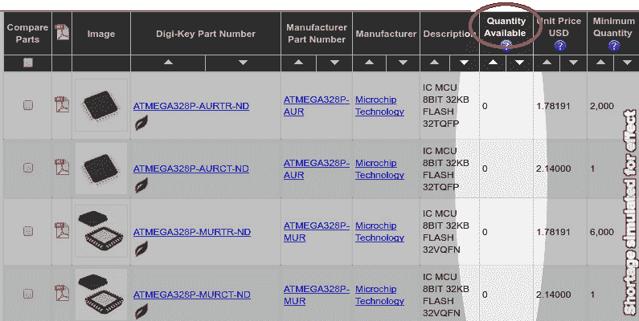
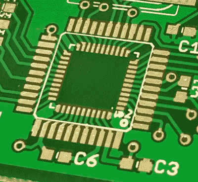

# 产品开发和避免库存问题

> 原文：<https://hackaday.com/2017/08/15/product-development-and-avoiding-stock-problems/>

你花了几个月的时间开发你的产品，你的 Kickstarter 刚刚成功完成，现在你准备订购所有部件。不幸的是，您的主要部件 ATmega328P 在各地都缺货，制造商的交货周期为 16 周。现在怎么办？

当大批量生产时，在正确的时间获得足够的库存可能会很棘手。可能会出现季节性短缺，因为公司试图为圣诞节制造和提供产品。可能会有自然灾害，比如硬盘工厂的洪水，或者与政治相关的可用性问题，比如电容器用钽，或者可能是新市场的开放增加了需求，或者是新产品耗尽了所有可用的供应。结果都一样；你很难得到你想要的。幸运的是，有一些方法可以避免这个问题，或者至少减轻它。

## 在开发过程中检查交付周期

不要设计带有“不适用于新设计”或“过时”标记的产品这似乎很明显。挑选零件时要考虑供货情况。如果像 Mouser 和 Digikey 这样的大型分销商有大量库存，那么它很有可能是一种将继续生产的受欢迎的零件，但它的需求并没有高到他们无法保持库存的程度。这是最理想的情况。

## 使用通用零件

零件越普通，当主要来源失效时，你就越有可能找到合适的替代品。0603 是一个超级常见的占地面积大小，您仍然可以在必要时获得 0805 或 0402 零件。也使用公共值。1%电阻与 5%电阻一样便宜，但如果使用 10k 电阻，则可以毫无问题地获得 10 亿个电阻。不过，试试 9.88k，你只能得到几个 10 倍于它的价格。

出现了许多带有通用部件的约定，使得替换变得容易。555 定时器可从 TI、Maxim、Microchip、Intersil 获得不同的零件号，这样的例子不胜枚举。它们的规格基本相同，引脚排列和封装也完全相同。您的设计越不具体，就越容易找到大量具有高可用性的合适组件。

## 列出每个零件的关键特征

如果你想测量电流，你可能会使用电流感应电阻。您可以指定电阻值、封装尺寸和额定功率。除此之外，虽然，你可能不关心任何其他规格。

请确保在原理图中注明关键规格，以便更容易地搜索替代器件。例如，如果您需要一个额定功率至少为 1W 的 0.01 欧姆 2512 电阻，那么您可以发挥创意，或许会发现有一种 3W 的芯片更便宜。当你清楚地定义了哪些规格重要，哪些不重要时，你就可以采购其他可能不重要的零件。

## 查找替代组件

如果没有人有你指定的零件库存，你需要能够列出其他零件。前面的观点涉及到了这一点，但它值得用粗体字详细说明。即使是在设计阶段，当你挑选要使用的零件时，收集几个其他的零件号也是很重要的。当我在搜索时，我通常会根据我需要的功能进行过滤，然后根据价格进行排序。前几个条目是我的主要和备用组件。通常就这么简单。

## 寻找替代资源

我有一个供应商层级，几乎总是我的第一选择有我需要的零件。不过，使用像 [Parts.io](http://parts.io/) 这样的工具，对照多个来源检查你的零件是一个很好的做法。如果你的来源中没有一个能可靠地得到你感兴趣的特定零件，或者他们都有很长的交货时间，这是一个信号，你应该寻找一个不同的组件。

**** 不要从粗略的来源购买零件。在绝望的时刻，你可能会忍不住从易贝购买一个出奇便宜、看起来一模一样的零件。这些零件是假货或工厂废品，或者已经损坏或暴露在潮湿的环境中，连接生锈，或者其他什么，但从长远来看，它们会给你带来更多的问题。不值得冒这个险，而且你也不知道接下来会让你痛苦的部分会出什么问题。

## 设计灵活的主板

A QFN package nested inside a TQFP package for more flexibility in sourcing.

这发生在我身上，我有 PCB 证明。在产品开发阶段，Atmega328P 供不应求。我想使用 TQFP-32 方案，但当时其他发达国家也是如此。幸运的是，一些供应商提供了 QFN 封装，所以我设计了两种封装嵌套的电路板。由于引脚排列完全相同，而且 QFN 正好放在内部，所以这很容易做到，并且使电路板与两种封装兼容。可能有必要设计您的电路板，使其能够适应不同的元件，具体取决于可用的元件或您使用的生产方法。

不要把自己设计在一个角落里，那里的零件太小众或不容易得到。在早期设计阶段就注意到这一点可以在以后省去很多麻烦。

***作者注:**我们的母公司 [Supplyframe 有一些工具](https://supplyframe.com/sourcing)用于选择你的零件和管理你的供应链等等。直到我对这篇文章进行最后的润色时，我才想起这一点，并意识到如果我不至少提到它并披露上面链接的 Parts.io 就是这些工具之一，我可能看起来像一个企业骗子。*