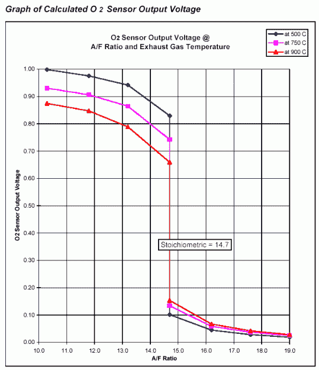
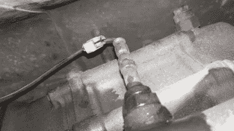
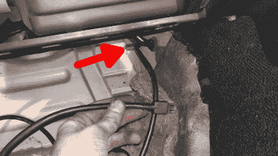
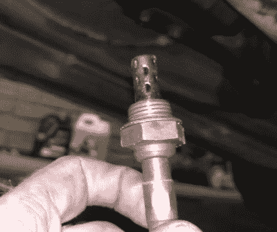
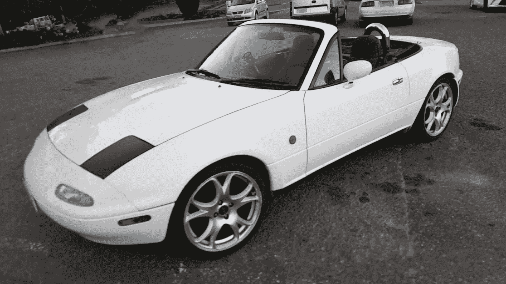

# 宽带灾难和垃圾箱 Miata

> 原文：<https://hackaday.com/2017/08/15/wideband-woes-and-the-junkbox-miata/>

与以往一样，我正在与我的 1991 年马自达 MX-5 进行一场险胜之战，这是我如何在我的日本纯种马上安装宽带氧传感器的故事。这是我正在进行的项目的一部分，我要为自己打造一辆可行的赛车，并弄清楚为什么我的 90 年代日本经济型汽车引擎运行起来更像 70 年代末萎靡时代的船锚。

我一直认为自己不走运。我对 90 年代早期金属的品味意味着我从来不知道 OBD-2 诊断系统的热爱，我不得不与那些刚刚开始生产可靠的燃油喷射系统的制造商实施的任何虚假系统打交道。

Narrowband oxygen sensor voltage output. The output is heavily dependent on sensor temperature and highly non-linear, making these sensors unsuitable for delivering a true AFR reading.

这通常包括在某处放一根跳线，连接一个 LED，并观察它闪烁出故障代码。我的马自达也不例外，在忍受了一辆耗油量大到后保险杠上到处都是烟灰的汽车后，我不得不进行诊断。

它显示了三个代码——一个是凸轮角度传感器的，两个是氧传感器的。现在，凸轮角度传感器(CAS)故障通常会阻止汽车行驶，因此可以安全地假设这是一个间歇性故障，需要密切关注。

然而，氧传感器显然需要注意。它的工作是让发动机控制单元(ECU)监测废气中的燃料混合物，并确保它不会太浓或太稀。很明显，我的车跑得太多了，诊断代码显示氧传感器出现了故障，因此需要修理。

我提高了替换传感器的价格，一个新的氧传感器可能不到 100 美元。然而，这并不是我想要的，因为不是所有的氧传感器都是一样的。80 年代和 90 年代的汽车通常从原始设备制造商那里运来，装有所谓的窄带氧传感器。这些几乎总是由二氧化锆电池组成，根据废气和自由空气之间的氧浓度差输出电压。当燃料混合物为化学计量比时，这些传感器通常处于 0.45 V，但在稀状态下会迅速变为 0.1 V，在浓状态下会迅速变为 0.9 V。这种响应是高度非线性的，并且相对于温度变化很大，因此只适合告诉 ECU 它是富还是贫，而不是富多少。带有窄带传感器的 ECU 在闭环 O2 控制中运行时往往会搜寻很多数据——你会看到发动机在神奇的 14.7 化学计量空燃比的任何一侧怠速搜寻，永远无法拨入正确的数字。

由于我打算在未来改用售后电子控制单元，我需要调整汽车。这包括确保空气/燃料比(AFR)是正确的，为此我需要能够正确地测量它们。仅仅知道你是富还是贫是不够的，因为通常在一定的发动机负荷下，有意地让发动机富或贫是可取的。为了获得真实的 AFR 读数，需要安装一个*宽带*氧传感器。这些有点复杂。

## 可用多种频率的ˌ宽频带的

NGK 在 1992 年首次完善了宽带传感器，它由一个窄带传感器和一个特殊的离子泵单元组成，离子泵单元安装在一个小的测量腔中，测量腔有一个排气孔。宽带控制模块通过窄带传感器监测测量腔中的氧浓度，如果检测到富条件，它控制泵单元电流将氧离子从外部空气泵送到腔中以消耗多余的燃料分子。在稀薄条件下，它逆转泵池电流，从测量腔中排出过量的氧离子。宽带氧气控制器可以通过监控将测量腔保持在化学计量混合物所需的泵电流来确定真实的空气燃料比。

由于宽带氧传感器系统的成本只有 250 美元左右，当我以后不得不升级到宽带时，再购买一个窄带传感器对我来说没有意义。我选择了创新 LC-2 宽带控制器套件和 DB 表。它配备了博世 4.9 宽带 O2 传感器、LC-2 控制器、安装和编程控制器所需的所有电缆，以及一个漂亮的绿色 LED 52 mm 仪表，这样您就可以用您对汽车空燃比的高度准确的了解来享受您的约会了。LC-2 是像我这样的设置的一个很好的控制器，因为它包括一个仿真窄带信号输出。这使我可以将宽带控制器与我的库存 ECU 一起使用，同时我还可以节省资金购买能够理解宽带输出的售后单元。

安装前的第一步是对宽带控制器进行校准。为此，控制器必须在没有连接传感器的情况下通电，并保持大约 30 秒，直到 led 正确闪烁。然后，控制器必须断电，然后在连接传感器的情况下重新通电。我使用了一个工作台电源，但是校准失败了，因为它只能提供 1 安培，这对于传感器的加热器来说是不够的。第二次尝试使用 ATX 电源，可以提供更大的电流，获得了成功。

安装的主要要求是宽带控制器的 12 伏开关电源。重要的是找到一条只有在点火开关处于 on 位置时才接通的电源线。这是因为宽带传感器有一个加热器来保持测量的正确温度。如果你直接用电池的 12 伏电压运行它，即使在汽车关闭时也会耗尽电池，还会烧坏传感器。由于我的车更注重性能而不是物质享受，我决定不在车里放音响。如果你坚持让你的音响保持安装状态，你可能要用一根单独的 12 伏保险丝来代替。

随着音响的消失，我决定将计量器安装在汽车音响通常会去的地方，并使用相同的电源线，这很容易，因为几个 led 最多只需要几百毫安。我的父亲很善良，他制作了一个立体空白面板来安装量具，安装后看起来非常整洁。

## 装置

LC2 设置有两个模拟输出，一个宽带输出在黄线上，前面提到的模拟窄带输出在棕色线上。我将宽带输出直接连接到仪表，并将仿真窄带输出连接到一条电线上，一直连接到发动机舱。这是更容易拼接到股票 ECU 的氧传感器线，而不是与杂物箱下的电线斗争。诀窍是在防火墙上的主引擎线束索环上切一个小口，让我的新氧气传感器线穿过。

Quick-splice connections – just say no. Credit: Lewin Day

当我运行这条电线时，我意识到最初的 O2 传感器故障的可能原因。以前的所有者安装了定制的排气集管，这需要将原来的氧传感器移动到一个新的位置。由于线束尺寸不合适，他们切断了原始传感器的线路，并用“快速拼接”连接器将其拼接在一起。这些东西普遍都很糟糕，连接也很糟糕，不应该*永远不要*用在汽车环境中，即使是收音机也不行。这几乎可以肯定是 ECU 无法从原始氧传感器获得正确读数的原因！

This grommet may come in handy if you’re choosing a similar layout for your wideband install! Credit: Lewin Day

接下来，我必须弄清楚如何将电缆从机舱内的宽带控制器连接到安装在排气管中的传感器。美国 Miata 车主通常会通过防火墙驾驶员侧的备用索环来传递这一信息，但我们这些在马路对面开车的人却没有这一功能。在一辆澳大利亚交付的汽车上工作时，我反而能够找到一个完全位于乘客侧脚坑的索环，用于一根小空调软管，并通过那里塞住我的电缆。

不幸的是，最糟糕的还在后面。是时候将新的传感器安装到排气管中了。问题是之前安装传感器的那个彻头彻尾的屠夫。该传感器已经完全错螺纹，并扭转到一个不虔诚的水平。在渗透油中浸泡了很长时间后，我能够移除旧的传感器，但是用技术术语来说，螺纹现在已经完全卡住了。如果不先把它们分类，就不可能正确安装新的传感器。

This brave old sensor stepped into the breech and acted as a tap, allowing me to chase the threads in the exhaust and save the day. Credit: Lewin Day

那些了解我的人会意识到，我并不在库存最充足的车库里工作。大小合适的水龙头可以让我快速清理螺纹，不会有太大问题，但我拥有的水龙头和双层巴士一样多。随着午夜的钟声敲响，去商店的希望也完全为零。谢天谢地，这是我年轻时的垃圾场探险拯救了我。

前几年，在试图对我以前的一辆车进行故障检修时，我从废品站采购了几个二手氧气传感器。我很幸运地发现一只还躺在那里，它被征召服役。我小心翼翼地将它插入排气管的传感器塞子中，尽可能使它笔直平行，然后小心翼翼地开始拧紧。每次转半圈左右，然后像技巧一样后退四分之一，我设法将一根可用的线切回到排气管中，挽救了局面。新的博世 4.9 宽带传感器已经周到地涂上了防卡，我现在可以小心翼翼地将它穿入到位，没有进一步的问题。

此时，已经是凌晨 2 点了，我依靠这辆车来跑，这样我就可以把自己推回家，躺在舒适的床上。通过一些愚蠢的运气，或者可能是因为从根本上获得正确的安装只取决于六条线的正确焊接，它第一次工作，量表进入生活报告我的发动机的 AFRs！一旦发动机变暖，人们可以清楚地观察到 ECU 的控制回路在寻找这个神奇的 14.7 数字两边的化学计量混合物。成功是甜蜜的。

总的来说，对于一个涉及 26 年车龄的汽车和一些严重卡住的旧零件的项目来说，安装非常顺利。经过几周的使用，我可以报告传感器工作正常，尽管我的汽车的燃油经济性仍然非常差，这意味着我必须进一步寻找其他问题。我推荐任何人接受这个建议，如果你正在进行类似的改装，并祝你们好运。愿它们在铁锈回到你后花园的泥土之前回到街上！

 [https://www.youtube.com/embed/Y9rvGVtPBYA?version=3&rel=1&showsearch=0&showinfo=1&iv_load_policy=1&fs=1&hl=en-US&autohide=2&start=112&wmode=transparent](https://www.youtube.com/embed/Y9rvGVtPBYA?version=3&rel=1&showsearch=0&showinfo=1&iv_load_policy=1&fs=1&hl=en-US&autohide=2&start=112&wmode=transparent)

Credit: Lewin Day