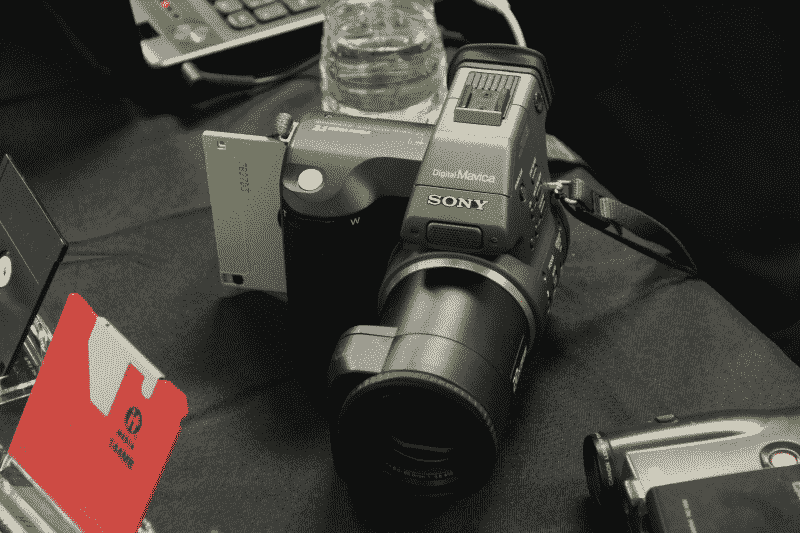
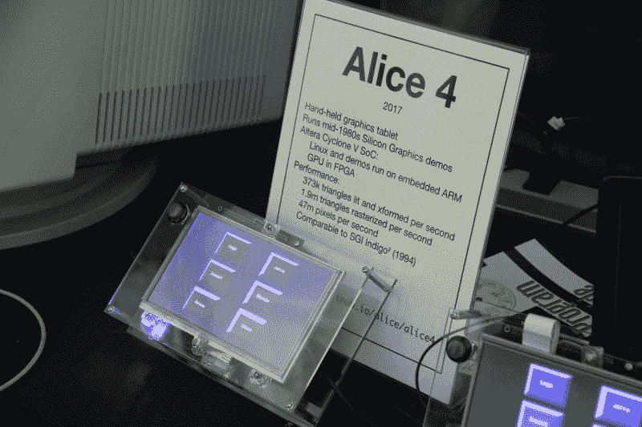
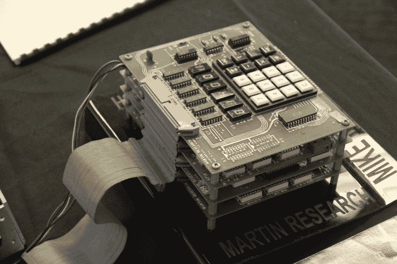
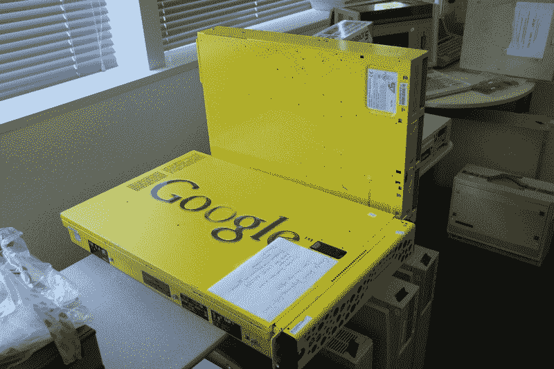

# 2017 年的 VCF 韦斯特是另一次令人喜爱的记忆之旅

> 原文：<https://hackaday.com/2017/08/10/2017s-vcf-west-is-another-beloved-trip-down-memory-lane/>

刚刚过去的这个周末，另一轮精彩的老式计算机节在山景城的计算机历史博物馆举行。和往常一样，[VCF·韦斯特](http://vcfed.org/wp/festivals/vintage-computer-festival-west/)将老式电脑的大师们聚集在一个公共场所谈论老式的硬件。它还吸引了一批独特的文物，其中许多要么仍在工作，要么被复活，要么通过现代方式转世。[Bil Herd]我顺便加入了人群，我抓拍了一些新面孔的照片和去年以来添加到体验中的作品。

## [Foone 的]数字媒体归档

在我们的遗愿清单上排在第一位的是[Foone]，一位数字媒体存档的图书管理员。在 VCF 之外，他经营着一家数字媒体备份公司，帮助人们将他们的利基、经常失败的磁盘格式备份成更现代的格式。他的备份驱动器具有特殊的“重读”功能，文件实际上会重读几十次，以验证从中提取的信息是正确的。

在 VCF 的现场，他把他收藏的文件格式的物理时间线带到了会场，让我们感受一下文件存储已经走了多远。他还拿出了一个稍微小众一点的软盘咀嚼数码相机，这是过去仅有的存储图像(和视频)的遗物之一！)到软盘上。就像用一卷胶卷拍摄一样，我可以想象出一种令人愉悦的美感，将软盘放入取出，以便给你的相机加载更多照片。

## 在新硬件上复活图形演示

[Lawrence]和公司一直在努力在新硬件上恢复旧的 1980 年的硅图形演示。在这里，Alice 4 是一系列硬件设备中的第四个版本。对于新的“平板电脑版本”的大小和速度，我们可以看到我们在现代硬件的芯片速度方面取得了多大的进步。该迭代在 Cyclone V(来自 DEO 纳米 SoC 套件)上合成的图形流水线上运行。通过一些努力，[Lawrence]和他的同事们已经让这些演示以 50Hz 的速度运行，相比之下，20 世纪 80 年代的硬件渲染一个新帧的速度大约为 0.5Hz。

最后，对于那些关注平板电脑外壳美学和思考*玻璃*的人，再看看。案例*其实*一个绿边亚克力。这种材料和我们的期望玩了一场愚蠢的游戏，它给了这个项目一个更华丽的触感。

## 过去的设计原则是前置和居中

VCF 不缺硬件。事实上，鉴于过去的个人电脑旨在提供的独特功能是使它们如此古老的部分原因，会议大厅覆盖着各种各样的东西。从这个奇怪的企业集团是从他们那里获取灵感的机会。上面显示了一个这样的例子。这一堆 PCB 共用每块电路板背面的一条公共总线，简化了板间布线。此外，可堆叠的尺寸和共享总线是以可预测的外形将大量电路板连接在一起的绝佳方式。人们很容易忽略这样的设计模式，这是一个经典的提醒，在一个旧部件的世界里，总是有机会将过去的想法融入到新的东西中。

## 老式五金配件市场

最后，如果没有自担风险的古董硬件出售，任何节日都是不完整的。在待价而沽的组件中，有谷歌服务器、机器人手臂，还有……我设法弄到了一本 2 美元的《PAL 设备手册》,里面有常见数字模式的配方，比如纠错码和状态机设计，以及各种架构的优化。(当然，[比尔]已经有一本在他的书架上，所以我在这里建立我的图书馆有点落后。)想看更多的照片，请看完整的相册。

Hackaday 是 VCF 西部大学的骄傲赞助商。您可以在附件页面的[查看【乔·金】的原创艺术。](http://hackaday.com/2017/08/01/this-weekend-vintage-computer-festival-west/vcfw_2017-scaled3/)