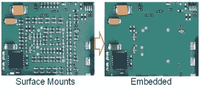

# 新版本使 EAGLE 和 Fusion 360 成为最佳产品

> 原文：<https://hackaday.com/2017/08/09/new-release-makes-eagle-and-fusion-360-besties/>

最新发布的 EAGLE 在机械设计和电子设计之间架起了一座桥梁。8.3 版增加了 EAGLE 和 Fusion 360 之间的同步功能。现在，您可以在机械设计和 PCB 布局之间切换，无需额外的步骤。这是 EAGLE 的第一个版本，突出了 Autodesk 购买的实际意义。

就在一年多前， [Autodesk 收购了 EagleCAD](http://hackaday.com/2016/07/05/the-future-of-eagle-cad/) ，这是一款更受学生、电子爱好者和开放硬件工程师欢迎的 PCB 设计套件。虽然有一些关于 Autodesk 旗下 EAGLE 的新许可结构的[问题，但有一个更快开发进度的承诺，以及 EAGLE 与 Autodesk CAD 程序集成的可能性。现在终于到了老鹰和 Fusion 360 成为闺蜜的时候了。](http://hackaday.com/2017/01/19/autodesk-moves-eagle-to-subscription-only-pricing/)

EAGLE 和 Fusion 360 集成更新包括[一个带托管库的在线库编辑器](https://hub.circuits.io/#/)。这些在线库是一个文件夹的“云”解决方案，该文件夹装满了装满零件的自定义 EAGLE 库。这些库将 3D 模型与 EAGLE 库打包在一起，简化了机械设计。您可以在 PCB 上放置元件，然后将该布局拉入 Fusion 360，查看电路板如何与您的机箱配合工作。在跳回 EAGLE 修复布线之前，可以在 Fusion 中调整与机柜冲突的组件放置。

Embedded passive designs. The resistors *are* the PCB.

EAGLE 8.3 的发行说明中还有一些其他有趣的内容。列表顶部是一个新的“纸板形状”对象。这不仅仅是一个电路板轮廓的铣削层，现在可以使用 DRC 检查电路板形状对象，以确保组件不会太靠近边缘。这也允许新的功能，如可定制的切口和嵌入式无源设计，或将电阻和电容放在 PCB 层中，而不是作为分立元件放置。

在此版本中，有一个新的单层模式。这种模式仅突出显示 PCB 的活动层，其他所有层呈灰色。说实话，这个功能十年前就应该在 EAGLE 了，但是迟做总比不做好。

在过去的一年里，我们这些没有抱怨新的 EAGLE 许可情况的人一直在关注 Autodesk 对 EAGLE 的更新。对于欧特克会在电子设计领域带来什么，有很多猜测。这就是了。看起来 Autodesk 正在履行他们的承诺，整合电子和机械设计。最新的 EAGLE 版本看起来很棒，特别是今年早些时候添加了行走路线和类似于推和推的痕迹，结合了设计项目机械方面的更新。

您可以查看下面 Autodesk 发布的新 EAGLE 宣传片。

 [https://www.youtube.com/embed/-VeIKlbo0mE?version=3&rel=1&showsearch=0&showinfo=1&iv_load_policy=1&fs=1&hl=en-US&autohide=2&wmode=transparent](https://www.youtube.com/embed/-VeIKlbo0mE?version=3&rel=1&showsearch=0&showinfo=1&iv_load_policy=1&fs=1&hl=en-US&autohide=2&wmode=transparent)

