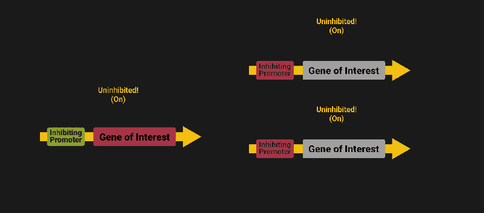

# 生活逻辑:电气思维的生物电路

> 原文：<https://hackaday.com/2017/08/21/living-logic-biological-circuits-for-the-electrically-minded/>

你知道你可以用生物学方法构建基本电路吗？这些不是普通的电路，但它们就像普通的电子元件一样工作。我们在这里谈论了很多关于普通硅和铜电路的问题，但是现在是时候动手实践一下，看看我们可以用生命的力量做些什么了！

1703 年，戈特弗里德·威廉·莱布尼茨出版了他的*([译](http://www.leibniz-translations.com/binary.htm))。受中国古代经典《易经》的启发，莱布尼茨认为算术和逻辑的原理可以用 1 和 0 来组合和表示。两百年后的 1907 年，德·福雷斯特的[三极管](https://www.google.com/patents/US879532)被用作与门。四十年后的 1947 年，布拉顿和 H. R .摩尔在贝尔实验室展示了他们的“ [PNP 点接触锗晶体管](http://hackaday.com/2014/01/14/retrotechtacular-the-genesis-of-the-transistor/)”(通常作为晶体管的诞生日期)。六年后的 1953 年，曼彻斯特大学发明了世界上第一台晶体管计算机。今天，13，086，801，423，016，741，282，500 个 ^([1](#1)) 晶体管构建了一个不断进步的连接、自动化和分析的世界。*

 *虽然我们永远不会知道伏羲、莱布尼茨、福里斯特或摩尔在奠定我们今天所知的数字世界的基础时的感受，但我们并没有完全失去运气:我们正处于自己不断发展的革命之中，但这一次是以生物技术为中心的。1961 年，Jacob 和 Monod [发现了 *lac* 系统](https://www.ncbi.nlm.nih.gov/books/NBK21954/):14 年前贝尔实验室提出的 PNP 晶体管的生物类似物。2000 年，Gardner、Cantor 和 Collins 创造了一个由热量控制的[基因拨动开关](https://www.nature.com/nature/journal/v403/n6767/full/403339a0.html)和一个合成液体生物模拟 ^([2](#2)) 。今天， [AND、OR、NOR、NAND、XOR 门](http://bioinformatics.ac.cn/synbiolgdb/browse.html)(在 [others](http://bioinformatics.ac.cn/synbiolgdb/search8Source.php?id=OTHER) 中)已经在世界各地的学术实验室中成功演示。

但是等一下。你说革命？电子晶体管从发明到计算机用了 6 年，生物晶体管从发明到触发按钮用了 40 年？我将及时讨论生物电路面临的挑战，但足以说明的是，与想要被喂养并且(似乎)喜欢死亡的生物一起工作会带来它自己的一系列挑战，这些挑战与与无生命和漠不关心的晶体管一起工作无关。但是，本着黑客精神，让我们开始吧。

## 我的第一个生物电路

遵循[组成模型](http://syntheticbiology.org/Abstraction_hierarchy/Composition_model.html)(即使[网络层模型](http://syntheticbiology.org/Abstraction_hierarchy/Network_layer_model.html)可能是[首选](http://ocw.metu.edu.tr/pluginfile.php/4339/mod_resource/content/0/week3content.pdf))，我将通过电子*和*生物方法完成一个简单振荡器的构建。我们的目标是让你对生物回路有更多的了解，它们是由什么组成的，它们能做什么，为什么它们很难制造。

### DNA/身体构造

在电子领域，我们的零件(大部分)由铜、硅和环氧树脂制成。在生物学中，碱基部分是 DNA 链 ^([3](#3)) 。出于这个原因，如果你需要[快速复习一下 DNA](http://learn.genetics.utah.edu/content/basics/dna) ，那就接受吧。但是，对于这篇文章，你必须知道的是 DNA 编码遗传信息。

### 零件清单:蛋白质表达介导的逻辑

对于我们的振荡器，我们需要三个反相门。在电子世界里，这相当容易([就像 0.06 美元容易](https://www.digikey.com/products/en/integrated-circuits-ics/logic-gates-and-inverters/705?k=&pkeyword=&pv247=24&FV=ffe002c1&mnonly=0&ColumnSort=0&page=1&quantity=0&ptm=0&fid=0&pageSize=25))。你可以[用(几乎)任何东西](http://hackaday.com/2017/01/03/make-logic-gates-out-of-almost-anything/)制造电子逻辑门，而且有无数的资源详细描述了[每一个](https://www.allaboutcircuits.com/textbook/digital/chpt-3/digital-signals-gates/) … [复杂的](http://williams.comp.ncat.edu/COMP370/LogicGates.pdf) … [细节](http://whatis.techtarget.com/definition/logic-gate-AND-OR-XOR-NOT-NAND-NOR-and-XNOR)，任何一个正常人都想知道。

生物世界有相当多的逻辑门，其中一些我们已经涵盖了。我们将关注最常见的类型:蛋白质表达介导的逻辑。通过这种方法，蛋白质浓度被视为信号，并像电信号一样使用。下面是一个遗传“非”门，信号 A(启动子的一种特定蛋白或“输入”)抑制信号 B(感兴趣基因编码的蛋白)的输出。这就像传统的非门一样，如果有【T2 非】信号 A，就产生信号 b。嗯，它的工作方式*几乎和传统的非门一样。这就是我们发现合成生物学面临的最大挑战之一:正交性。*

在电逻辑中，我们通常不需要担心正交性，因为我们可以用导线和/或走线将非门的输出连接到我们想要的(并且仅仅是我们想要的)。在生物学中，我们通常没有这种奢侈，因为我们在原核生物(没有细胞核的细胞)中工作，它们可以有效地被认为是化学物质的袋子 ^([4](#4)) 所以，我们没有从一个门到另一个门的直接连接，我们只有一个信号“网”作为我们网络的一部分。

计算机通过像 MAC 地址这样的标识符解决了这个问题。例如，如果 Bob 想要发送消息给 Sue，他可能会广播类似“FOR: SUE，MESSAGE: HI”的内容。这对计算机来说很有用:它们自己制造接收器和发射器。在代码和硬件方面，它可能是微不足道的(这是我们有[所以](https://en.wikipedia.org/wiki/Serial_communication) [许多](https://en.wikipedia.org/wiki/Lists_of_network_protocols) [电子](https://en.wikipedia.org/wiki/List_of_automation_protocols) [通信](https://en.wikipedia.org/wiki/IEC_61850) [标准](https://en.wikipedia.org/wiki/IEEE_Standards_Association)的部分原因)但是，在生物学中，蛋白质工程是[难](https://www.ncbi.nlm.nih.gov/pubmed/12468711)的，它需要时间、独创性和劳动力。

想象一下，在每个项目中你只能使用一种类型的晶体管。例如，假设您使用两个 2N3904s，可以同时开启或关闭，但不能一个关闭一个开启。现在，假设对于每一个晶体管，你不得不把一台电脑放在野外的角落里，[拆开](https://www.youtube.com/watch?v=WjeptaI2T8E)它，并手动移除它的所有组件，以期找到一种新型的晶体管。当然，简而言之，这将使制造一台拥有[300 亿](https://www.sciencealert.com/new-computer-chips-can-fit-30-million-transistors-on-your-fingertip)晶体管的计算机变得困难。

因此，实际上今天使用的所有启动子(输入位点，在 DNA 中编码)最初都是在自然界中发现的，并且已经被[改造用于合成用途](http://www.openwetware.oimg/2/24/Penumetcha_etal_2010.pdf)。而且，我们在这方面相当成功，有足够多可用的推广程序，我们需要一个[目录来将它们全部分类](http://parts.igem.org/Promoters/Catalog) ^([6](#6)) 。

### 用非门构建的器件

现在，向前看。让我们试着用我们的非门建造一个装置。因为我们只是在这里学习概念，我将向你们展示如何创建一个环形振荡器。如果你对自己的术语有点生疏，或者[你太忙而没有时间去上 100 级电路课](http://hackaday.com/2016/07/28/amazing-sdr-built-by-16-year-old/)，不用担心。环形振荡器*非常*简单，这就是为什么[是第一批制造的生物振荡器](https://www.ncbi.nlm.nih.gov/pubmed/4437195)之一。环形振荡器是通过在一个周期(环)中放置奇数个反相器(通常大于 1)制成的。请看下面这张*非常酷的 gif*,希望它能澄清关于它如何工作的任何疑问。但是，如果事情不太清楚，MITx [的 Enrique 会支持你](https://www.youtube.com/watch?v=EFKJO8G62dQ)。

现在是生物部分。我们已经有了“非”门，所以我们当然可以把三个相同的“非”门串在一起，最后得到一个振荡器，对吗？嗯，正如我们之前提到的，我们将需要使用三个不同的**门，所以事情看起来像三个并联的非门，而不是串联的。但是，即使有三个不同的非门，我们可能还有另一个问题:死亡。**

毕竟，我们所有的逻辑都发生在一个耗尽资源并产生“无用”蛋白质的细胞中。而且，根据细胞的本质，细胞拥有的资源数量是有限的。我们可以尝试[提高我们细胞的有效吞吐量](http://www.biocompare.com/Cloning-and-Expression/7135-Cell-Culture-Media/)，但在某些时候，我们需要意识到，细胞虽然贪婪，[却必须照顾生命的基本需求](https://www.ncbi.nlm.nih.gov/pubmed/22649052)。然而，不要害怕。我们的三栅极振荡器应该是可持续的^(T5 7T7。但是，如果我们尝试七个甚至九个门振荡器，我们可能需要开始担心。)

无论如何，足够的磨蹭。我们已经把我们的 DNA 序列放在一起，将它们引入细胞，现在我们等待它们生长 ^([8](#8)) 。我们已经使用 GFP(一种 ***G*** 绿色 ***F*** 荧光 ***P*** 蛋白质)作为我们的“信号”之一，因此我们可以可视化我们的信号(就像使用[LED 来查看数字信号](http://makezine.com/2009/12/28/ring-oscillator-pendant/))。

而且……什么都没有。一开始。大约 160 分钟后，我们的细胞开始发光。就像电子环形振荡器一样，我们的[频率取决于每个非门](https://pdfs.semanticscholar.org/c1f2/7dd01a563a82646e295824ab449511c69034.pdf)的延迟时间。在电气环境中，这给我们提供了通常在/高于 kHz 范围内的频率。在生物学中，我们以极快的 1×10[-4]赫兹的速度工作，周期约为 160 分钟。这也是生物电路和电子电路的另一个明显区别。

### 在实践中/为什么你应该关心

好吧，我知道这看起来像什么。生物逻辑不发达，速度慢，受生活制约。但是，有一种和谐！生物学所缺乏的，它以不可估量的方式弥补。毕竟，我们是由细胞构成的，而不是硅。

从[调节再生医学的转基因表达](https://www.omicsonline.org/application-of-synthetic-biology-to-regenerative-medicine-2155-9538.S2-003.php?aid=2972)到[针对癌细胞的可调双启动子整合器](https://www.ncbi.nlm.nih.gov/pubmed/21179016/)，细胞逻辑有机会改变[我们认为药物应该如何工作的方式](http://medicalfuturist.com/what-could-crisprcas9-do-tomorrow/)、[我们认为生命是什么](https://www.statnews.com/2017/07/28/cell-build-from-scratch/)以及[植物是否应该发光](https://www.technologyreview.com/s/601884/why-kickstarters-glowing-plant-left-backers-in-the-dark/)。你应该关心，因为它很酷，是新的，有潜力帮助很多人。我们是黑客。我们一直站在技术的最前沿，仅仅因为这一点，我们不需要改变。所以，让我们开始黑吧！

正如你可能已经猜到的，我真的很喜欢写合成生物学，所以如果有你们想听的话题，请告诉我。一些关于合成生物学可操作程序入门的“入门”文章是一个好的起点吗？

## 笔记

【1】[使用福布斯文章](https://www.wolframalpha.com/input/?i=(1.65)%5E(2017-2014)*2,913,276,327,576,980,000,000)[中的数字计算](https://www.forbes.com/sites/jimhandy/2014/05/26/how-many-transistors-have-ever-shipped/)“有多少晶体管已经出货？”。虽然我对这篇文章没有多少信心，但我愿意相信所展示的数字至少精确到几个数量级。不管怎样，确切的数字没有今天我们周围许多晶体管的总体印象重要。

[2]具体来说，*大肠杆菌*由异丙基β-D-1-硫代半乳糖苷(IPTG)控制，异丙基β-D-1-硫代半乳糖苷是乳糖代谢物别乳糖的分子模拟物。使用 IPTG 是因为，与别乳糖不同，IPTG 不能被β-半乳糖苷酶水解，所以它的浓度保持恒定，因为它不容易被分解。

好吧，是的:DNA 是由核苷酸组成的，但是铜是由原子组成的，我们必须在某个地方停下来。在我们今天的语境中，停在 DNA 上是有意义的，但在其他语境中，如 [DNA 合成](https://hackaday.com/2017/04/27/osm-pronounced-awesome/)，DNA 显然不是基本单位。

说细胞只是“化学物质的袋子”是一种过于简单化的说法，类似于称我们的身体只是“里面有东西的皮肤”。技术上是真的，但不是很好描述。我想说的是，细胞(1)被一层膜所束缚，它们(2)是一个发送器和接收器的系统，以及(3)它们吸收/排出物质的速率有限。这个比喻很容易将这些属性形象化，所以我本着 [Upaya](https://en.wikipedia.org/wiki/Upaya) 的精神选择了它(在最高的意义上，一些事情可能最终不是“真实的”，但它可能仍然是一种权宜的做法)。为了更准确地描述细胞，请查阅这本[获奖书籍:细胞、凝胶和生命引擎](https://www.amazon.com/Cells-Gels-Engines-Gerald-Pollack/dp/0962689521)。

[5]在整篇文章中，我使用启动子作为一个宽泛的短语，来指代[阻遏物](https://en.wikipedia.org/wiki/Repressor)和[启动子](https://en.wikipedia.org/wiki/Repressor)，这有两个原因:简单性和避免在整篇文章中不断使用启动子/阻遏物，启动子已经是一个足够长的词了。

[6]即使不是全部，这些启动子中的大部分也只对大肠杆菌*具有特征性。但是，由于大肠杆菌 T4 是合成生物学的主力，这通常不是问题。*

 *所谓可持续，我的意思是细胞不应该因为表达我们电路所需的蛋白质而死亡。然而，我没有说*而不是*意味着产量将在更长的时间内保持可持续。随着时间的推移，我们的系统将崩溃，我们最终将得到我们系统中所有 3 种蛋白质的微弱表达。哦，这就是城市生活。

我不喜欢我快速跳过了这个过程。准备 DNA(更不用说准备/设计 DNA)和强迫细胞表达你的 DNA 的过程完全是另一回事。很容易成为另一篇文章(或一组文章)。(眨眨眼)**