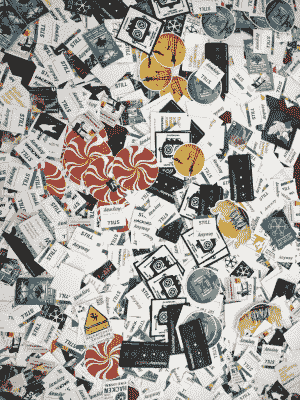
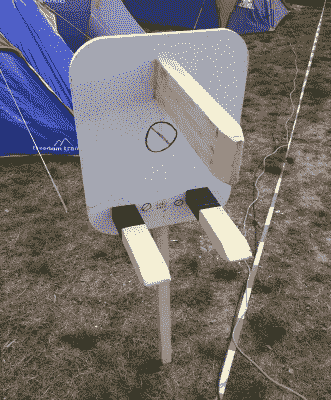
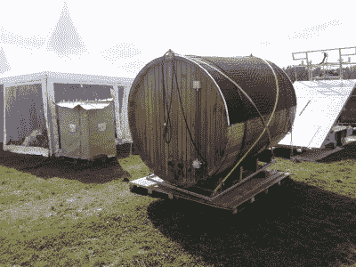
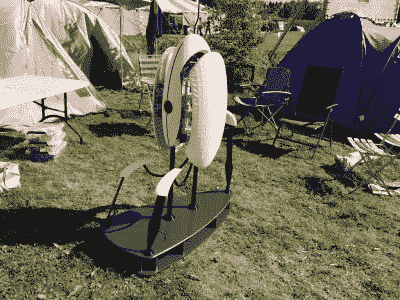
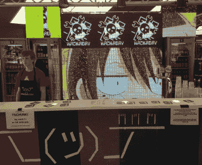
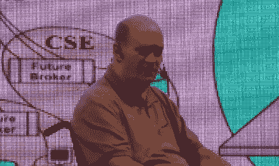
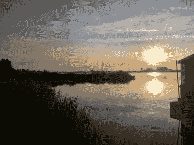

# SHACamp 2017，个人评论

> 原文：<https://hackaday.com/2017/08/25/shacamp-2017-a-personal-review/>

从节日下来有一系列的阶段。在繁忙的旅行之后，有几天时间来弥补失去的睡眠，重新开始你的生活，然后一旦表面上恢复了秩序，就会有几周的空虚。你的生活将不再一样，这一切都是那么的*平凡*。

I’m pleased to say the Hackaday and Tindie stickers were very popular.

现在距离荷兰 SHACamp 2017 黑客节如火如荼地进行已经有几个星期了，在这段时间里，在作为 Hackaday 书记员和编辑的其他工作中，下面的文章慢慢成形了。当我写这篇文章时，正是英格兰南部的清晨，所以在同一天的这个时候，当我在 SHACamp 时，我会带着一大包贴纸在交换桌上分发，穿过前一天晚上狂欢后仍在熟睡的营地的朝阳。经过我们的德国和荷兰近邻，沿着堤坝的斜坡，我左边是纸板帐篷仓库，右边是美食广场，来到信息帐篷。在夜班结束时问候睡眼惺忪的志愿者，并在桌子上为大众铺上大量 Hackaday 和 Tindie 贴纸。然后呢？找一杯咖啡，在地球上最令人兴奋的社区之一，开始新的一天。我的社区。*您的*社区。

如果你想了解一个大的黑客阵营，贴纸表是一个很好的起点。在它上面，你会发现各种各样的组织和团体的标志。有一些像 my Jolly Wrenchers 和 Tindie the puppy 这样的商业品牌，也有一些来自志愿组织或利益团体，但大多数情况下，它们是一个大陆——在某些情况下甚至是更广泛的世界——黑客空间和创客空间的标志。在这里，你可以看到与会者的广度，因为来自数千英里之外的空间的标识你以前从未遇到过。这算不上是一次全球性的聚会，但却有一种全球社区的感觉。

## 你如何描述一个黑客阵营？

You shall find us by our clearly superior yet dangerous to barefoot pedestrians fused right-angled mains connector.

所以在我带你经历我的 SHA 之前，最好先用更一般的术语描述一个黑客阵营。当我向不读 Hackaday 的人描述像 SHA 这样的营地时，我把它比作他们习惯的音乐节，但没有乐队。相反，观众通过他们带到活动中或在活动中做的工作，以及通过谈话和讲座的综合节目来提供娱乐。哦——这是让他们大开眼界的一点——从最小的单人帐篷到最大的帐篷，现场的每一个建筑都有主电源和高速互联网。人们有时从这种描述中领会到沙是什么，有时却没有。

不同的群体，无论是个人的 hackspaces，来自某个特定国家的人，还是其他特殊利益群体，聚集在村庄，帐篷，帐篷和凉亭的集合中，他们在那里设置他们带来的任何酷的东西。我的帐篷和它的 Hackaday 旗帜在一个由英国 hackspaces 混合组成的村庄里，在堤坝上，来自 MK Makerspace 的 Michael 标记了一个由一个巨大的 BS1363A 电源插头组成的标志。不止一个人指出，最好是平躺在地上，把图钉举在空中，准备抓住一只不小心的*巨蟒*的脚。

The Finns brought a sauna. As one does. Helsinki Hacklab ([CC BY 2.0](https://www.flickr.com/photos/helsinkihacklab/36220231731/))

在英国村，可以说我们有更多的生活空间，而不是展览空间，但对于许多其他村庄来说，显然已经付出了巨大的努力来使它们成为一个展示——在某些情况下是一场盛会——来总结这个群体。通常这包括展示性的黑客和作品，但有时国家和地区的村庄会带来当地的风味。例如，意大利大使馆正在为排着长队的人提供意大利面，一群芬兰人带来了一个移动桑拿浴室，而比利时人有大量的瓶装啤酒。也许英国人下次应该带些巧克力酱来，那会让他们看到的！

The TkkrLab *Portal* turret. Dave Borghuis ([CC BY-NC 2.0](https://www.flickr.com/photos/zeno4ever/36416821586/))

当近 4000 人聚集在一个地方进行这种活动时，你可以想象这个地方需要相当大。SHA 的地点是 Scoutinglandgoed Zeewolde，这是一个巨大的户外童子军营地，该地区的大多数人可能需要花 15 分钟才能从一端走到另一端。它被划分为以黑客先贤祠中著名和有影响力的人物命名的领域，从[伊丽莎白·亚历山大]到[康拉德·楚泽]，不同的领域各有各的特色。一些人喜欢边远地区的安静区域，另一些人把他们的家人带到设备极其完善的家庭场地，还有更多人更喜欢在喧闹的场地上整夜在喧闹的电子音乐、人造烟雾、实验烟火和灯光效果中狂欢。

我们社区有这么大的集会，很难看到球场上的一切，更不用说在一个地方报道了。因此，最好在查看一些谈话时间表的重点之前，先传递一些对活动的社区方面的印象。

## 绕着场地走

[![Never mind backseat drivers, [Lucy Fauth] and [Jana Marie Hemsing] are armchair drivers!](img/ad616e16487b9c7c1258da3edbe021bc.png)](https://hackaday.com/wp-content/uploads/2017/08/chaoswest-armchair.jpg) 

别介意后座司机，[露西]和[嘉娜·玛丽]是扶手椅司机！但愿我想到了这一点！

走在工地上，这一刻的黑客仿佛是电动交通工具。至少有一个电动沙发，一把扶手椅，几把草坪椅，甚至还有一个电动啤酒箱。这可能是由部件可用性驱动的事情之一，在这种情况下，使能因素是平衡板和类似设备的轮毂内车轮电机的现成可用性。我们的德国朋友似乎已经垄断了市场，特别是在这方面，我们的荷兰主人都是这样的自行车爱好者，以至于带来了他们可信赖的骏马。

其他引起所有人注意的建筑是 [TkkrLab *门户*炮塔](https://translate.googleusercontent.com/translate_c?depth=1&rurl=translate.google.com&sl=auto&sp=nmt4&tl=en&u=https://tkkrlab.nl/wordpress/zomervakantie-tkkrlab-sha2017_2017_08_09&usg=ALkJrhjZtRm8SZT-WeieJJOrOa-ASiAMGg)(谷歌翻译链接)，以及烟火和由[42 区工业](https://m.facebook.com/area42.industries/)提供的最好描述为后世界末日的交通工具。除此之外，这是一个下降到分散在该网站的各个村庄，食品黑客村，多旋翼飞行器，等等。

硬件黑客区可能会吸引许多黑客常客，它隐藏在比利时的村庄里。有一个常规的表面贴装和回流焊接课程正在进行中，还有一两个来自我们社区的套件供应商提供他们的产品。人们失败项目的“拿来交换”似乎大多产生了成堆的多余电子元件，但也许我出现得太晚了，没能抓住好东西。

Apply beer, get pixels.

沙人自己提供了几个酒吧和美食广场，从喧闹的中心酒吧到外围安静的酒吧。说到黑客营的食物，我的最高建议是:去素食卡车，即使你不是素食者，你会得到更好的食材，而且队伍总是更短。与此同时，中央酒吧的[可寻址像素屏幕](https://wiki.sha2017.org/w/Pixelflut_bar)是一个战场，各种个人和村庄争夺显示内容的控制权。下午三点左右，为英国黑客空间的一名手提电脑的成员买一瓶啤酒带来了酒吧后面的一群快速扳手，但他在晚上没有机会，因为大枪推出了他们最好的努力。

## 同时，在舞台上…

当然，有趣和轻松只是这些活动的一半，还有一个综合的讲座和谈话节目，这要感谢 [CCC 视频运营中心](https://c3voc.de/)团队[，你可以亲自观看](https://media.ccc.de/c/SHA2017)。

Bill Binney at SHA. ([CC BY-SA 3.0](https://media.ccc.de/v/SHA2017-402-how_the_nsa_tracks_you))

最重要的可能是 NSA 举报者[Bill Binney]对情报机构大数据收集活动的令人不寒而栗的描述，“[NSA 如何跟踪你](https://media.ccc.de/v/SHA2017-402-how_the_nsa_tracks_you)”，这当然引起了一些传统媒体的注意。然后是[马拉维卡·贾亚拉姆]揭露印度政府邪恶的生物识别身份证计划，“数十亿人的[生物识别身份证”。](https://media.ccc.de/v/SHA2017-190-biometric_id_cards_by_the_billion)

更侧重于硬件的安全主题演讲来自[威廉·韦斯特霍夫]，他的“[一个实习生如何黑掉电网](https://media.ccc.de/v/SHA2017-434-how_an_intern_hacked_the_powergrid)”详细描述了利用太阳能控制器中的漏洞对电网进行的分布式攻击。不过，后来在我们的营地引起了一点轰动的是“[黑客是如何入侵自 2009 年](https://media.ccc.de/v/SHA2017-250-how_hackers_could_have_hacked_all_dutch_elections_since_2009)以来的所有荷兰选举的”，来自【Sijmen Ruwhof】，这是一个关于荷兰选举系统的揭露，那些在讲座上的人主要是在讨论问题中对真正的选举志愿者的全面攻击(在视频中，大约在 [42:10](https://media.ccc.de/v/SHA2017-250-how_hackers_could_have_hacked_all_dutch_elections_since_2009#video&t=2530) )。哎哟！

对于 Hackaday 的读者来说，更近一步的是[阿克塞尔·泰尔曼]的"[" Hackeboy 掌上游戏机](https://media.ccc.de/v/SHA2017-153-the_hackeboy_handheld_game_console)"，其演示幻灯片打破了静态模式，[塔尔·梅拉梅德]的"[黑客 BLE 智能设备](https://media.ccc.de/v/SHA2017-230-hack-a-ble)"，[多米尼克·斯皮尔]和[克蒂姆金]的" [FaceDancer 2.0](https://media.ccc.de/v/SHA2017-221-facedancer_2_0) "关于 USB 黑客行为。由于[Russell]关于“[我如何制造柴油摩托车](https://media.ccc.de/v/SHA2017-310-how_i_made_my_diesel_motorcycle)”的演讲，机械项目在会谈中亮相，该演讲涵盖了不是一辆而是两辆摩托车，一辆配有小型 Kubota twin，另一辆配有大众 1.9 升汽车单元。然而，公平地说，这更多的是一个软件事件，而不是舞台上的硬件事件。

Camp fires were banned on the site, but gas burners weren’t. The [Chaos West](https://chaos-west.de/wiki/index.php?title=Hauptseite) crew applied lateral thinking, propane, and sand to the problem.

提问环节比演讲本身更有趣的是[Lazerbeamwizard]关于成为现代流浪汉的演讲，“利用北美铁路”。你可能不想亲自动手，但如果你对 YouTube 上的货运视频很感兴趣，那么这就是你获得第一手资料的机会。如果你喜欢音乐，那么一定要看看[Matt "Gasman" Westcott]的“[一小时内从零到 chip tune](https://media.ccc.de/v/SHA2017-175-zero_to_chiptune_in_one_hour)”，其中他接受了观众的推荐，并在你眼前的 ZX 频谱跟踪器中进行作曲。我必须承认，在那里，我是选择音乐的一方，他的黑客空间在期待另一个观众会做出更明智的选择，但没有人这样做。他干得很出色，但很抱歉[马特]。最后，在一次明目张胆的自我推销中，如果你曾经想过将你的电子套件之一投放市场，我给了我去年在这里写的系列文章[:](http://hackaday.com/2016/07/29/from-project-to-kit-so-you-want-to-sell-electronic-kits/)[从项目到套件](https://media.ccc.de/v/SHA2017-133-from_project_to_kit)。

## 永远不够长

就这样，2017 夏令营。日子不够，但这些营地从来都不够。我玩得很开心，我真诚地感谢活动背后的许多人，以及我们社区中所有欢迎我的人，他们与我分享了一两杯啤酒和一些爆米花，谈论了电子产品、苹果酒、Hackaday、独木舟、收音机、英国电源连接器和许多其他有趣的事情。你是我们所在的社区的一部分，和你在一起很开心。

You’d want to return, too.

关于 SHACamp 2017 的地点，有必要说几句话。弗莱沃兰是荷兰最新的一个省，它的南部，弗莱沃波尔德，是它最近的一部分，在 20 世纪 60 年代末才从艾塞尔米尔湖深处被开垦出来。它可能没有最令人兴奋的名声，因为即使按照荷兰的标准，它也是非常平坦和开放的，一切都还很新。但我来自英格兰农村，熟悉我们的沼泽地，我发现这是一个足够宜人的地方，有大量的绿色植物和几个世纪前荷兰绘画大师捕捉到的同样广阔的天空。我想不出在这个领域的其他聚会中，我可能会和朋友一起坐在独木舟上沿着海岸线轻松地划桨，我肯定会回到这里。

荷兰 SHACamp 2017 的继任者将在 2021 年，因此与此同时，下一个类似的欧洲活动将是明年夏天在英格兰西部离我家更近的 [EMF Camp](https://www.emfcamp.org/) 。我希望在那里见到你。