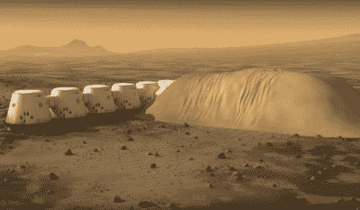
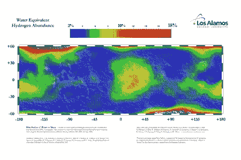
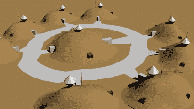
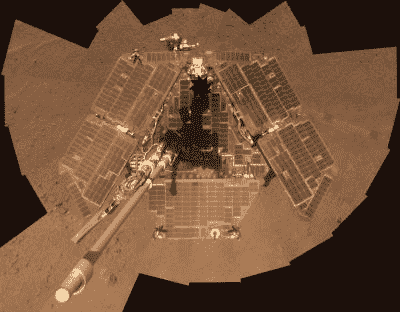

# 生活在火星上:你从未想过的事情

> 原文：<https://hackaday.com/2017/08/17/living-on-mars-the-stuff-you-never-thought-about/>

在 *[火星人](https://hackaday.com/2017/06/30/hacking-on-mars-in-the-martian/)* 中，我们看到了需要什么样的黑客攻击才能在火星上生存相对较短的时间，但是如果你试图在那里永久生存呢？火星的恶劣环境会影响你的房子，你的交通，甚至你的交流方式。所以这里有一个有趣的想法实验，关于你如何作为一个更大的社区的一部分生活在火星上。

## 不是你平常的房子

Mars One living units under regolith, Source [video](https://www.youtube.com/watch?v=_vP5G5gxY8E)

火星上的辐射来自太阳粒子事件(SPE)和银河宇宙辐射(GCR)。计划单程火星之旅的组织“火星一号”谈到将他们的栖息地“T2”覆盖在几米厚的风化层“T3”中，这是一个对覆盖在基岩上的各种岩石材料的别称。五米提供了与地球大气层相同的保护——大约 1000 克/厘米 ² 的屏蔽。美国国家航空航天局兰利研究中心的一篇论文称，最大的减少来自表层 15 到 20 厘米的风化层。所以我们的火星房子将有一个底层结构，但辐射防护将来自 20 厘米到几米的风化层。实际上，人们将生活在地下。

在地球上，为你的房子生产水和空气不是你想做的事情，更不用说处理呼出的二氧化碳了。但是火星房屋将需要这种系统和更多的系统。

## 寻找水源

Water equivalent hydrogen within 60° on Mars

水是氢和氧的混合物，并以冰的形式混合在火星风化层顶部一米处。在赤道附近和高达 60°的纬度上，它的浓度从 2-18%不等，但在更北和更南的地方，它的浓度甚至更高，在北极达到 100%。

就像在地球城市一样，水将通过管道或从其他地方运进来，或者可以由室内环境系统从最近的采石场运送风化层来产生。在任何情况下，它都是通过加热风化层将冰变成蒸汽，然后将蒸汽冷凝成液态水而产生的。火星一号雇佣了太空环境系统专家 Paragon 太空发展公司来为他们的栖息地 T3 设计 T2。他们的设计包括一个漏斗，作为生产水的第一步，将浮土放入其中。

## 空气、毒素和食物等琐事

[火星空气是](https://en.wikipedia.org/wiki/Mars#Atmosphere) 95%的二氧化碳(CO2)，1.93%的氩气，1.89%的氮气，只有 0.16%的氧气。然而，我们的[地球大气层](https://en.wikipedia.org/wiki/Atmosphere_of_Earth)含有 78.09%的氮气、20.95%的氧气、0.93%的氩气、0.04%的二氧化碳和微量的其他气体。在*火星人*中，呼吸用的新鲜氧气取自火星空气中的二氧化碳。在 Paragon 的环境系统中，氧气也来自火星空气中的二氧化碳，但也需要氮气、氩气和微量的二氧化碳进行更完全的混合。此外，Paragon 的系统还利用电解从水生产系统中获取一些氧气。

有趣的是，一个不太明显的问题是防止灰尘中的有毒元素进入室内。火星尘埃是带电的，会粘在任何东西上，就像泡沫聚苯乙烯包装一样。如果你生活在进屋前必须清洁靴子的环境中，想象一下你必须清洁整个宇航服，或者你可以把它留在气闸里。

在火星上种植食物是可能的——我们知道这一点，因为我们已经报道了用类似火星土壤进行的测试。一些食物将在房子里种植，附带的好处是植物吸收二氧化碳和呼出氧气。但是为了品种、数量和节省时间，大部分将来自单独的温室。

当然，通过这一切，我们必须记住，所有的废物，用过的水和呼出的空气都被回收和再利用，以尽可能实现闭环。这意味着对原材料的需求会比在地球上少。

## 火星上的电气接地

火星[没有本地电接地](https://www.nap.edu/catalog/10360/safe-on-mars-precursor-measurements-necessary-to-support-human-operations)。地球是这样，因为地面是导电的，并接受与它接触的任何带电物体的电荷。由于局部大地的质量很大，它接受这种电荷，但本身并不带电。土壤中的水分使离子能够四处移动，从而有助于土壤的导电性。然而，火星的地面是干燥的，虽然它含有冰，但冰进一步降低了传导性。

火星也充满灰尘。四处飘散的灰尘会使宇航服、交通工具和没有被浮土覆盖的部分房屋带电。这是由于[摩擦电效应](https://en.wikipedia.org/wiki/Triboelectric_effect)造成的，这与当你走过地毯(给你的身体充电)时发生的事情相同，然后当你触摸门把手时会受到电击。就火星而言，是尘埃和其他物体之间的相互作用产生了电荷。

由于没有局部的电气接地来使物体放电，它们可以积累不同的电荷量。在外面走了一圈后，当一个人来到一个气闸室并按下按钮打开它时，火花会在他们之间穿过，损坏敏感的电子设备。

解决方案是在设计系统时牢记没有自然的本地基础。为了获得局部接地，虽然不是一个完整的解决方案，但通过电缆将房屋和其他结构电连接起来会产生一个巨大的电容器，存储电荷。尖锐的金属点和正常的建筑物不规则性将有助于将累积的电荷释放到大气中，就像反向避雷针一样。

## 无线通信问题

Mars houses with antennas

如上所述，住房基本上都在地下。这在尝试无线传输高频信号时会产生问题。当然，一个解决方案是使用电缆，铜缆或光纤。但是如果我们想让事情变得简单和灵活，那么这些房子只需要将天线延伸到风化层屋顶之外。

如果房子真的在地下，那么可以从采矿业的[透地采矿通信系统](https://en.wikipedia.org/wiki/Through-the-earth_mine_communications)中获得线索。这可以在 300-3000 Hz 的超低频下传输信号，并且可以穿透数百米的岩石。发射机使用地面上或正下方的大型环形天线，通过地面向下面的住宅发射信号。

[洞穴探险者也在几百米的距离上使用了这种多圈便携式装置。这不是正常的电磁波广播，而是通过岩石的磁感应，发射器的回路产生磁场，在接收器的回路中感应出匹配的磁场。](http://site2.caves.org.uk/radio/comms_in_caves.html)

但是考虑到如此低的频率下可用的低带宽，我们将使用外部天线或电缆进行大多数通信。

## （家用）电器

Chris Hadfield with water bubble in the ISS, Source NASA

与在地球上相比，对栖息地内使用的设备影响最大的是火星的重力，是地球的八分之三。我们肯定在国际空间站有很多微重力的演示。大多数情况下，这将影响到与液体打交道的东西。例如，食物搅拌机的叶片在底部，但如果向下的拉力是一半大，它还能工作吗？

在我们关于[电网上房屋的接地](http://hackaday.com/2017/07/25/earth-ground-and-the-grid/)的文章中，我们展示了接地在我们的电气系统中发挥作用的各个地方。

带有金属外壳的电器通常有一根设备接地线将金属外壳接地。这是为了释放由于附近的雷击等原因在电器外壳上积聚的电荷。但是，虽然火星上的沙尘暴中确实会出现闪电，但这种形式不会通过地面将电荷传送到电器中。取而代之的是，它更多的是在尘埃云中发光的形式，并不涉及地面。

这并不是说这些电器的插头上不需要接地插脚。如果火线短路到金属外壳，电路中使断路器跳闸的部分，不涉及接地，仍然需要。同样，如果你不明白这是为什么，可以看看我们的基础文章。

还记得人们过去常常修理坏掉的电器而不仅仅是买新的吗？这将是火星上的常态，就像制作你自己的东西一样。黑客在火星上会做得很好。

## 发电

Opportunity rover’s wind cleaned solar panels, Source: NASA

美国宇航局的大多数火星探测器都使用太阳能电池板，并长时间为其供电。因此，太阳能电池板可以用来为我们的房子供电。灰尘可能会覆盖这些太阳能电池板，但与火星车不同的是，人们会到场清理它们。沙尘暴可能是一个问题。勇气号和机遇号探测器于 2004 年着陆，仅在 2007 年遭遇了一次大的沙尘暴。这让他们进入了生存模式几个星期。因此，就像地球上的离网系统一样，需要一个备用电力系统。

[地热能](https://en.wikipedia.org/wiki/Geothermal_energy)(火星上的热能)[是一种可能的来源](https://www.forbes.com/sites/brucedorminey/2016/09/30/why-geothermal-energy-will-be-key-to-mars-colonization/)但是不知道你要钻多深，1 公里还是 10 公里，才能达到足够高的温度。钻得越深，需要的能量就越多。它还需要大量的钢管，这些钢管可以由构成火星浮土大部分的氧化铁制成。压缩和液化的 CO2 可以用作传热流体。

核能也是一种选择，例如使用放射性同位素热电发电机(RTG) 。然而，从长远来看，将需要替换放射性材料。如果需要，这可以是从地球供应商那里购买的产品。

## 去外面

在火星上冒险是有问题的。[地面气压](https://en.wikipedia.org/wiki/Mars#Atmosphere)只有 0.00628 个大气压，地球海平面是 1 个大气压，即 1 个标准大气压。

Flight engineer Petit helping MS Herrington don his EMU space suit, Source: NASA

人们必须穿太空服，我们已经讨论过太空服如何收集灰尘并把它带到室内。它也需要很多时间来适应和不适应。在电影《地心引力》中，桑德拉·布洛克在不到一分钟的时间内就不适应了，但如此快的速度是为了让剧情继续下去。实际上[国际空间站上的宇航员要花更长的时间](https://www.youtube.com/watch?v=VsdoJy8rzZg)，因为他们首先要穿上一件紧身内衣，内衣上穿有用于热控制的管子，然后弯曲成半刚性的部分，形成合适的宇航服。一直以来，一切都在被检查。这一过程当然可以加快，但仍有比系鞋带和穿夹克更多的事情要做。

那么，不如溜进一辆停在车库大小的气闸里的汽车，给车库减压，然后开车出去？这里有几个问题。一个是循环如此大体积所需的时间。另一个原因是在如此大的气闸循环中空气的损失。还有一个原因是需要一个巨大的开口，这会招致大量的灰尘。穿上衣服，溜进一辆在外面等着的敞篷车里，可能也一样快。因为它总是在外面，你不需要每次旅行都把灰尘打扫干净。

另一个选择是在房子之间建隧道。这是一个很大的容积，可以充满可呼吸的空气并保持温暖，所以你可能想在小范围内这样做。

为了避免上述问题，对于许多工作，你可以派一个机器人代替，一个留在外面，只需要定期维护的机器人。机器人可以保持太阳能电池板的清洁，将供应品从一个地方运送到另一个地方，并进行日常维护。他们可以有一定程度的自主权，但仍然需要遥控操作。

## 甜蜜的家

这就是我们关于生活在火星上的思想实验。这让你想拔起木桩搬家吗？你会有什么不同的做法？我们遗漏了哪些问题？请在下面的评论中告诉我们。