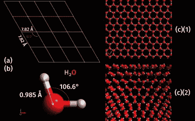

# 由磁铁制成的气体模型

> 原文：<https://hackaday.com/2017/08/15/a-gas-model-made-of-magnets/>

磁铁是很棒的东西，每个人都喜欢它们，你可以用它们做很多事情，包括创建固体晶体结构的模型，就像[科迪的实验室]使用一对有机玻璃板内的一堆磁铁所做的那样。

Crystal structure of ice. Image from [Wikemedia Commons](https://en.wikipedia.org/wiki/Crystal_structure#/media/File:Ice_Ih_Crystal_Lattice.png).

许多材料的原子排列成高度有序的微观结构——晶体——包括大多数金属、岩石、陶瓷和冰等。当材料固化寻找最小能量配置时，结构出现。每个原子通过微观力与它的邻居相互作用，根据特定的材料和条件形成几种模式。

在他的宏观世界里，[科迪的实验室]用磁铁作为他的“原子”，它们之间的磁斥力代表微观力。将磁体限制在两个透明的壁内，人们可以看到磁体一个接一个地添加时晶体结构的形成。

这是一个很好的教学资源，也是一种有趣的玩磁铁的方式，如果你想试试的话。或者，如果你想要另一个磁铁黑客，我们有很多，包括[将它们植入你的身体](http://hackaday.com/2012/05/13/hacking-magnets-into-your-skin/)，或者[用 3D 打印制作自己的](http://hackaday.com/2016/11/12/3d-printing-permanent-magnets/)。

 [https://www.youtube.com/embed/XNCIp3fm7V0?version=3&rel=1&showsearch=0&showinfo=1&iv_load_policy=1&fs=1&hl=en-US&autohide=2&wmode=transparent](https://www.youtube.com/embed/XNCIp3fm7V0?version=3&rel=1&showsearch=0&showinfo=1&iv_load_policy=1&fs=1&hl=en-US&autohide=2&wmode=transparent)

