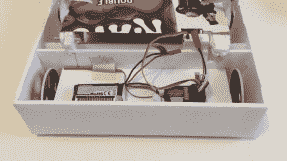
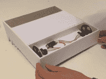
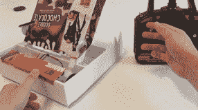

# Krave Antweight 机器人被吃掉后还活着

> 原文：<https://hackaday.com/2017/08/17/krave-antweight-robot-gets-eaten-and-stays-alive/>

战斗已经结束，结果已经揭晓——[alta powder dog]的，又名[Carter Hurd]，[纸板和泡沫装甲，轻量级 Krave 机器人](https://www.youtube.com/watch?v=AurvMibcPsI)在 2016 年击败了它的金属兄弟，在 2017 年表现良好。你问一个纸板 Krave 麦片盒和泡沫板机器人是怎么做到的？纸板和泡沫外部结构被切片、粉碎，通常被吃掉，而精密的电子设备、马达和车轮仍然安全地埋在里面。

我们报道了他的 2016 版的制作，但没有跟进它在当年的[伊利诺伊州机器人斗殴](http://www.circpeoria.org/category/bot-brawls/)比赛中的表现。正如你在下面激动人心的第一个视频中看到的，尽管它的装甲遭受了反复的严重损坏，它还是赢得了 1 磅重量级的第一名！

  Battery and RC receiver  Wheels, motors and speed controller  Finished Krave robot

2017 年，他又做了一个，但重量减半了——所以他做了两个！让他们在 12 英寸乘 12 英寸的范围内开始，他们可以作为一个团队战斗。他是怎么让它变轻的？部分是通过取消前面的金属唇的能力来完成的，轮子从四个减少到两个，一个更小的伺服系统用于打开和关闭嘴。完整的构建视频与 2017 年他获得第七名的战斗视频一起显示在下面。

2016 年的胜利战役…

 [https://www.youtube.com/embed/NX9vPZiAFpc?version=3&rel=1&showsearch=0&showinfo=1&iv_load_policy=1&fs=1&hl=en-US&autohide=2&wmode=transparent](https://www.youtube.com/embed/NX9vPZiAFpc?version=3&rel=1&showsearch=0&showinfo=1&iv_load_policy=1&fs=1&hl=en-US&autohide=2&wmode=transparent)

制造 2017 年机器人…

 [https://www.youtube.com/embed/AurvMibcPsI?version=3&rel=1&showsearch=0&showinfo=1&iv_load_policy=1&fs=1&hl=en-US&autohide=2&wmode=transparent](https://www.youtube.com/embed/AurvMibcPsI?version=3&rel=1&showsearch=0&showinfo=1&iv_load_policy=1&fs=1&hl=en-US&autohide=2&wmode=transparent)

2017 年的战斗…

 [https://www.youtube.com/embed/VuBxSCYeNPo?version=3&rel=1&showsearch=0&showinfo=1&iv_load_policy=1&fs=1&hl=en-US&autohide=2&wmode=transparent](https://www.youtube.com/embed/VuBxSCYeNPo?version=3&rel=1&showsearch=0&showinfo=1&iv_load_policy=1&fs=1&hl=en-US&autohide=2&wmode=transparent)

Krave 麦片盒机器人并不是我们在这里讨论的唯一一个与食物相关的机器人。看看这个[黄油传递战斗机器人](http://hackaday.com/2017/05/06/butter-passing-battlebot/)和这个由南瓜制成的[战斗机器人。](http://hackaday.com/2016/10/28/dont-make-your-battlebot-out-of-a-pumpkin/)