# 控制你的 LED

> 原文：<https://hackaday.com/2017/08/29/control-thy-led/>

在之前的一篇文章中，我讨论了 led 的一般特性。在这篇文章中，我想举一些驱动 led 的例子，并比较几种最常用的方法。没有“放之四海而皆准”的方法，但我会尽可能地尝试和归纳。这个想法是为了能够有效地控制 LED 的亮度，并延长它们的寿命。如果你打算长期使用它们，一个高效的司机会带来很大的不同。让我们看看问题，然后讨论解决方案。

# LED 亮度控制问题

大多数新手都会对制作一个不会爆炸的发光二极管感兴趣。再往下一点，它归结为亮度控制，然后混合颜色，从颜色选择器产生任何阴影。在任何情况下，对最终应用有一个清晰的理解是至关重要的。诸如工作台灯的照明应用将很少需要浪漫情调灯控制。相反，迪斯科灯需要不同颜色发光二极管的不同强度。

那么亮度是如何感知的呢？从逻辑上讲，当你有两个 100 流明的 led 灯时，结果应该是亮度加倍。实际上，人类的眼睛对强度变化是对数敏感的，这意味着强度加倍将被感知为微小的变化。

对光强度的感知遵循史蒂文斯幂定律，其指数取决于你的视野被光占据的程度。对于 5 度的光斑，指数约为 0.33，但是对于点光源，指数约为 0.5。这意味着一个 5 度的点光源需要增加 8 倍才能看起来亮两倍，一个点光源需要增加 4 倍才能看起来亮两倍。

让我们从一个简单的 1 W 贴片 LED 开始，就像来自 [Adafruit](https://www.adafruit.com/product/518) 的那种。这个额定为 90 流明，配有一个铝制 PCB 作为散热器。下面是 LED 的一些参数。

数据手册中有一些非常重要的信息，从正向电流(连续)和峰值正向电流开始。数值分别为 350 mA 和 500 mA，不应超过。

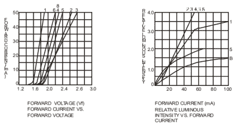

使用了两个更重要的信息，用图形表示。第一个是正向电流和电压图，显示 1.8 V 左右的电压足以正向偏置 LED。此后，电流以欧姆级上升，在大约 3 V 时，据报道消耗大约 200 mA。第二条曲线是相对的 L1 对正向电流，其显示电流控制光输出的量(延伸到“4”标记的直线)。

鉴于 LED 遵循欧姆定律，电流应该与电压成正比，因此我们可以改变电压来控制亮度。只有一个小问题，即正向电流的曲线非常陡峭，电压的小增量会导致电流的大变化。如果连接一个硬币电池而不是两节碱性电池，亮度会有所不同。两者都有 3 V 的电位差，但两者提供的电流量不同，因此亮度也不同。与其控制电压，不如直接控制通过 LED 的电流。

## 简单的方法

最简单的方法是增加一个与 LED 串联的电位计。简单！基本上，当你改变电阻时，欧姆定律开始生效，瞧！可变电阻等于可变电流等于可变亮度。

[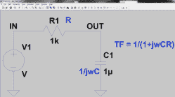](https://hackaday.com/2017/08/29/control-thy-led/screen-shot-2017-08-14-at-4-29-24-pm/)[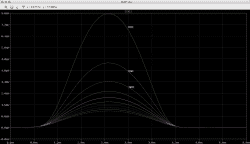](https://hackaday.com/2017/08/29/control-thy-led/screen-shot-2017-08-14-at-5-04-35-pm/)

这是一个 LED 的模拟图，可变电阻从 100 欧姆到 1 千欧姆不等。唯一的问题是，如果 LED 的电阻发生变化或电压波动，结果可能是毁灭性的。这本质上是开环控制，除了改变亮度之外，没有从电路到用户的反馈。

当然，还有效率问题，因为电位计也会消耗功率。

## 日常检查

下一个最简单的方法是创建一个恒流电路。有多种方法可以创建一个简单的恒流源，我强烈推荐阅读《电子艺术》这本书，以获得详细的解释。毫不奇怪，维基百科上也有一篇关于这个主题的文章。

您可以使用经典的 LM317 可变电压调节器来提供[小恒流](http://theparanoidtroll.com/2011/01/05/constant-current-sourceload-lm317/)。它的效率不是很高，因为在较高电流下，调节电阻会散发大量热量。

更好的方法是使用提供模拟反馈的闭环电路来抑制过大的电流并补偿负载的变化。所示电路是一个简单的限流器，推荐使用，因为它比其它晶体管电路具有更高的效率。

它的作用是限制通过 R_sense 的电流，使其压降不超过 0.6 V，如果发生这种情况，Q2 开启，Q1 关闭，从而限制通过 R_load 的电流，本例中 R _ load 是一个 LED。调节 R_sense 利用欧姆定律，我们可以调节 LED 的最大电流。

我个人更喜欢上面的电路，用 MOSFET 代替 Q1，但是如果我们想用数字方式控制亮度，下一个方法会更适合。

## 数字方法

下一个电路包括使用一组脉冲来打开和关闭通过 LED 的电流。这就像快速按下电源开关，灯光似乎变暗了。通常称为 PWM 或脉宽调制，一系列具有可变占空比或开关时间的脉冲可用于该任务。

在这个题目下，有两个部分要讨论。第一个是开关源，可以是简单的振荡器或微控制器。第二个是开关本身，这将是本设计的驱动阶段。让我们简单地看一下这两者。

### PWM 源

为了产生脉冲，简陋的 555 是一个很好的选择。该电路显示了一个简单的 PWM 电路，T1 为开关元件。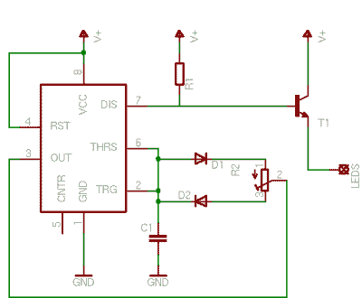

对于产生脉冲，humble 555 是一个很好的选择。下面的电路显示了一个简单的 PWM 电路，T1 是开关元件。

在这一点上，我们有许多选择和问题需要回答。

1.PWM 的正确频率是多少？

2.我如何知道供应的电流量

3.这一切是如何影响亮度的？

PWM 的频率影响所感知的闪烁。一个简单的例子是，当在 60 赫兹的照明环境下录制数字视频时，如果使用 NTSC，您的相机会出现大量闪烁，切换到 PAL 会有很大帮助。对于 PAL，它是 50 赫兹，所以现在就用你的网络摄像头试一试，看看效果。

这个想法是，开关频率越高越好，但你不能任意高。请记住，所有 led 都有一个开启时间，这是它打开并开始发光所需的时间。如果开关太快，LED 就不会亮。另一个结果是，频率对开关元件的效率有影响，我们一会儿会谈到这一点。现在我们需要找出 LED 的最佳频率。向上滚动，查看数据表片段中的最后一个条目。

它表示 1 KHz，这是制造商的建议值，大多数情况下，数据手册中会提供这一信息。如果不是，那么高于 500 Hz 的任何频率都是可用的。查看此[链接](https://www.digikey.com/en/articles/techzone/2016/oct/how-to-dim-an-led-without-compromising-light-quality)了解调光 led 的应用。

由于这项技术允许对电流进行数字控制，因此亮度，下一步将是找出一种控制亮度的方法。请记住，LI 与电流成正比，但感知亮度是对数关系。我们需要将线性步进输入转换为对数电流变化。

当使用微控制器甚至 FPGAs 时，答案非常简单——loookup 表！具有对应于一系列感知亮度值的 PWM 占空比列表。我不得不提到的一个很好的例子是这里的，设计人员使用 FPGA 来创建对数 LUT，以根据用户输入生成线性 PLI。Arduino 可以使用相同的查找表，我强烈建议您尝试一下。

个人提示:当 LED 最初出现时，我们面临的一个问题是，灯具自带的 LED 驱动器会出现故障。我最初设计了一个小电路来限制电流，如果开关元件过热，我还设计了一个热敏电阻来关闭 LED。最终，专用的解决方案开始出现，我们将在后续章节中讨论。

### 让我们换一下:MOSFET 与 BJT

菜单上的第二项是实际的开关元件。根据你的预算和心态，你可以使用 BJT、FET 或 MOSFET。BJT 更简单，只需要很少的附加元件。2N2222 可以安全地处理 800 mA 的电流，这对于许多应用来说都是好事。

另一方面，MOSFETS 对元件的要求更高，需要小心部署。作为交换，它们的导通电阻要小得多，只有几毫欧，效率更高。让我们来看看两者。

### BJT 领导的司机

这里是最简单的 BJT LED 驱动电路。它由一个共发射极连接的晶体管组成。当输入开关闭合时，晶体管导通，允许电流从 LED 流向接地端。电阻计算如下

r0 = (Va+Vce) / Ic，其中 Va 为早期电压。

这不是恒定的，并且随着晶体管的工作点而变化，并且在饱和条件下大约为几欧姆。对于几毫安来说，功耗微不足道，但对于较大的电流消耗来说，很快就会成为一个问题。

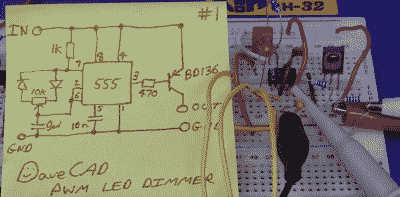

我向你推荐 EEVBlog 的[达夫·琼斯]的一个视频帖子，其中他使用 BD136 和 555 来改变一件设备上的 led 的亮度。这适用于低瓦数的负载，但是如果你想驱动更大的 led，那么就要增加一些相当大的散热器。

### MOSFETs 是 LED 最好的朋友

MOSFET 的导通电阻非常低，只有几毫欧，这意味着在这种状态下，根据 P = I ² R，它将散发非常少量的热量。

由于这些是电压驱动器件，具有非常高的输入阻抗，因此我们可以安全地将它们并联在一起。不幸的是，这些也容易受到假导通事件的影响，因此对于开关应用，电路必须仔细设计。更详细的解释可在[这里](http://www.electronicdesign.com/power/mosfet-design-basics-you-need-know-part-1)找到，不过对于这篇文章，我们将继续讨论一个一般案例。

#### 设计一盏灯

我最近从当地一家五金店买了两块没有品牌的 LED 面板。卖家告诉我，我应该将它们连接到 12 V 的电源上，它们就会工作。当我把它们连在一起并连接到一个台式电源上时，我发现在 12 伏的电压下，它们可以吸收高达 2.7 安培的电流！近距离的亮度很吓人，我需要控制它们的亮度。

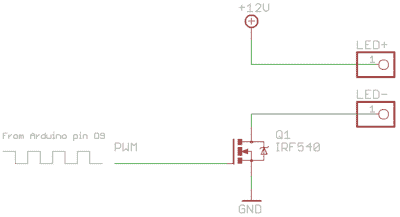下一步是找出最适合的 MOSFET。考虑到切换时的过冲，为了安全起见，我希望使用 20 V 甚至 30 V 的漏源电压器件。至于电流，如果我打算通过大约 5 安培的峰值电流，0.1 欧姆的 Res(ON)将意味着 2.5 瓦！在这种情况下，我的散热器成本将极大地影响我的最终产品。相反，我喜欢导通电阻很小的器件，比如 0.01 欧姆或更小，尤其是 SMD 器件。

接下来，我打算用 555 或 Arduino 来切换 MOSFET。这相当于 5 V Vgs，因此逻辑电平 MOSFETs 是首选；虽然我将用 12 伏电源驱动 led，因此我可以使用晶体管或专用 MOSFET 驱动器。没有它，有效电阻会更高，但仍然值得一试。

我还想看看 PH2520U 和现在已经过时的逻辑级 MOSFET MTP 3055 VL。MTP3055VL 具有相对较高的导通电阻，可以在 5.0 伏下导通，代价是 0.18 欧姆和大量功耗。

IRF530、IRF540、IRFZ44N 和 AO3400A 都是不错的选择，因为我有几个库存。用一个 IRFZ44N，我做了一个简单的 LED 驱动，直接用了一个 Arduino Uno。请记住，Arduino 引脚最高可达 5V，我使用的 fade 示例可以即时生成 PWM。PWM 信号的频率为 490 Hz，相当不错。

结果是面板的有效变暗。然而，仔细观察波形，我们发现单个 LED 面板的输出具有显著的上升时间。

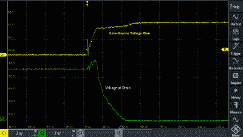

这是由于容性寄生效应和弱电流驱动造成的，可以通过增加一个晶体管驱动级来弥补。这份 [TI 应用报告](http://www.ti.com/lit/ml/slua618/slua618.pdf) (PDF)很好地记录了栅极驱动器电路，参考了由【Joost Yervante Damad】在[详细研究过的同相双极性图腾柱驱动器](http://joost.damad.be/2012/09/dimming-12v-led-strip-with-mosfet-and.html)。由于我们的开关频率处于较低的范围，这些开关损耗是微不足道的。如果我们在 kHz 或 MHz 范围内切换，这些寄生效应将很快导致原型的死亡。

在我的例子中，我没有驱动级，但修改了 75%占空比的代码，并测量了不同 PWM 值下的电流消耗。原来它吸收的峰值电流略低于 1 A。MOSFET 不会发热到需要散热器的程度，因此该电路也可用于 LED 面板。我可以继续为我的小灯制作 PCB，但是，还有一个选项我想看一下。

## **LED** 驱动器

[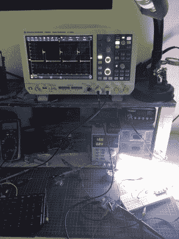](https://hackaday.com/wp-content/uploads/2017/08/img_4367.jpg) 专用 LED 驱动芯片使您能够有效控制 LED，而无需考虑所有参数。TPS92512 就是一个很好的例子，它允许使用内部控制的 PWM 来控制高亮度 led。电流控制在内部实现，包括 PWM 和模拟信号在内的外部信号可用于线性控制亮度。不需要查找表。

我用相同的 LED 面板连接了一个测试板，以便使用 IADJ 引脚控制亮度。使用一个简单的预置来改变所需引脚上的电压，范围为 0.8 至 1.8 伏。输出是一个干净有效的变化电压，由输出级电容过滤。

在电感之间探测时，PWM 频率约为 580 kHz。我在输出 LED 引脚上看不到任何振荡，但这意味着滤波器级有效地完成了工作。我在 [Autodesk Eagle](https://github.com/inderpreet/TPS92512_Eagle) (GitHub)中创建了一个 PCB 的 DIY 版本，你可以下载来自己制作。

 [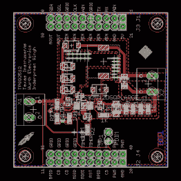](https://hackaday.com/2017/08/29/control-thy-led/layout-tps/)  [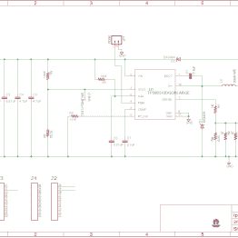](https://hackaday.com/2017/08/29/control-thy-led/sche-tps/)  [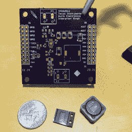](https://hackaday.com/2017/08/29/control-thy-led/img_4368/) 

有一点 OSHPark 紫色在那里，我希望自己焊接它。看着别针的大小，这应该是一个有趣的练习。如果你自己做一个让我知道。

# 结论

那么，如何驱动 LED 呢？答案就在你的应用领域。对于小的 LED 电流消耗，BJT 更简单且最便宜。对于中等电流消耗，MOSFETs 是更好的选择，如果您想要提供出色开箱即用体验的解决方案，专用驱动器芯片是最佳选择。至于我，我有一个灯要完成，它将使用中间的道路，因为它在我的测试中工作。如果我在视频中看到闪烁，TPS92512 解决方案会非常方便。我相信你有自己的解决方案，分享它的最佳方式是在 Hackaday.io 上的一个项目。来吧，做一盏像雪一样白的小灯，与我们分享你的故事。