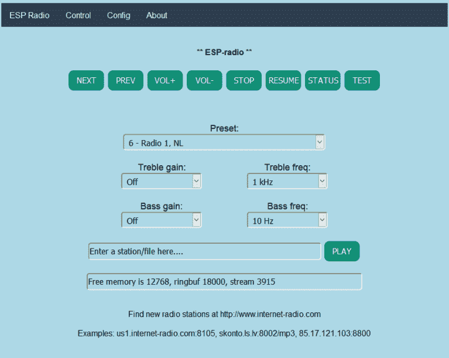

# 基于 ESP8266 的互联网收音机功能丰富

> 原文：<https://hackaday.com/2017/08/22/esp8266-based-internet-radio-receiver-is-packed-with-features/>

有一台无法修复的漂亮古董收音机？这个由[Edzelf]设计的基于[ESP8266 的互联网收音机](http://github.com/Edzelf/Esp-radio)将是让它再次运行的一个极好的起点，作为基于[Raspberry-Pi 的设计](http://hackaday.com/2013/07/14/simple-looking-antique-internet-radio-has-a-lot-under-the-hood/)的替代方案。基本前提很简单:ESP8266 处理与您选择的互联网广播电台的连接，VS1053 编解码器模块解码该流以产生音频信号(这将需要某种形式的放大)。

除了[出色的文档](http://github.com/Edzelf/Esp-radio/blob/master/ESP-radio.pdf) (PDF 警告)之外，这个固件真正闪光的地方是增加了大量的功能。它包括一个网络界面，允许您选择任意电台，并通过预设循环，调整音量，低音和高音。

如果你喜欢物理控制，它支持按钮和转盘。如果您想要更多的物联网，它也可以由 MQTT 协议控制。它甚至默认支持彩色 TFT 屏幕，尽管这减少了可用于按钮输入的引脚数量。

该固件还支持播放服务器上的任意. mp3 文件。鉴于该设备的零件数量少，控制选项丰富，我们可以看到这种设备进入门铃，恶作剧和小型博物馆展览。

要查看它的运行情况，请观看下面的视频:

[谢谢杰西]

 [https://www.youtube.com/embed/Rc8va3NSI8A?version=3&rel=1&showsearch=0&showinfo=1&iv_load_policy=1&fs=1&hl=en-US&autohide=2&wmode=transparent](https://www.youtube.com/embed/Rc8va3NSI8A?version=3&rel=1&showsearch=0&showinfo=1&iv_load_policy=1&fs=1&hl=en-US&autohide=2&wmode=transparent)

