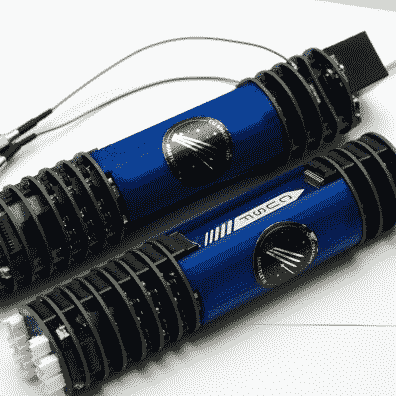
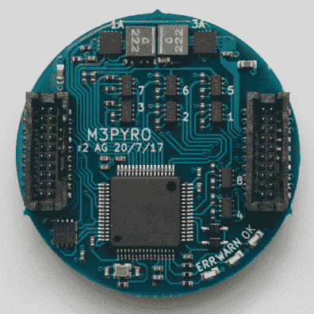

# 开源模块化火箭航空电子设备包

> 原文：<https://hackaday.com/2017/08/21/open-source-modular-rocket-avionics-package/>

剑桥研究生[Adam Greig]帮助设计了一个火箭航空电子系统，由一系列堆叠排列的盘形 PCB 组成。有很多东西进入了这个系统，你可以通过 flickr 相册好好看看。

在剑桥大学太空飞行项目的帮助下建造的 Martlet 是一种三级探空火箭，依靠 Cesaroni Pro98 发动机可以升空 15 公里/50 公里。[Adam]的控制系统在各种电路板上使用了几个 Arm Cortex M4s，而不是只有一个大脑控制一切。

    

每个光盘都是一个模块，在系统中扮演着特定的角色。有几个电源板支持 twin LTC2975，能够为十几个不同的电路提供定制电源。动力系统有一个主控板，上面还有一个 M4。导航系统有一个 IMU 板，包括加速度计、磁力计、陀螺仪和气压计，所有这些都由一种算法监控，该算法计算火箭在飞行中的位置和姿态。有一个无线电板，带有 GPS 接收器和 ISM 波段无线电收发器，用于遥测，以及带有 10 个热电偶测量通道的数据记录器。发动机由控制四个不同通道点火电流的 pyro 板控制。垂直间隔物还用于向相邻的板传输电力和数据。

如果您有兴趣了解更多信息，请查看[Adam]的[GitHub 库](https://github.com/cuspaceflight/m3-avionics)上的项目代码和示意图。

亚当对这些页面并不陌生，他的 [Nerf Vulcan 炮塔](http://hackaday.com/2010/06/18/nerf-sentry-turret/)几年前出版，他的[气球跟踪装置](http://hackaday.com/2010/03/17/arduino-balloon-tracking/)最近出版。照片是 CC-SA 格式的，可以在[【Adam】的 Flickr feed](https://www.flickr.com/photos/randomskk/36480971721/) 中找到。