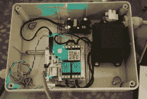

# DIY 无线喷水灭火系统？不要介意我这样做。

> 原文：<https://hackaday.com/2017/09/05/diy-wireless-sprinkler-system-dont-mind-if-i-do/>

一旦你的房子安装了自动喷水灭火系统，该怎么做:买一个自动喷水灭火系统还是自己做一个？[后者，显然是](https://blog.danman.eu/wifi-enabled-sprinkler-controller/)。

[danaman]决心拼凑一个廉价的物联网系统，但这并不容易——花了一年多的时间才开始工作。他没有从零开始，而是使用了开源的可持续灌溉平台(SIP)控制软件——一个 Python 洒水调度程序，具有一些[danman]正在寻找的功能(例如:如果预报有雨，它就不会激活)。因为他没有像推荐的那样用 Raspberry Pi 运行它，[danman]写了一个 Python 插件，作为守护进程在他的家庭服务器上运行，监听 TCP 端口 20000 的连接，然后更新相关的中继。好了，软件搞定；在继电器控制器盒上！

【丹曼】的洒水系统有四个 12V 的交流阀门需要争论，没有数据线，需要  无线设置。最初，他的控制箱包含一个 240V 交流到 12V 交流 50VA 变压器为阀门供电，以及一个 240 AC 到 5V DC 电源为 USB 继电器板和 WiFi 路由器供电。然而，一旦连接到外部，路由器就无法进行可靠的连接。[danman]订购了一台 ESP8266 并进行第二次尝试——在 LUA 编写一个程序来连接 SIP 调度程序，但现在继电器的串行连接是不可靠的链接。挫败感！

[danman]选择了一个更全面的解决方案，他选择了一个 link node R4——一个集成了 ESP8266 并由 ESP 的 GPIO 引脚直接控制的继电器控制器——并重用了他在第二次尝试中编写的代码，取得了巨大的成功！

[danman]的代码可以在他的博客文章中找到，你一直在考虑为你自己的财产建立这样一个系统。也就是说，除非你想要火力稍微强一点的东西。