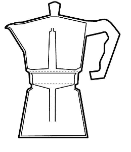

# DIY 摩卡炊具

> 原文：<https://hackaday.com/2017/08/27/diy-mocha-cooker/>

食品级 3D 打印细丝正在兴起，在办公室里有一个定制的咖啡杯来给当地人灌输一点羡慕是很好的。[Stefan]自己创造了一个摩卡机器，他将 3D 打印并测试他的细丝的边界。

[Stefan]使用 Fusion 360 复制了著名的 Bialetti 陆丹蓝快速锅的真实八角形。由于壶在压力下煮咖啡，他在 Fusion 360 中测试了公差，以确保所有厚度都正确。在打印设计时，增加了一个钢垫圈来促进感应加热，因为你不能真的把塑料罐放在火焰上。这张照片使用的是在 110 摄氏度下退火一小时的 Formfutura 火山 PLA。

下面是整个过程的视频，虽然材料可能不是食品级的，但这个项目绝对是朝着正确方向迈出的一步。由于打印部件可以承受高达 160 摄氏度的温度，涉及沸水或结晶实验的项目可以从定制设计中受益。

我们真的希望看到更多使用这种技术的项目，然而，对于那些现在正在看他们的咖啡机的人来说，看看[更多的咖啡机黑客](http://hackaday.com/2016/01/28/hacking-a-coffee-machine/)以及[闹钟黑客](http://hackaday.com/2017/05/21/wake-up-to-fresh-coffee/)在早上煮咖啡。

谢谢你的提示

 [https://www.youtube.com/embed/OzfXVH59LjM?version=3&rel=1&showsearch=0&showinfo=1&iv_load_policy=1&fs=1&hl=en-US&autohide=2&wmode=transparent](https://www.youtube.com/embed/OzfXVH59LjM?version=3&rel=1&showsearch=0&showinfo=1&iv_load_policy=1&fs=1&hl=en-US&autohide=2&wmode=transparent)

