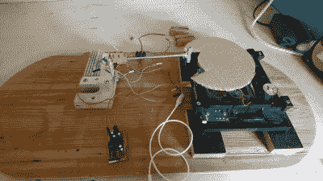

# 注定要失败的白炽灯

> 原文：<https://hackaday.com/2017/08/28/doomed-incandescent-light-blinker/>

【Jānis】入围闪灯奖从一开始就注定了。或者我们应该说末日来临了？这是一个复杂的鲁布-戈德伯格式的混乱，基本上保证了他没有时间制作一个合适的视频，提交和参赛。但它也遭遇了厄运。或者至少在上跑了*的厄运。*

(注意:[Jānis]在电子邮件中向我们发送了这一黑客攻击——这里没有这篇博文的链接。你正在此时此地阅读它。)

 它始于一台从 DVD 播放机中抢救出来的 DC 电机，它转动一个轮子，来回拨动开关，从而改变电机的电源极性。这就像一台[最没用的机器](http://hackaday.com/?s=useless%20machine)，但是没有人参与。这个装置周期性地按下一个被掏空了内脏的鼠标上的按钮。

在多人末日游戏中，在一台电脑上按下鼠标按钮发射一枚火箭，并触发墙上的一盏灯。另一台电脑上的第二台毁灭战士面对着墙坐着。当 LCD 闪烁时，悬挂在玩家 2 的显示器前的太阳能电池发出高电压和低电压。该输出进入 Arduino 克隆的 ADC，驱动晶体管驱动继电器打开和关闭灯泡。

我们观看了所有的[闪光灯奖](https://www.flashinglightprize.com/)的参赛作品，从中获得了很多乐趣，我们也为荣誉提名名单中出现了如此多的 Hackaday 常客而感到兴奋。(难过地看到【雪碧】的[僻](http://hackaday.com/2017/07/06/blinking-a-light-with-ping/)没有晋级！)

如果你，像[Jānis]一样，仍然坐在一个设计上，不要烦恼。看来这个奖明年会有回报。呜！

[https://videopress.com/embed/M50vfygi?hd=1&cover=1&loop=0&autoPlay=0&permalink=1&muted=0&controls=1&playsinline=0&useAverageColor=0](https://videopress.com/embed/M50vfygi?hd=1&cover=1&loop=0&autoPlay=0&permalink=1&muted=0&controls=1&playsinline=0&useAverageColor=0)