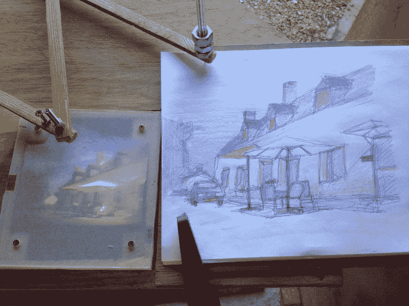

# 用传统的方法描绘场景

> 原文：<https://hackaday.com/2017/09/02/tracing-a-scene-an-old-fashioned-way/>

拍照就像轻点屏幕一样简单。画一个令人难忘的场景，即使它就在你面前，也是一种完全不同的技能。所以追踪它！嗯，没有[适当的准备](http://imgur.com/gallery/tmgGc)，这有点难做到。

[bobsteaman]的方法是首先制作一个受电弓——在末端用一个毡制标记进行测试效果很好。接下来，他在一个小木头盒子里装了一个暗箱，盒子顶部是哑光的有机玻璃，效果不太好。相机针孔光圈上方的放大镜有所帮助，但需要进行艰苦的测试，以确保它设置在完美的位置，以获得清晰的图像。哑光有机玻璃也被扔掉，经过一些实验后，用夹在两片透明有机玻璃之间的半透明烘焙纸代替。结果很难反驳。

这个暗箱被捆绑在一张绘图桌上，下面装有一面 45 度角的镜子，所以它可以投射到有机玻璃的下面。受电弓接头处的一个钝钉子和一支笔复制了摄像机捕捉到的任何东西。现在，[bobsteaman]被迫把它放在他汽车的后备箱里，以捕捉他渴望的迷人场景，但也可以方便地拿出来招待客人。

照相机 obsucra 是一项古老的技术，但是它的用途从[观察最近的日食](http://hackaday.com/2017/08/18/catch-the-eclipse-with-a-wearable-pinhole-camera/)延伸到[实际拍照](http://hackaday.com/2012/10/25/a-beautiful-pinhole-camera-takes-wonderful-photos/)！

[via [/r/somethingimade](https://www.reddit.com/r/somethingimade/comments/6tmgct/ive_made_a_drawingmachine_pantograph_and/)