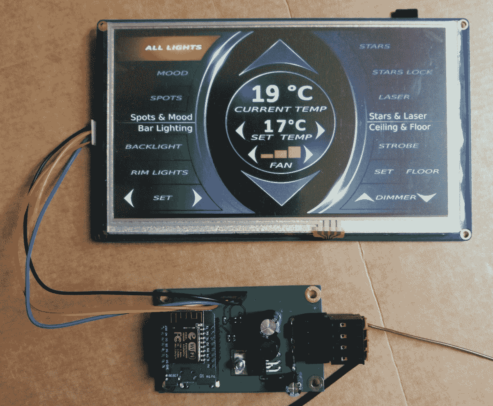

# ESP8266 为加长豪华轿车增加了光滑的触摸屏控制

> 原文：<https://hackaday.com/2017/08/29/esp8266-adds-slick-touchscreen-controls-to-a-stretch-limo/>

ESP8266 WiFi 模块的流行与其廉价连接互联网的能力有很大关系。然而，[hwhardsoft]的 [stretch limousine 环境控制系统](http://hackaday.io/project/26879-esp8266-controlled-stretch-limousine)探索了这些模块的另一种用途:一种通过公共用户界面将不同系统联系在一起的简单方法。

在基本层面上，这个问题是我们都面临过的:具有多个控制界面的多个设备造成了尴尬的用户体验。你曾经在一个有 6 个品牌的空调需要 6 个不同遥控器的办公室工作过吗？由于其低成本、支持 Wi-Fi、串行和 GPIO，ESP8266 板是为多个设备创建统一控制系统的合理候选。ESP32 更是如此，因为它增加了蓝牙支持。

[hwhardsoft]的用例相当简单。豪华轿车(林肯加长版)有多个 LED 照明控制器、气候控制和激光投影仪。这并不完全是一个流畅的用户体验，所以[hwhardsoft]将所有的控制捆绑到两个光滑的触摸屏界面上(大概一个给司机，一个给乘客)。

每个触摸屏使用 UDP 通过 Wi-Fi 向控制板发送命令，控制板切换继电器来控制不同的设备，[正如我们之前看到的](http://hackaday.com/2017/06/04/esp8266-mqtt-remote-gate-entry/)。

虽然继电器在这里可能不是理想的解决方案，但这些控制板已经存在并发挥作用，所以扔掉它们是浪费。适用于未来项目的一个简单改进是使用 NPN 晶体管来模拟遥控器上的按钮按压。这非常有效，降低了成本、功耗和器件数量，同时更快、更可靠、更安静。

如果你想在家里或办公室建造类似的东西，但想使用 Android 智能手机而不是触摸屏，那么 [Kivy Python 模块](http://kivy.org)可以让你做到这一点。设置一个带有按钮、下拉列表和文本输入的简单界面并通过 UDP 将数据发送到 ESP8266 是非常容易的。