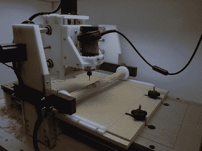

# 绕第四轴滚动

> 原文：<https://hackaday.com/2017/09/03/rolling-around-a-4th-axis/>

[Perry]对在他的数控机床上增加第四个轴很感兴趣，但对花费数百美元购买零件和电子设备使其工作的前景不太感兴趣。不过，有一种非常聪明且非常便宜的方法可以为数控机床添加第四轴，经过一点加工后，他能够[为他的机床](http://perryprojects.blogspot.com/2017/08/cnc-4th-axis.html)添加一个“滚动”的第四轴。

 

【摇头晃脑】的‘滚动’第 4 轴。

这个构建的想法来自 CNC Shark 论坛上的【Bob】[。[Bob]没有增加电机来旋转工件，而是简单地将工件安装在两个钳口之间，并靠着 CNC 刳刨机的底座滚动所有东西。不知道那是什么意思？看看右边的图片，你会看到用 Delrin 和 HDPE 制成的 brilliance。通过将两个齿条安装在床身上，将两个齿轮夹爪安装在机器的托架上，在 Y 轴上移动刳刨机也会旋转第四轴。这太聪明了。它不需要任何额外的电子设备，唯一的软件调整是一点 g 代码黑客。](http://www.cncsharktalk.com/viewtopic.php?f=12&t=1521)

[Perry]看了一眼[Bob]的项目，决定这将是为他获得第四轴的完美构建。这个建筑的部件由黑色高密度聚乙烯制成，唯一真正改变的设计是一个“可变长度”的第四轴。不是两个齿条安装在机器的床上，[Perry]的构建只使用一个齿条，另一端只是在床上滚动。

有很多聪明的发明都行不通，那么这个 CNC hack 有什么定论呢？实际上看起来很不错。[佩里]能够把一些方形股票变成圆形股票，并能够雕刻一个圆柱体周围的螺旋。你可以看看下面的视频。

 [https://www.youtube.com/embed/2ZVmKiehGnU?version=3&rel=1&showsearch=0&showinfo=1&iv_load_policy=1&fs=1&hl=en-US&autohide=2&wmode=transparent](https://www.youtube.com/embed/2ZVmKiehGnU?version=3&rel=1&showsearch=0&showinfo=1&iv_load_policy=1&fs=1&hl=en-US&autohide=2&wmode=transparent)

 [https://www.youtube.com/embed/MhsOeTr2kh4?version=3&rel=1&showsearch=0&showinfo=1&iv_load_policy=1&fs=1&hl=en-US&autohide=2&wmode=transparent](https://www.youtube.com/embed/MhsOeTr2kh4?version=3&rel=1&showsearch=0&showinfo=1&iv_load_policy=1&fs=1&hl=en-US&autohide=2&wmode=transparent)

