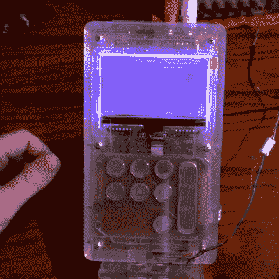

# 便携式 SNES 芯片调播放器

> 原文：<https://hackaday.com/2017/08/30/portable-snes-chiptune-player/>

Chiptunes 是过去复古游戏机的音乐芯片的梦幻般的音乐再现。艺术表演者压倒性地喜欢各种口味的游戏男孩，尽管也有人使用各种各样的机器，如 Commodore 64、世嘉 Genesis 和任天堂娱乐系统。在 chiptune 领域，更不寻常的是超级任天堂，但[kevtris]已经出击，为 SNES 音乐制作了一款 chiptune 播放器。

繁重的工作由 FPGA 完成，它模拟 SNES 的 S-SMP 声音处理器，并处理从 SPC 格式文件加载音乐。作为 chiptunes，这些文件既存储乐器数据，也存储音乐的音符数据。音频输出干净、清晰，[如测试视频中所听到的。](https://www.youtube.com/watch?v=Qbzk2BV-eNY)

The laser cut case lends the device a great aesthetic.

案例设计是这个项目真正的亮点。激光切割透明丙烯酸树脂与明亮的 LCD 字符显示器和一些 led 相结合，产生的效果与您 90 年代平台选择的发光魔法块没有什么不同。它与一些光滑的电容按钮相结合，避免了为笨重的传统按钮钻孔的需要。[kevtris]介绍了机箱设计，展示了如何通过螺钉和支架的组合将所有部件组合在一起。这款表壳由一系列 2D 切片制成，一次叠一层。

这个项目真正突出的是适合和完成。有很多微控制器和 FPGA 项目可以哼出一首曲子，但对外壳设计细节的关注和布局整齐的 PCB 确实为这样的项目增添了光彩。换个角度，为什么不看看这款围绕树莓派打造的 chiptune 播放器呢？

【谢谢莫里斯！]