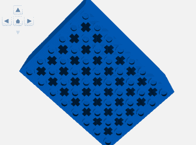
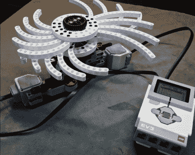
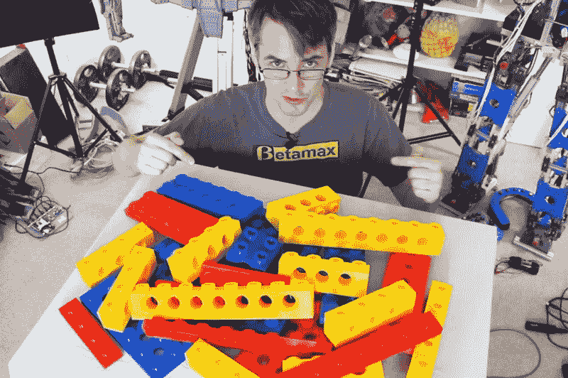
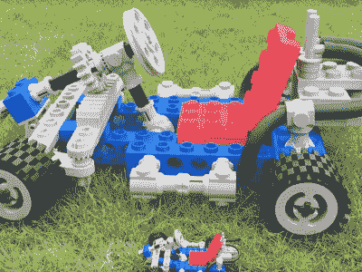

# 我看到了未来，它充满了巨大的砖块

> 原文：<https://hackaday.com/2017/09/08/ive-seen-the-future-and-its-full-of-freakin-huge-bricks/>

"你知道吗，你可以 3D 打印乐高积木，它实际上可以作为普通的乐高积木使用？"我，在 2009 年

这些神奇的文字让我真正体会到了 3D 打印的神奇。那是一段神奇的时光！每个人都在 3D 打印一切，尽管大多数都不是很好，因为技术不存在。但是就像每一项技术都经历了一次进化一样，酷的目标已经超越了过去对每个人都在谈论的新事物的关注。

这些天，没有人会对你的 3D 打印乐高积木感到好奇。尽管如此，当你把那块凹凸不平的塑料看作只是进化中的一步时，它还是相当重要的。我想说的是，我们看到的未来可以用三个词来形容:巨大的砖块。

### 再造那些基本的砖块

2009 年，乐高开始出现在 Thingiverse 上。wizard23 的[参数化乐高积木](https://www.thingiverse.com/thing:591)就是一个很好的例子。一开始肯定是重新创造现有的设计，而不是想出新的设计。没有人在做疯狂的乐高，因为疯狂的部分只是砖块的*制作*。输出可能是(而且经常是)有史以来最具标志性的乐高元素，2×4 的砖块。随着社区和硬件变得越来越好，它们也往往印刷得很差。

然而，有趣的是，乐高积木的数字化再造甚至在十年前就已经不是什么新鲜事了。乐高元素的数字化很早就开始了。1995 年，当大多数人对 3D 打印机的想法是“茶、伯爵茶、热茶”时，一位年轻的澳大利亚乐高书呆子 James Jessiman 发布了一个 DOS 乐高积木程序，其中只有三块积木:2×2、2×3 和 2×4。不幸的是，杰西曼于 1997 年死于流感并发症，年仅 26 岁。然而，他的遗产使 LDraw 在 2002 年成为一个非盈利组织，并且它已经率先以一种深思熟虑、经过同行评审的方式将每一个新发布的乐高产品数字化。除非委员会批准，否则任何元素都不会被添加到 [LDraw](http://www.ldraw.org/) 库中。它也是平台中立的，所以任何独立的乐高建筑程序都可以使用 LDraw 的设计来绘制。

LDraw 独特的 CAD 架构是在开源成为日常概念之前创建的，因此它遵循一些不寻常的规则。每个元素的数据文件只包含指示某种引擎绘制特定形状的文本。主设计的较小部分，如饰钉，是它们自己的文件。因此，一个普通的 2×2 砖块实际上可能由许多子文件组成。基本形状是一个长方形盒子，里面有第二个盒子，倒置。每个文件都是从主零件文件中引用的自己的文件。砖块的边缘是临时绘制的几何图元，但是立柱是一个单独文件的四个实例。

LDraw 项目之所以重要，是因为有史以来第一次，多亏了新兴的互联网，berfans 控制了这个产品。他们有数百台旧电视机需要数字化，每台新电视机出来时，都会被急切地检查是否有新零件。由此产生的库探索死的产品线和模糊的一次性元素。它原本打算用于虚拟建筑项目，但它有一个意想不到的好处:是的，我们可以打印它们。例如，只要找一个导入工具[把你的 LDraw 文件放到搅拌机](https://github.com/TobyLobster/ImportLDraw)上，从那里你可以打印任何东西。

(我应该指出，乐高迷并不是唯一追随这个梦想的人。O.G. LEGO hacker 和 LDraw ninja Philo T. Hurbain [为 LDraw 创建了一个 VEX 库](http://www.philohome.com/vexldraw/vexldraw.htm),允许你以与 LEGO 完全相同的方式构建虚拟 VEX 模型。Thingiverse 有几十种经典 K'nex 连接器的变体，以及大量 VEX 兼容部件。最后，有时建筑设备制造商将数字化视为一种承诺而不是威胁:机器人建筑系统 Actobotics [为每个部件](https://www.servocity.com/step-files)提供 STEP 文件，这些文件可以放入你最喜欢的 CAD 程序中。)

### 拥有模式

Thingiverse 的早期关注点是“哇，打印乐高玩具，实际上可以连接到你在商店里买的玩具上”的新奇因素。我有来自 hackerspace 的照片，这些照片是我们纸杯蛋糕上可怕的乐高打印品，但它们在当时非常酷。记得学过你可以把它们染成 RIT 吗？

随着设计师变得越来越自信，他们创造了更多实用的项目。例如， [GoPro 安装有乐高技术安装孔](https://www.thingiverse.com/thing:2180572)。适配器和连接器之类的东西。艺术集体脂肪实验室在 2012 年创造了现在经典的[免费通用建筑套件](http://fffff.at/free-universal-construction-kit/)，作为对所有那些认真的适配器的模仿。有了这个工具包，你可以连接从乐高到 Tiddlywinks 到林肯原木的所有东西。

这是 superfans 将乐高的模式所有权作为建筑标准的又一个例子。忘记品牌，这是一个可以普遍适用的标准。你不能获得砖块形状或林肯原木形状或任何其他类型建筑的版权，只能获得商业外观的版权。这就是为什么乐高的每个鞋钉上都印着他们的名字。但是如果你能再造一块没有商标的砖头，它就是你的了。

 在另一个让用户控制标准的技术例子中，参数模型激增，允许用户修改砖块配置来创建甚至可能不存在的元素。[cfinke]的[可定制的乐高兼容积木](https://www.thingiverse.com/thing:615256)是你可能需要用来创建任何假设元素的单一工具。你可以用你想要的钉、十字轴孔和技术支架的任何组合来创造一个砖块、盘子或其他形状，不管这是否是你从该公司的官方产品中看到的。您也可以在顶部、底部、两者或两者都不指定立柱。你可以把砖块做得如此怪异，以至于无法成型或印刷。

[Steve Medwin]是另一个探索参数化乐高形状的粉丝。其中一些是好玩的:他的[可定制的弯曲梁](https://www.thingiverse.com/thing:629875)和他的[可定制的乐高技术中心](https://www.thingiverse.com/thing:703993)允许你制作你自己的零件，而公司永远不会这样做，但(理想情况下)可以连接到官方零件。创建一个全新的元素使对话超越了复制一些丹麦工程师的工作，并证明了这个标准不能被包含或控制——它现在已经在野外了。

### 下一次进化:做大

因此，多年来，人们一直在数字化砖块，但直到最近，打印质量才达到乐高零件的打印质量，甚至接近该公司的 ABS 铸件。让我们面对现实吧，乐高集团在工程和质量控制方面享有盛誉。这是书呆子们喜欢它的一个重要原因——不是品牌，不是怀旧，而是对物理部件的设计和生产的关注。

James Bruton [going big with his LEGO](https://www.youtube.com/watch?v=IykkSf5IMJo) prints

但是在过去的几年里，技术已经开始赶上数字化。直到最近，我们才能够使用业余爱好者质量的打印机以足够的精度输出，以公正地对待官方产品。你想知道另一件事吗？人们正在印刷大字体。既然能做一个大的，为什么还要做一个小小的乐高玩具呢？在 Hackaday 上，我们最近写了詹姆斯·布鲁顿的[超大乐高滑板](http://hackaday.com/2017/08/05/electric-lego-longboard-now-complete-with-epic-road-test/)。它由巨大的砖块(如图)组成，他将它们粘在一起，制成了一个厉害的电动滑板。他的朋友马特·丹顿更进一步，造了一辆五倍大小的卡丁车，它是用 ABS 精确打印出来的，以至于他能够在不需要胶水和支撑的情况下组装和拆卸它。Ninjaflex 轮胎与普通尺寸的轮胎一样容易套在塑料轮圈上。衬套如预期的那样固定十字轴的端部。

Matt Denton’s [quintuple-sized GoKart](https://www.youtube.com/watch?v=jDz1jJxER-I)

这些巨型模型之所以成为可能，是因为改进的 3D 打印机不仅大大提高了精度(允许更大的部件实际上作为功能性建筑集工作)，而且具有更大的构建平台，因此部件可以做得更大。[James]和[Matt]使用的 Taz5 打印机采用了 11”x 11”的构建平台，并在 MAKE 2016 年 3D 打印机综述中被评为[最佳整体打印机](http://makezine.com/product-review/lulzbot-taz5/)。

然而，尽管这些项目很糟糕，但它们仅仅触及了可能性的表面。这两个人都用在 Thingiverse 上找到的普通零件做了一些项目。[马特]建造了一个现有模型的放大版。当 Taz5 的质量变得普通时，预计会看到更多更奇怪配置的部件。

也期待看到超大的建筑套件部件——通过参数化模型进行适当定制——成为高品质家具的元素。谁不想要一套用 80/20 加固的 ABS 搁板，或者一盏除了内部布线就像从玩具屋里出来的台灯呢？一切皆有可能，而你有工具让它发生。建造一些巨大的东西。