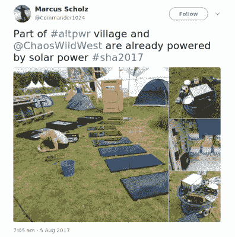
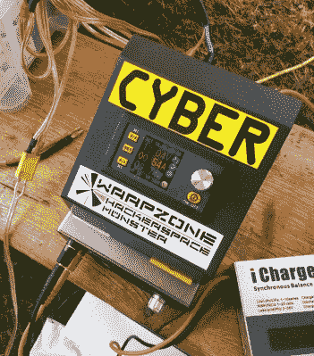

# 分散的低电压地方 DC 电网，它是怎么做的？

> 原文：<https://hackaday.com/2017/09/08/that-decentralised-low-voltage-local-dc-power-grid-how-did-it-do/>

今年早些时候，Hackaday 发表了一篇简短的日常文章，内容是 altpwr.net 背后的人为荷兰 SHACamp 2017 黑客营制定的低压 DC 电网计划。在北半球寒冷的一月写这篇文章的时候，这一事件似乎还很遥远，但随着夏天的消逝，许多沙坎参与者在荷兰的阳光下晒成了深褐色，这是值得回去重新审视这个项目的。他们做到了吗？他们做得怎么样？这并不是我们对 SHACamp 本身报道的一部分，仅仅是一个偶然的故事，碰巧黑客阵营是它的剧院。

## 一个有效的 DC 电力系统

[The SHACamp 2017 solar array when the sun was out](https://twitter.com/Commander1024/status/893835395661803520).

作为一个对 DC 电力感兴趣的人，他们的村庄在我的优先考虑名单上名列前茅，即使它距离英国 hackspaces 村太远，我无法拥有自己的供应。当我在第一天的持续降雨中过来时，我发现的是一个功能齐全的 DC 电网，尽管不像我们第一次报道这个项目时计划的那样雄心勃勃。

电力来自一组太阳能电池板，每块电池板上都有一个 42 伏的调节器。这些都集中在一个中央配电柜中，再由一个分柜分发给村庄和其他用户。全尺寸电网的计划是建立一个这样的机柜网络，然而，志愿者团队在首次部署时面临的巨大后勤挑战意味着展出的系统要小得多。

窥视机柜内部显示了断路器阵列和用于电流监控和电压调节的定制板。使用的电缆不是你所期望的尺寸，因为相对较小的安装尺寸，看起来他们使用了很大的电源电缆，因为电流在它的能力范围内。

Regulator and charger on the other end of the wire in the ChaosWest village

是时候跟随一条蜿蜒穿过 Scoutinglandgoed 草地几百米的电缆了，它带我去了混沌西村，顺便遇到了一个可怕的丙烷营火和一些我吃过的最好的爆米花，但那是另一个故事了。在那里，我找到了他们的端点，以及一个自制的稳压器，它可以对各种电压进行降压，这些电压似乎既用于 LED 照明，也用于为他们的电动汽车阵列充电。据报道，他们的电缆线路上的电压降超过 10 伏，这是其长度和相对较小的铜横截面积不可避免的结果。然而，他们确实有可用的电源，并且正在利用它。

从 SHACamp 2017 DC 电网可以清楚地看到，这是一个功能齐全的操作，能够安全地发电并向与会者配电，他们可以利用商业开关模式转换器板的成本。虽然很明显，这是一个有限的部署，他们在准备活动中可以使用，但它给我们的是一个预览，我们可以在未来的活动中期待什么。

## 可行的概念证明

特别是这篇文章的标题中缺少了 SHACamp 部署的关键词。*分散*。在这种情况下，只有相当于电源节点或电站(如果您愿意的话)和客户节点的东西。你可能会说，这正是中央电力系统的典型，混沌西村的电压下降以明显的方式暴露了它的缺点。令人高兴的是，需要强调的是，这不是设计的问题，而是第一次部署的逻辑之一。该系统是从头开始设计的，从“官方”电力节点的一系列电源向用户供电，并将自己的电力反馈给用户，这为我们提供了一个令人兴奋的前景，即未来的营地将在此基础上建设更广泛、更强大的 DC 电力基础设施，但更少关注电压损失。

因此，在 SHACamp 2017 上审查 DC 电网时，最好不要批评它可能存在的任何缺点。相反，我们应该把这次郊游看作是一个令人兴奋的发展概念的证明，它将成为未来营地的特色。这不是展示 altpwr.net 人的能力极限，而是对未来的尝试，而这只会令人兴奋。

更多关于电网的信息，包括重要的技术细节，可以在[altpwr.net](https://altpwr.net/)找到。