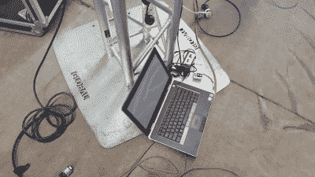
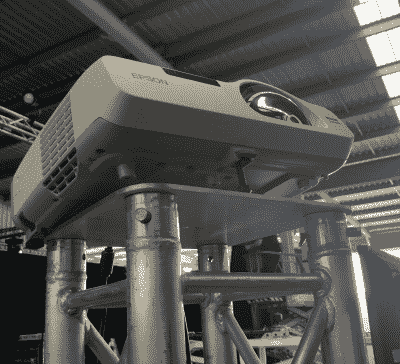

# 黑客英雄主义:打造你走出 AV 地狱的路

> 原文：<https://hackaday.com/2017/09/06/hacker-heroism-building-your-way-out-of-av-hell/>

许多年前，在澳大利亚西海岸一个多雨的水泥丛林里，我为一家中型企业工作，做着各种各样的办公室工作。不知何故，我发现自己正忙于策划一场产品发布会，这超出了我的正式职责范围。我们熬过来了，但在此之前，活动的视听(AV)设置变成了一个巨大的黑客攻击。

最初的计划阶段进行得非常顺利，直到离这个大日子不到一个月的时候，对演示文稿进行了三周的疯狂修改和修订。这是我迄今为止工作生涯中最艰难的几天，因为似乎我们将锁定一项新的安排，但几天后随着一些新的重要标准的出现，我们又将它撕毁，一切又陷入混乱。

事件发生的前一天晚上，事情到了紧要关头。我们与两个不同的影音团队合作，计划在整个场馆安装四台投影屏幕和五台平板电视，并通过中央影音台进行控制。但是在所有这些变化中的某个地方，电视被设置成显示静止图像，或者什么都不显示。我需要在每个屏幕上显示不同的视频，并有能力将它们全部屏蔽掉。

就在这个时候，我意识到我们完蛋了。制作团队根本没有硬件来驱动另外五个屏幕，但他们可以采购——总共 5000 美元。管理层非常愤怒，他们和我一样认为这是我们已经要求并支付的费用。我陷入了僵局，开始怀疑下周一我会不会有工作。我徘徊到一个角落去诅咒，更重要的是，思考。毕竟，我是一名黑客——我可以度过这个难关。

### 那种沮丧的失败感

一般来说，在任何危机中都有几种选择。一个是尖叫着跑来跑去，但我怀疑这不会给我带来结果。在这一点上，我的大脑每分钟都在运转，时而充满沮丧，时而试图拼凑出解决方案。这个问题的定义很简单。我有五台电视，分布在一个房间里。我需要能够以准确的时间触发视频，并使屏幕空白，以满足当晚大揭露的剧场要求。演出大约需要 23 个小时，我只有几百美元的预算来运作。

我的第一个想法是全部手动完成。将一台笔记本电脑挂在每个屏幕上，让舞台工作人员身着黑衣躲在屏幕后面，在适当的时候触发视频。然而，我几乎立刻对这个解决方案打了折扣。房间的布局阻碍了舞台工作人员的有效隐藏，更糟糕的是，我实际上没有舞台工作人员。我也怀疑我能否训练五个人在街上准确地在揭露序列的正确时刻触发视频，即使我能在这么短的时间内找到他们。

### 要是有一种方法能把多台计算机连接在一起就好了

这让我意识到，如果我能自己远程控制笔记本电脑，我也许能把所有的东西整合在一起。当我考虑这是否真的可能时，齿轮开始转动。我需要找到五台能够播放 1080p 画面的笔记本电脑，把它们都连到网络上，并找到某种可靠的远程控制方法，既能启动视频，又能让屏幕空白。

To the untrained eye, they may be just a simple switch and router, but to me, they’re heroes.

怀着一丝希望，我跑回办公室，开始在成堆的旧 IT 设备中挖掘。我想克服的第一个障碍是网络。活动现场没有 WiFi，所以我不得不从头开始搭建。谢天谢地，我找到了我一直在寻找的老式 24 端口惠普交换机，并开始将它连接到几台办公室电脑上。当一切都无法通话时，我的希望暂时破灭了，直到我意识到交换机没有提供 DHCP 租约。然后，Luck 认为适合给我提供一个旧的 TP-Link 家用路由器，突然，当它插入交换机时，灯光闪烁，我开始想知道我是否能完成这个任务。

接下来，我必须找到一种方法，尽可能无缝地在远程机器上运行视频，同时保留屏蔽屏幕的可能性。运气又一次对我有利。该公司购买了 Dameware 远程管理软件，这是一个巧妙而强大的工具，用于远程控制其他计算机。结合远程电脑上的 VLC，我可以控制网络，按空格键，开始播放视频。通过确保前几帧和最后几帧是全黑的，我可以最大化 VLC，并确保屏幕是空白的，直到触发视频的时间。屏幕底部的控件有时会弹出来，但考虑到我发现自己在没有可行的推进方式的情况下在某个污水溪中走了多远，这只是一个小问题。

Every available laptop was pressed into service.

障碍依然存在。我在哪里可以找到五台笔记本电脑？A/V 公司也帮不上什么忙，因为他们的计算机都被锁定了，无法安装远程控制的 Dameware 客户端。然而，这是一次重要的发布，给了我一份小礼物——整个远程销售团队都在城里。发电子邮件，打疯狂的电话，所有可用的笔记本电脑都被征用并投入使用。

### 把你所有的猫都给我！

唯一需要解决的是网络。我本来可以在 TP-Link 无线路由器上运行，但考虑到制作的时间敏感性，我不太喜欢在 WiFi 上运行。如果可能的话，必须装上电线。现在时钟敲到了晚上 10 点，我指示一些同事在早上第一件事就是突袭商店，尽可能多地购买 25 米 Cat5 电缆，并打电话给朋友和家人寻找更多电缆。快到 11 点的时候，我回到床上睡了几个小时，为早上的艰苦战斗做准备。

We had four of these rather awesome short-throw projectors. Very impressive from an optical standpoint.

我不安地睡了一觉后，于 5:30 起床。我把所有我认为可能需要的东西都扔进了车里，直奔工地。这一夜的休息给了我一个好处——我意识到我正在构建的控制屏幕的系统也可以控制我一直假装不存在的四个投影仪。我只需要另外四台笔记本电脑。很简单，对吧？

当我去上班时，这个网站是一个活动的天堂。城镇另一边的商店里的网线开始出现在我的桌子上，甚至老爸爸也过来送一台笔记本电脑、一些 Cat5 和一捆各式各样的视频电缆。毕竟，最好是拥有它，而不是需要它，然后需要它，而不是拥有它。剩下要做的就是建立这个系统，并祈祷它能起作用。我很担心，这是真的——在我内心深处，我不太确定是否真的有任何远程网络软件可以同时控制 9 台独立的计算机。

我们开始铺设电源和网络电缆，并把所有东西连接在一起。这听起来可能微不足道，但筹备这样的大型活动与 2004 年左右邀请一些朋友参加局域网聚会完全不同。必须注意确保你不会到处制造绊倒的危险，当涉及到你的生计时，风险更大。对于一些视频电缆的长度有一些小小的担心，但总的来说，我们坚持下来了。屏幕和投影仪安装在 2 米高的地方，所以几台笔记本电脑最终被放在 1.5 米 VGA 电缆末端的纸箱上。我们尽最大努力清理干净，下午 2 点，我们准备测试。

我和制作团队一起坐在 AV 桌前，开始慢慢登录每台远程机器。我在屏幕上排列了九个窗口，确保每个窗口都加载了正确的视频，这样我就可以连续触发每个窗口。第一次排练进行得很顺利。我混淆了几个触发器，一切都是一两秒钟，但没有什么会破坏幻觉。它一点也不完美，但已经足够好了。

在接下来的几个小时里，我负责一系列琐碎的工作，同时确保尽可能多的细节尽可能完美。我改变了所有笔记本电脑的电源设置，以确保它们永远不会关闭或运行屏幕保护程序，并每半小时检查一次所有东西是否都还开着并准备就绪。

努力得到了回报。零点时刻到了，音乐响起，幕布落下——五台平板电视和四台投影仪加入了这场舞蹈。每个视频按顺序触发，当工作完成时，每个屏幕都消失了。观众鼓掌，产品推出，我的事业活到明天。

### 当计划不够完美时，要相信黑客

总而言之，这是一次非常艰难的经历，也给了我一些很好的教训。沟通中的绝对清晰是很重要的，一个疯狂改变的计划会带来很多痛苦，并且会大大增加出错的可能性。不过，从根本上说，那天晚上我离开时，对将这一切结合在一起的惠普交换机以及使这一修复成为可能的所有其他硬件和软件充满了热爱。缺少其中任何一个关键要素都会使这种修复变得不可能。知道服务器机房深处隐藏着什么总是很方便的。你永远不知道它什么时候会救你。

史诗般的基础设施拯救是你个人背景故事的一部分吗？我们很想在下面的评论中听到它。