# 非标准电路:电子爵士乐

> 原文：<https://hackaday.com/2017/09/05/non-standard-circuits-jazz-for-electrons/>

当你制作电路板时，你有多有创造力？你会四处寻找不同的材料来做板子吗？只要它是绝缘体，能够承受烙铁的热量，那么任何东西都是公平的。还是根本不用板？让我们探索一些选项，既有老的最爱，也有一些你以前可能没见过的，看看我们是否能让我们的创意之汁流动起来。

## 透明电路板

  Glass circuit board with LED matrix [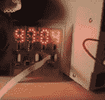](https://hackaday.com/2017/09/05/non-standard-circuits-jazz-for-electrons/cnlohr_glass_circuit_clock/) Glass clock circuit [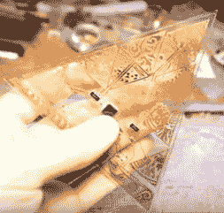](https://hackaday.com/2017/09/05/non-standard-circuits-jazz-for-electrons/cnlohr_keytar_triangular_part/) Triangular part for keytar [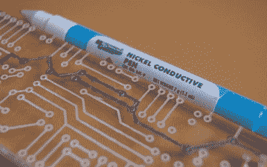](https://hackaday.com/2017/09/05/non-standard-circuits-jazz-for-electrons/sony-dsc-79/) Attempted circuit on acrylic

让我们从展示更多电路和更少电路板的愿望开始。为此，我们可以从玻璃上的[电路开始，通常是显微镜载玻片。他的特别好的一点是，他提供了整个过程的详细视频，包括他一路上尝试过的所有失败的事情。因为他不是从覆铜板开始，而是用 Loctite 3301 将铜片粘到玻璃上。接下来是通常的蚀刻过程，尽管在这个过程中有很多问题。](http://hackaday.com/2016/07/18/cnlohrs-glass-pcb-fabrication-process/)

最后，他制作了一些电路，包括玻璃上带有发光二极管的 LED 时钟，甚至试图领导社区将 T2 制作成玻璃键盘。后者没有成功，但由此产生的玻璃电路无论如何都是一件艺术品。

用亚克力做透明电路板[怎么样？[Frank Zhao]尝试用激光在丙烯酸树脂上切割出凹槽，然后用镍墨水绘制。但是墨水中的某些东西侵蚀了丙烯酸树脂，似乎这还不够糟糕，镍上的电压降对他的电路来说太高了。对于如何解决这些问题，评论中提出了建议，但除非我们错过了，否则我们还没有看到另一种尝试。](http://hackaday.com/2014/10/09/fail-of-the-week-transparent-circuit-design-is-clearly-a-challenge/)

但是我们才刚刚开始。如果你想要更多的透明度呢？

## 空气中的电路板

一种比玻璃或丙烯酸树脂更透明的方法是完全去掉纸板。历史上，这被称为[点对点结构](https://en.wikipedia.org/wiki/Point-to-point_construction)，这一术语出现在印刷电路板之前。我们在 Hackaday 上更经常看到的名称是一个死 Bug 电路，这个名称来自于当您颠倒安装一个组件并焊接到它的腿上时得到的外观。

 [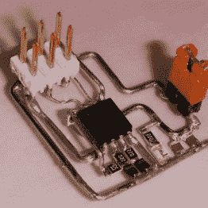](https://hackaday.com/2017/09/05/non-standard-circuits-jazz-for-electrons/freeformsmdlittlewire/) Freeform SMD Little Wire  Circular digital clock [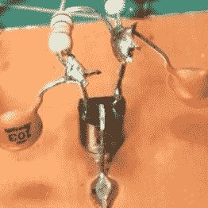](https://hackaday.com/2017/09/05/non-standard-circuits-jazz-for-electrons/dead_bug_transistors/) ead bug transistors. [Source](https://forums.parallax.com/discussion/163128/manhattan-and-pittsburgh-electronics-prototyping-techniques)

一天下午，【matseng】无聊了，[做了一个](http://dangerousprototypes.com/forum/viewtopic.php?f=19&t=3238&p=44916#p44886)[小电线电路](http://littlewire.github.io/)的死 Bug 版本，一个 AVR 编程器，零件数量最少。一两个小时后，他用一个尖头烙铁、0.4 毫米焊料和一个立体显微镜制作出了这里所示的非常精致的导线和仅含部分电路。死虫是 SOIC 版的 ATtiny85。

然而，这些类型的电路看起来并不都像死虫子。有些远非如此。其中最引人注目的是【吉斯莱恩·伯努瓦】的[圆形数字时钟，它由数千个部件组成](https://hackaday.com/2015/01/24/when-handmade-circuits-become-art/)，使用北美 60 赫兹的电源电压周期来计时。

 [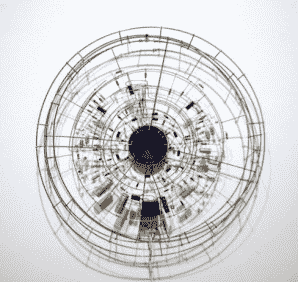](https://hackaday.com/2017/09/05/non-standard-circuits-jazz-for-electrons/peter_vogel_circular_acceleration/) Peter Vogel’s Circular Acceleration [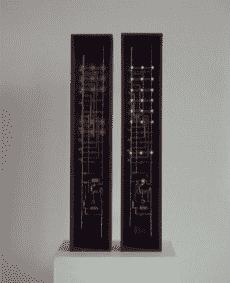](https://hackaday.com/2017/09/05/non-standard-circuits-jazz-for-electrons/peter_vogel_double_light_box/) Peter Vogel’s Double Light Box  Peter Vogel’s Wirbel

令人惊讶的是，在 Hackaday 上没有出现的是[[Peter Vogel]](http://www.bitforms.com/artists/vogel)的无电路板艺术电路，也许我们在 2009 年左右错过了它。这些其实也管用。一些监控光线水平并通过
改变声音做出反应，一些点亮，一些有旋转的螺旋桨。

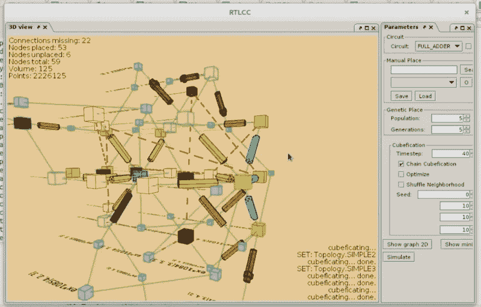

Pyrite volumetric circuits software

[Anderson]已经做了很多工作，将无动力转向下一个水平，称之为体积电路。他写了一个软件，叫做黄铁矿，用来设计它们。它让你画出正常的 2D 版本，然后在模拟器中测试，然后它将电路折叠成 3D 版本供你用作指南。他还研究了一些用于原型制作的 3D 连接器的 T2。

## 封装死虫电路

Crystal cMoy headphone amplifier

然后就是透明板和死 Bug 电路的结合。一个完美的例子就是[鲁珀特·赫斯特]漂亮的封装在透明树脂中的耳机放大器电路。如果你曾经一次铸造这么多树脂，那么你会知道当树脂固化时，它可能会达到高温。在这种情况下，温度达到了令人难受的 108°C，而电容器的额定温度为 125°C。还有树脂泄漏到插孔盒中的危险。为了防止这种情况发生，[鲁伯特]首先在可能发生泄漏的地方涂上一点树脂。结果是一个功能放大器和一件艺术品。

## 三维表面上的电路

 [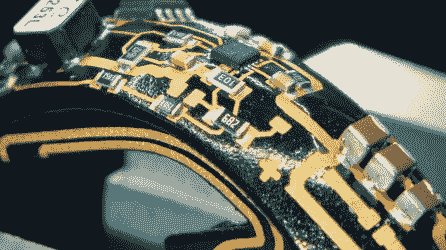](https://hackaday.com/2017/03/16/robot-ants-wear-circuitry-as-exoskeleton/ant_exoskeleton_as_circuit_board/) Ant exoskeleton as circuit board [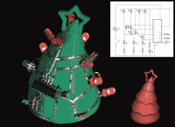](https://hackaday.com/2017/09/05/non-standard-circuits-jazz-for-electrons/surfcuit_3d_christmas_tree_circuit/) SurfCuit 3D Christmas tree circuit

下一步是把你的电路放在远离电路板的电路板上。[FESTO]的[仿生蚂蚁军](http://hackaday.com/2017/03/16/robot-ants-wear-circuitry-as-exoskeleton/)就是这样一个例子。这些板子是 3D 打印的蚂蚁身体。该电路采用 3D [MID](https://en.wikipedia.org/wiki/Molded_interconnect_device) ，这是一种在特殊的非导电材料上印刷车身的过程，激光在其上绘制出轨迹。然后将身体浸入各种浴中，镀上铜、镍和金层。

我们搜索到的另一个例子是一个名为[sur cuit](https://arxiv.org/abs/1606.09540)的研究项目，该项目主要涉及应用于 3D 打印物体的基本元件。这一个包括类似于[安德森]为死虫电路工作的软件。该软件允许您将 2D 电路叠加到 3D 模型上。然后根据需要向模型中添加通道和孔。3D 打印完成后，您可以将实际的电线和组件应用到这些通道和孔中。

正如我们所说，我们很难找到这些。如果你知道更多关于 3D 打印物体的电路，请在下面的评论中分享。

## 衣服上的电路

     [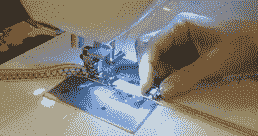](https://hackaday.com/2014/04/12/sewing-conductive-thread-in-parallel-lines/sewing-parallel-lines-conductive-thread/) Sewing conductive thread on a machine

这就把我们带到了衣服上的电路。在这种情况下，布线通常是导电线，编织到布本身。当然，用机器来做更快，我们已经看到了 Cynthia Design Studio 的一个版本，其中[列出了运行 WS2812 LEDs 所需的三条平行走线](https://hackaday.com/2014/04/12/sewing-conductive-thread-in-parallel-lines/)。

织物中使用的导电线连接缝在布料上的组件。这种技术通常被用于添加 led，就像 Martijn 对他的登山夹克所做的那样。在那里，led[根据气压传感器和其他组件确定的海拔高度](https://hackaday.com/2016/09/03/altitude-controlled-led-jacket-changes-color-as-you-climb/)改变颜色。但是也有其他的用途。其中一个是[Afrdt]的[EMF 波检测服](https://hackaday.com/2014/10/03/perceiving-invisible-forces-with-an-emf-detecting-dress/)，它使用振动马达回放信号，并作为可以插入衣领的耳塞的声音。

## 闭合电路

在这篇文章中，我们一直在强调艺术，创意，甚至下巴掉下来的美丽。但是这种电路也可以反其道而行之，正如我们的[Dan Maloney]在他的关于电路变得丑陋的文章中指出的。

无论如何，希望这能让你在下一条赛道上发挥创造力。当然，我们不可能在一篇文章中囊括所有令人惊叹的例子，所以让我们知道你特别喜欢的其他例子，或者更好的是，你自己创造的例子！