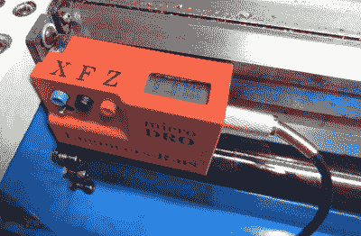

# Hackaday 奖参赛作品:车床的迷你 DRO

> 原文：<https://hackaday.com/2017/09/07/hackaday-prize-entry-mini-dro-for-a-lathe/>

手动车床有控制主支架进给的刻度盘和帮助在工件上进行切割的十字滑块。这些进给轮总是有一些间隙，并需要经常重置“零”。通常的过程是用游标卡尺或千分尺在工件上进行测量，每隔一段时间就需要停止机器，增加了机器的工作时间。数字读数的增加不仅简化了过程，而且大大减少了加工时间。由于 DRO 磁条直接附在十字滑块上，齿隙的影响得以减轻。

 【伊戈尔】就有这样一台手动车床，并在几年前从零开始建造了自己的[迷你 DRO 装置](https://hackaday.io/project/27031-mini-dro-for-lathe)。大多数 DRO 都有编码器条和传感器连接到十字滑块上，一个更大的显示单元单独连接在一个杆上，电线在两者之间延伸。[伊戈尔]通过建造一个适合他的空间限制的单位来保持事情的简单。他的装置仅由两个传感器模块组成，每个模块都直接连接到载玻片上。主单元包含线性霍尔传感器、电子设备、按钮、小型 LCD 和电池。第二个轴单元仅容纳传感器，用电缆将其连接到主单元，以提供数据和电源。系统的核心是一对 [NSE-5310 线性霍尔传感器编码器](http://ams.com/eng/NSE-5310)芯片。这些与[多极磁条](http://ams.com/eng/Products/Magnetic-Position-Sensors/Magnets/AS5000-MS10-300)协同工作。编码器提供 12 位输出，磁条的磁极间隔为 2 毫米。这相当于几乎 0.5 微米的理论分辨率，但当然，机器机械限制了实际结果。编码器芯片通过 I ^( 2 ) C 总线与 ATtiny2313 对话。三个按钮和电源概括了硬件。为了使用 1.5 V 可充电电池供电，[Igor]使用升压转换器获得 3.3 V 电压。LCD 所需的 5 V 电压由连接到微控制器 PWM 输出的倍压器获得，并由齐纳二极管调节。第二个传感器单元通过 TRRS 3.5 毫米插座连接。

事后，他添加了一个蓝牙模块，但耗尽了 GPIO 引脚和程序空间，不得不发挥创造力让它工作。该计划是将数据传输到一个 Android 平板电脑上，作为一个大型的远程无线显示器。不过他从来没有使用过这个功能，因为他对小 LCD 显示屏很满意。在构建过程中出现了一些问题，如果他要再次复制这个项目，一些改变和改进会有所帮助。因此，如果有人计划做类似的事情，先检查一下[Igor]的项目日志。

The [HackadayPrize2017](https://hackaday.io/prize) is Sponsored by:   