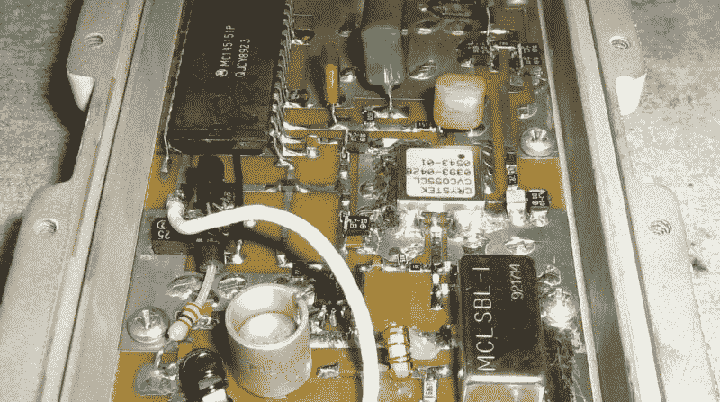
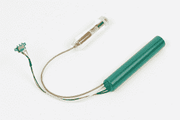

# 间谍技术:非线性结探测器

> 原文：<https://hackaday.com/2017/09/20/spy-tech-nonlinear-junction-detectors/>

如果你看过一部间谍电影，你肯定见过某个不知名的科技人物用某种探测器在房间里搜寻窃听器，然后要么宣称房间是干净的，要么在灯里找到隐藏的麦克风。当然，作为一名黑客，你必须开始考虑这是如何工作的。如果你有一个一直在传播的窃听器，那就简单了。灯可能不应该一直发射射频能量，所以这很容易被检测到，这是一个致命的泄露。但是如果虫子更复杂呢？也许它每小时醒来一次，然后把数据传送回家。或者也许它记录到内存中，并不传输任何东西。然后呢？

高端 bug 检测器使用另一种技术，声称能够找到活动的器件结。这些被称为非线性结检测器(NLJD)。众所周知，美国、俄罗斯和中国的间谍机构使用它们，监狱也用它们来寻找手机。他们声称这种设备不需要打开就能被检测到。你可以在下面看到一个商业 NLJD 的视频

## 理论

NLJD 背后的想法是用特定频率的 RF 信号淹没体积。该地区的普通绝缘体和导体不会改变信号。然而，任何具有非线性响应的物体，比如二极管结，都会发出谐波。它们可能处于较低水平，但如果能检测到谐波，就能识别这些接合点。

听起来很简单，但射频必须足够强大，才能到达那里并产生您可以检测到的谐波。它也不应该如此强大，以至于你不能限制音量，或者——极端地——它会损坏电路。另一个问题是，任何不同的金属结都会表现出非线性行为。所以除了虫子和手机，你还会发现生锈的钉子和类似的东西。

您可以获得一个关于专业人士如何使用 NLJD 的[概述。这比电影要复杂一点。概括地说，操作员首先了解该区域的任何无线电源，以尽量避免误报。显然，通过观察二次和三次谐波的比率，有经验的操作员(或聪明的计算机)可以区分生锈的钉子和真正的电子设备。](http://www.tscm.com/tmdenljd.html)

## 现货供应

 [https://www.youtube.com/embed/YxKz3M0Ohrs?version=3&rel=1&showsearch=0&showinfo=1&iv_load_policy=1&fs=1&hl=en-US&autohide=2&wmode=transparent](https://www.youtube.com/embed/YxKz3M0Ohrs?version=3&rel=1&showsearch=0&showinfo=1&iv_load_policy=1&fs=1&hl=en-US&autohide=2&wmode=transparent)

可以买到现成的 NLJDs。但是它们并不便宜。即使在普通的中国进口网站上，好看的模特也要卖 1 万美元左右。更主流的版本都希望你询问价格，我们决定不通过询问进入任何中情局的观察名单。我们确实见过标价超过 14000 美元的猎户座。

当然，商业单位有其他功能，但这仍然是一大笔钱。你会认为一个聪明的黑客可以做得更好。

 [https://www.youtube.com/embed/FVUXJHnHNp0?version=3&rel=1&showsearch=0&showinfo=1&iv_load_policy=1&fs=1&hl=en-US&autohide=2&wmode=transparent](https://www.youtube.com/embed/FVUXJHnHNp0?version=3&rel=1&showsearch=0&showinfo=1&iv_load_policy=1&fs=1&hl=en-US&autohide=2&wmode=transparent)

## 公司自产自用

 没有多少家酿 NLJDs，我们不知道为什么。我们能找到的唯一明显的例子是在[一个不寻常的充满地下工程的地方](http://67.225.133.110/~gbpprorg/mil/non/index.html)。它说正在开发中，没有展示任何使用中的例子，所以我们不知道它是否表现良好。

虽然有详细的照片和相当多的数据，但这种设备似乎是存在的。

别忘了看看帖子的第二部分[。在那一页的底部有一些基本 Stamp II 的示例软件，所以虽然复制它并不容易，但是如果你感兴趣的话，看起来确实有足够的信息可以进行实验。](http://67.225.133.110/~gbpprorg/mil/non/part2/index.html)

## 间谍大战间谍

NLJD 最初并不是一个间谍设备。[查尔斯·博维尔]在第二次世界大战期间发明了它，用于发现飞机油漆表面下的腐蚀。然而，间谍使用它变得很明显。以至于从 1968 年左右开始，中情局的设备，如这里看到的 SRT-107 T4，都有特殊的过滤器将探测信号分流到地面。

因此，对于严肃的间谍来说，NLJD 可能不再非常有用，尽管更常见的窃听设备可能仍然容易被检测到。然而，还有一个更大的原因是它们不再像以前那样有用了。电脑和手机无处不在，你真的不需要再装窃听器了吧？你只需要妥协主体的设备，在许多方面，这甚至更容易做到。

秘密窃听不是什么新鲜事。隐藏和发现它们的技术数量是一个很大程度上未知的竞赛，甚至可能使太空竞赛相形见绌。