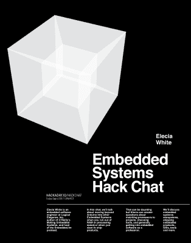

# 星期五黑客聊天:艾丽西娅·怀特谈嵌入式系统

> 原文：<https://hackaday.com/2017/09/07/friday-hack-chat-elecia-white-talks-embedded-systems/>

尽管 Real Engineers 对 Arduino 生态系统进行了评论，但它实际上非常棒。没有其他工具能像 Arduino 一样支持如此多种类的微控制器，拥有如此多的库，并且如此易于使用。它非常适合快速启动和运行项目，但当它涉及到从嵌入式系统中获取最后的周期或千比特时，您会很快发现蓝色的无限小图标并不能解决问题。

嵌入式系统设计远远超出了 Arduino 生态系统，对于本周的黑客聊天，我们将讨论如何从微小的硅片中挤出最后一滴。

我们本周 Hack Chat 的嘉宾是【Elecia White】，Logical Elegance 的嵌入式软件工程师，O'Reilly 的[制作嵌入式系统](https://www.amazon.com/Making-Embedded-Systems-Patterns-Software/dp/1449302149)的作者， [Embedded.fm 播客](http://embedded.fm/)的主持人。在本次聊天中，我们将讨论超越 Arduino 生态系统。

本周 Hack Chat 的主题将包括嵌入式系统生态系统，如何将处理器与项目匹配，选择 ide、程序员和其他工具，以及实际上将所有这些令人惊叹的微控制器项目发送给急切的买家。我们欢迎所有问题，所以如果你有什么要补充的，[这里有一个电子表格来指导讨论](https://docs.google.com/spreadsheets/d/1kfTzK1j4dTzoOrotlLQ-5VsNvoyQsfSWCZKAvqih8bE/edit?usp=sharing)。

### 以下是参与方式:

 我们的黑客聊天是在 [Hackaday.io 黑客聊天群发消息](https://hackaday.io/project/5373/token/7879571d-62c3-46a8-af36-2b6f265590f2?redirect=messages)上的现场社区活动。黑客聊天大多是，通常是太平洋时间周五中午。本周也不例外，一切都将在太平洋时间 9 月 8 日星期五中午进行。时区会让人困惑吗？不是问题；这里有一个方便的倒计时器！

点击右边的语音气泡，你会被直接带到 Hackaday.io 上的黑客聊天群。

你不必等到星期五；随时加入，你可以看到社区在谈论什么。