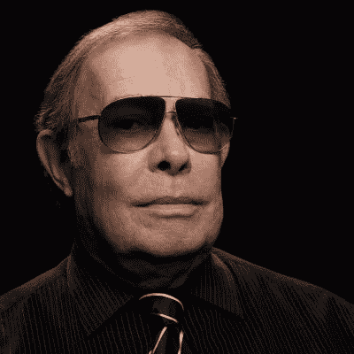
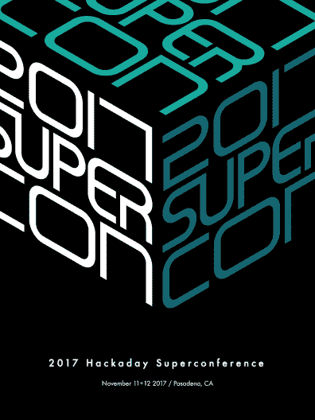
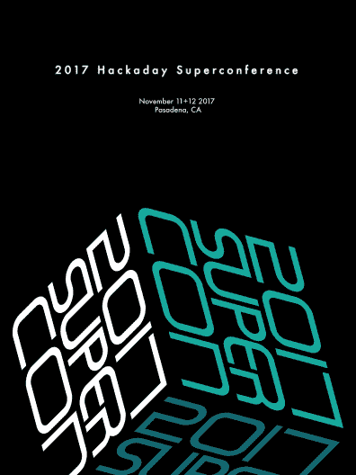

# 视觉未来学家赛得·米德将在黑客日超级大会上发表主题演讲

> 原文：<https://hackaday.com/2017/09/06/visual-futurist-syd-mead-will-keynote-at-hackaday-superconference/>

未来实际上是什么样子的？当你面对这个问题时，你脑海中的想法很可能会受到赛得·米德的严重影响。他是一名工业设计师，但他的作品——包括一些最具标志性的科幻电影——为他建立了一个更有趣的头衔:视觉未来学家。

见见赛得·米德，他将于今年 11 月 11 日和 12 日在加利福尼亚州帕萨迪纳举行的 [2017 年黑客日超级大会](https://www.eventbrite.com/e/hackaday-superconference-2017-tickets-35735832838)上发表主题演讲。

菲利普·K·蒂克想知道机器人会梦到电动绵羊吗？但是到了建造这些羊和它们生活的世界的时候，导演雷德利·斯科特指望赛得·米德来决定《银翼杀手》在*中的未来到底是什么样子。他发明了一个世界，这个世界实际上是通过在计算机图形成为标准之前广泛使用的实用布景和道具建立起来的。西德的作品也出现在*星际迷航:电影*、*外星人*以及电影*创*的标志性设计中。从那以后，他的多产作品继续出现在银幕上，其中《极乐世界》和《明日世界》是他最近的作品。*

一个人如何创造未来，即使经历了几十年的进步？这就是硬件创造者的角色——设想我们明天想要和需要什么，而不是今天或昨天。赛得·米德是一个硬件创造者，他的硬件一次又一次地被制造出来，激励我们所有人朝着科技的方向前进。在 Hackaday 超级会议上和 Syd 一起兜风。[现在就买票](https://www.eventbrite.com/e/hackaday-superconference-2017-tickets-35735832838)。

【主图鸣谢:*银翼杀手*赛得·米德概念艺术】

   