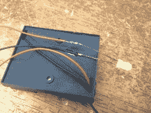
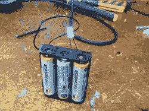
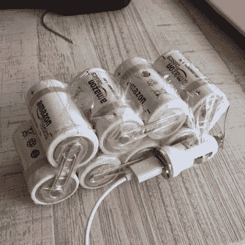

# 需要夜灯吗？

> 原文：<https://hackaday.com/2017/09/19/need-a-night-light/>

[斯科特]创造了一个 [LED 蜡烛](http://www.swharden.com/wp/2017-09-09-hurricane-hack-diy-led-candle/)为巨无霸爸爸风暴(风暴？)来了。像佛罗里达数百万其他人一样，当一场迎面而来的飓风向他们袭来时，他和室友们被困在了家里。由于担心停电时会在黑暗中磕磕绊绊，他们开始收集身边所有的蜡烛。意识到巨大的蜡烛和火柴堆看起来越来越像是一个死亡的愿望，决定用他们手头的组件来制作一个临时的灯。现在，无法从任何外部来源获得零件意味着您将拥有一个基本模型。

也就是说，这种直射光只需要几秒钟就可以组合起来。陪审团装配几节 AA 或 AAA 电池，然后装上一个电阻、LED 和跳线，让它运行起来。用电工胶带把整个东西包起来，甚至用管道胶带，只要能完成任务就行。在它上面放一个小纸帽会漫射光，然后啪嗒，啪嗒，你就大功告成了。不过一般来说，直接焊接到电池上并不是一个明智的想法。因此，如果你想变得花哨，也许一个更好的替代方案是有一个如下所示的电池外壳。

如果你的家不是一个电子元件的微型仓库(显然，它不赞成堵塞你的车库进行项目)，并且你的时间有限，这种 LED 蜡烛是一个明确的选择。然而，如果在你的窗户被吹开之前你还有几分钟的时间，看看你是否能超越史上最亮的手电筒(到目前为止)。

如果您缺少这两个项目中使用的一些硬件，就使用您现有的硬件。这是另一个临时灯，它使用 12V DC 电源供电的 LED 模块。只要你有一个电源和某种 LED，你就可以创造光。被限制在随机部件上工作的一半乐趣是弄清楚你能用它们做出什么。

 在当今这个时代，另一个让任何理智的人都望而却步的失去电力的想法是他们的手机会没电。[便携式电池组](http://thewirecutter.com/reviews/best-usb-battery-packs/)很棒，但不是每个人都有，我们都知道人们很容易忘记确保它们已经充电并为灾难做好准备。一个简便的方法是用车载 USB 充电器、一堆 C 电池、一些回形针和胶带来对付你的坏男孩。

即使是最小的停电也可能随时发生，所以做好准备比 SOL 要好。你最喜欢的应急妙招是什么？