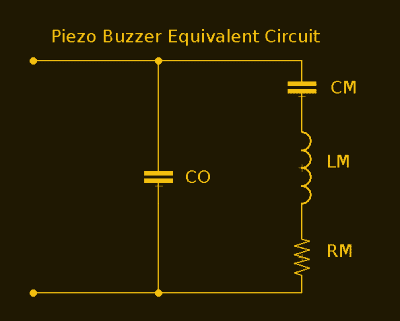
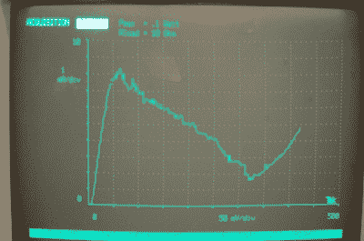

# 关于无源元件的积极讨论

> 原文：<https://hackaday.com/2017/10/16/active-discussion-about-passive-components/>

人们谈论有源和无源元件时，就好像它们是两种不同的电子元件。当采购 BOM 上的组件时，你有被动件，这是比一毛钱一打还便宜的小东西，然后是构成大部分成本的其余部分。二极管和晶体管肯定属于便宜的小东西类别，但不一定是无源元件，所以有什么区别呢？

## 电阻、电容、电感、变压器、二极管*和忆阻器

这就是名单。那些是你的无源元件。嗯，没那么容易。还要加上一些传感器，因为它们仍然是被动的。光敏电阻是一个传感器，但它仍然是一个电阻器，即使它的电阻根据外部影响而变化。任何测量电阻、电容或电感变化的传感器仍然是无源器件。同样为了好玩，让我们添加一个压电蜂鸣器。

忆阻器很奇怪，因为尽管在 70 年代就提出了理论，但直到最近才被证明存在，并且仍然没有完全商业化。现在有关于记忆电感和记忆电容的理论，它们也是无源器件，但它们还不存在。

## 这取决于你对活跃的定义是什么

部分问题在于，人们似乎对“活跃”有不同的定义。与其揭穿所有错误的观点，传播不好的观点，不如告诉我们什么是正确的。如果满足以下任一条件，则设备处于活动状态:

*   它是力量的源泉
*   它能放大能量
*   它就像一个开关

将此应用于明显活跃的设备，如微控制器，这是有意义的。它在一个 GPIO 引脚上完成所有这些工作。晶体管可以放大或充当开关。电池是能量的来源。

电路保持无源，直到增加一个有源元件，所以 RC 或 LC 网络仍然是无源的。压电蜂鸣器具有完全无源元件的等效电路，因此它也是无源器件。

The equivalent circuit of a piezo buzzer is all passive elements.

顺便提一下，每个电路至少有一个有源器件(电源)。此外，像物理开关这样的机电设备也被认为是无源的。

## 二极管

二极管有一个例外。大多数情况下，它是一个无源器件，因此只需将其添加到无源器件列表中，然后就可以轻松地忘记它了。不过，这并不有趣，除非我们深入研究是什么让它有时对那个单一的、很少使用的异常活跃，而要做到这一点，我们必须进入量子隧道。

隧道二极管速度非常快(微波频率)，用于频率转换器和检测器，特别是在空间中，其耐电离辐射、低电压、高频率和长寿命是所期望的品质。隧道二极管有一个特定的条件，在这种条件下，它具有负电阻，因此电压的增加会导致电流的减少。除了这个特殊区域，隧道二极管在任何地方都像普通的无源二极管一样工作。

IV curve of a tunnel diode. The descending section is the area of negative resistance where increased voltage results in decreased current. By [Mcguireatneuroticadotcom](https://commons.wikimedia.org/w/index.php?curid=26038774) CC BY-SA 3.0

一个带电粒子穿越一个障碍需要足够的能量来越过障碍，否则它就不能穿越。对于普通二极管，有一个 PN 结充当隔离栅。电源提供足够的能量(称为正向电压)让电子越过该屏障，电流就流过它。然而，根据量子力学，有一个非零的概率，电子会跳到屏障的另一边，而不会越过它。这就是量子隧道。在大多数二极管中，势垒足够高(由 PN 结的掺杂控制)，隧道效应不太可能发生，因此在有足够的正向电压使电子越过势垒之前，不会有电流流过。在隧道二极管中，PN 结有更多的掺杂，增加了隧穿的可能性。由于高掺杂，这些二极管的工作电压比普通二极管低得多。

在非常低的电压下，电子会频繁地隧穿，从而产生一些电流。随着电压的增加，隧穿增加到一个峰值，然后开始下降。它下降是因为势垒一侧的电子具有越来越多的能量，但势垒另一侧没有相同的空穴来接受它们的隧穿。一旦正向电压足够高，电子就有足够的能量越过势垒而不隧穿，隧道二极管再次像正常二极管一样工作。这种行为允许隧道二极管充当放大器或振荡器，从而将其归入有源类别。几个月前我们报道了隧道二极管中的负阻[，而](https://hackaday.com/2017/03/21/negative-resistance-it-shouldnt-make-sense/)[一篇关于二极管](https://hackaday.com/2017/08/29/a-diode-by-any-other-name/)的帖子在评论中引发了主动/被动的争论。

## 有关系吗？

不，不是真的。这是深奥的领域，除了在聚会上和可能在下面的评论中惹恼别人之外，没有任何实际用途。主动和被动是组件的通用术语，无论特定组件被归类为哪一种都不会改变其使用方式。然而，量子隧道是很巧妙的，我们已经利用它的事实让我想知道我们离曲速和传送点有多近。