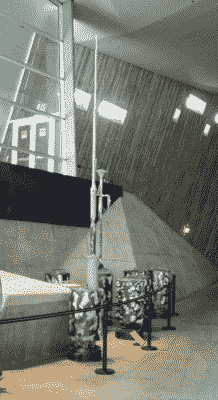

# 库尔特气象站

> 原文：<https://hackaday.com/2017/10/18/retrotechtacular-weather-station-kurt/>

有时候，当研究一个平凡的故事时，我们作为作家偶然发现一个思路通向另一个。最近对 20 世纪 60 年代无人气象站浮标的观察也是如此，它将我们带到了一个更早的自动化气象站。

The restored Kurt in the Canadian National War Museum.

库尔特气象站是第二次世界大战期间德国军方一次大胆尝试中唯一一次成功的安装，目的是从大西洋西侧获取自动实时气象数据。在这句简单的话背后，隐藏着当时令人印象深刻的技术和军事成就。这是整个战争期间德国军队对北美大陆的唯一一次陆上武装入侵。虽然它被秘密包围，并且发生在拉布拉多北部一个极其偏远的地方，没有发生冲突，但它没有被加拿大当局注意到，很快就作为更广泛的火灾中一个不重要的脚注被遗忘了。

库尔特采取了一系列包含大量镍镉电池、气象仪器、遥测系统和 150 瓦高频发射器的罐子的形式。此外，还有一个携带风速和风向仪器的桅杆，以及发射天线。在使用中，它将提供来自西大西洋的天气锋向欧洲战场前进的重要预警，在敌人的领土上建立一个有人驻守的站太危险了。

西门子在 1943 年建造了少量的自动气象站，其中一个被派遣到 U 型潜艇 U537 上，安装在遥远的大西洋海岸，也就是今天加拿大的一部分。1943 年 10 月下旬，在一次危险的跨大西洋航行后，他们成功地完成了这项任务，离开了标有不存在的“加拿大气象服务”标记的空间站，试图欺骗任何可能偶然发现它的人。直到 1977 年，它才被一位地质学家发现，1981 年，它被找回并被带到加拿大战争博物馆。

令人沮丧的是，除了每隔几个小时以 3940 千赫兹传输一次之外，关于遥测系统的确切工作方式，几乎没有什么信息可寻。谷歌图书的一个结果提到，传输是用莫尔斯电码编码的，使用的是神秘的格劳隔膜，一种“复杂的接触鼓”，以柏林的一位博士[格劳]命名。这是一项被遗忘的技术，在 2017 年挑战我们的 Google-fu，但它实际上肯定是一种机械的模数转换器。

如果你碰巧去加拿大首都，你可以看到在加拿大战争博物馆展出的库尔特。它似乎已经从生锈的状态中得到了广泛的修复，它出现在检索过程中拍摄的照片中，知道是否还有任何 Graw 隔膜的残留物将是有趣的。有读者知道空间站的这一部分是如何工作的吗？请在评论中告诉我们。

气象站库尔特检索图像，加拿大国家档案馆。([公共领域](https://ww2db.com/image.php?image_id=23785))。

博物馆图像中的气象站库尔特，SimonP ( [公共领域](https://commons.wikimedia.org/wiki/File:Weather_Station_Kurt.JPG))。