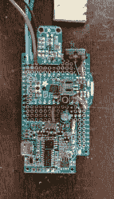

# 建造这个 TARDIS 绝非易事

> 原文：<https://hackaday.com/2017/09/23/building-this-tardis-is-anything-but-a-snap/>

作为《神秘博士》节目的狂热粉丝，[亚当·西佛纳基斯]看到了一个激光切割的 TARDIS 模型，这激起了他的好奇心，最终成为一个为期数周的项目，涉及多次挫折、失误、修改，最后是满足。看哪，他的[声激活了 TARDIS](https://hackaday.io/project/26964-sound-activated-tardis) 。【T2

首先，组装和绘制模型是一个有趣的难题——尽管去了几次商店——由于不耐烦，画有一点倒退。接下来，创建一个带有音频剪辑的脉冲软白光 LED 电路，以真正出售迷你 TARDIS 的图像，这被证明是一个乏味的考验，最终通过模型上的牛皮纸扩散窗口发出令人满意的光芒。

怎么触发灯？[Sifounakis]最初想要一个电容传感器来触发声音效果，但那样会引发龙— *和*的疯狂——所以他采用了 snap-activated effect 来激活 TARDIS，就像医生自己一样。在努力构建自己的麦克风设置后，他改用了增益可调的驻极体麦克风，效果非常好。设置这个 TARDIS 的 Adafruit Pro 饰品大脑遇到了一两个障碍，之后就一帆风顺了！

直到他的电源电路又出了故障。幸运的是，增加一个电容来增加电路启动时的电量解决了这个问题。剩下要做的就是在所有这些故障排除和替换之后，拆除并重建他的电路，最后，将它安装到他的模型中。

非常满意和 LED 脉冲效果的最后返工，它完成了。看看吧！

 [https://www.youtube.com/embed/mShBE_wHAk8?version=3&rel=1&showsearch=0&showinfo=1&iv_load_policy=1&fs=1&hl=en-US&autohide=2&wmode=transparent](https://www.youtube.com/embed/mShBE_wHAk8?version=3&rel=1&showsearch=0&showinfo=1&iv_load_policy=1&fs=1&hl=en-US&autohide=2&wmode=transparent)

无论是[次声波低音炮](https://hackaday.com/2016/04/06/this-tardis-is-an-infrasonic-subwoofer/)，还是[运动感应报警器](https://hackaday.com/2014/02/11/tardis-alarm-doesnt-go-vworrrrrp-vwrorrrp-vworrrp/)，或是[装饰圣诞树](https://hackaday.com/2010/12/27/tardis-tree-topper/)，TARDIS 总能给人惊喜。