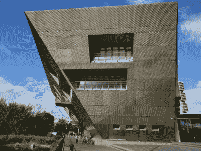

# 伦敦来电:英国非正式会议综述

> 原文：<https://hackaday.com/2017/09/19/london-calling-the-hackaday-uk-unconference-roundup/>

对于乡下的英国人来说，去伦敦旅行是一项事业，在经历了中央线拥挤的流动桑拿浴室、蜿蜒的国际观光客和蜂拥而至的西装革履的上班族之后，你总是会疲惫不堪，还有点脏兮兮的。通常你在这样一次探险后的疲劳是在完成了一项艰巨的劳动后，但有时它反而会是一段充实而忙碌的时间所带来的满足感。

这将是 Hackaday 社区的快乐乐队的状态，他们本周末来到伦敦，参加与我们的赞助商 [DesignSpark](https://www.rs-online.com/designspark/home) 联合举办的英国 unconference。周五晚上在舒适的 Bloomsbury 酒吧举行了一次社交聚会，然后周六在一个前萨里商业码头旁边的礼堂举行了为期一天的连续 7 分钟的会谈，展示了我们的读者参与的各种有趣的工作。

“多样和有趣”甚至还没有开始涵盖项目的广度，以及您，我们的读者所涵盖的专业知识。作为一名 Hackaday 编辑，看到 Hackaday.io 项目涵盖的新的有趣领域，以及这种多样性贯穿于这一活动中，不断有发言者涵盖从数字隐私到激光增强任天堂 zappers 和机器人远程呈现设备到干细胞研究的一切，这是一种持续的惊喜和喜悦。我们热爱我们的社区！

问题是，有这么多与会者和这么多高质量的演讲，我们从哪里开始描述它们呢？也许最好是从个人的角度概述一下那些最让我印象深刻的演讲，并向那些我没有空间提及的人道歉。

A super-sized Boldport PCB

作为一个硬件发烧友，也许最好从三个与 PCB 相关的扬声器开始，我很乐意听他们讲话，时间远远超过规定的七分钟。[Saar Drimer]是一个名字，你们中的一些人可能会从他在 Boldport 电子设计机构的职业生涯中认出他，他带来了各种各样更具艺术性的作品，包括一个用于博物馆展览的超大 PCB 和一个他过去为我们的赞助商创作的 PCB 奖杯。他的演讲涵盖了他的君主焊接工具的巧妙设计，一个 PCB 闪光灯蝴蝶。

[罗杰·桑顿]是一个你可能很熟悉的人，即使你不能马上认出他的名字。作为 Raspberry Pi 基金会的首席硬件工程师，你在 Raspberry Pi 板上看到的是他的手，他的演讲让我们对 Raspberry Pi Zero 的设计有了独特的见解。将无线芯片组安装到已经很小的电路板上，同时只在一侧保留组件，并将成本降至最低，这是一项充满困难的任务。

[![[Mike]'s super-tiny electric stuff](img/a94645ff75246283e82b55d6c6e13afc.png)](https://hackaday.com/wp-content/uploads/2017/09/mikes-electric-stuff-screen.jpg) 

【迈克】的超微型电动玩意儿

然后是【迈克哈里森】，你可能从他的 YouTube 频道知道他是【迈克的电动玩意儿】。他的注意力被供应商目录中的一种新型小型表面贴装白光 led 所吸引，这让他幻想着进入微小密集的 PCB 矩阵尘埃照明世界。这听起来可能是一项简单的设计工作，但所涉及的密度也要求 PCB 过孔的网格间距很小，他必须在电路板的另一侧围绕它铺设驱动电路。结果是既漂亮又明亮的小屏幕，以及越来越复杂的小电路板。

安全和隐私会谈也在议程中，Joe Fitz 向我们展示了为什么即使是基于硬件的双因素身份认证也不应该被视为完全可信，为这些 RSA SecurID 令牌提供了一个制作精美的小型无线后门 PCB。然后，在 Privacy International 工作的[Dana Polatin-Reuben]展示了物联网设备制造商无处不在的数据收集的一些更令人不寒而栗的方面。

[![[Ales Eames] and his bicycle turn signal](img/0bd1faa215d4f954c99143ae825f81f4.png)](https://hackaday.com/wp-content/uploads/2017/09/alex-eames-lights.jpg)

【Alex Eames】和他的自行车转向灯

围绕 LED 项目的几场令人难忘的会谈。[Raspi.tv]的[Alex Eames]向我们展示了他的 LED 自行车灯，这当然不仅仅是照明。[Alex]的自行车有指示灯和刹车灯，因为他讨厌布线，想要可移动自行车灯的便利，所以前后单元形成了无线网络的两半。然后是(Rachel Wong)谈论她的可穿戴技术，尽管这只是她所涉及内容的一半。她的日常工作是作为一名干细胞科学家，她向我们简要介绍了这项前沿工作。

我们进行了一些机器人技术讲座，[Libby Miller]展示了她的[LibbyBot]，这是一个使用宜家灯具制作的迷人的远程呈现机器人，[Neil Lambeth]向我们介绍了机器人足球，当然还有机器人的支持阵容。

作为一名 Hackaday 编辑，认识团队中的其他人感觉特别好，因为我们遍布全球。我们的主编[Mike Szczys]向我们讲述了他在基于分立元件的第一原理的数字逻辑方面的工作，而执行主编[埃利奥特·威廉姆斯]向我们展示了他的 flip-dot display talk timer，这是用 FORTH 编程的。与此同时，我们的自由撰稿人[Alasdair Allan]讲述了一个关于信任物联网数据的危险的警示故事，撰稿人[Adil Malik]向我们展示了他相当漂亮的三相电源监控器。然后轮到我时，为了轻松一下，我避开了硬件项目，用一个关于苹果酒的故事来娱乐大众。

Our venue was in quite a striking building

最后，一个著名的演讲来自[詹姆斯·拉尔森]，你可能会认为他是[闪光灯奖](https://www.flashinglightprize.com/)的创始人。他宣布了 2018 年的比赛，其中必须包括霓虹灯和 50%占空比的 1 Hz 闪光频率。黑客们，启动你们的振荡器！

因此，在九月的夜晚，人群涌出礼堂，来到附近的酒吧，度过了有启发性和娱乐性的一天。在场的有来自我们社区各个方面的人，有我们介绍过其作品的人，也有长途跋涉来到伦敦只是为了一睹其风采的读者。我们坐下来享受了一个晚上的社交活动，喝了一两杯相当不错的精酿啤酒，我们这些普通员工在忙碌了一天后需要放松一下。

 我谨代表 Hackaday 向我们的赞助商 [DesignSpark](https://www.rs-online.com/designspark/home) 表示感谢，是他们使会议得以在不收门票的情况下举行，加拿大水文化空间的工作人员为会议的顺利进行提供了支持，最后，我还要感谢您，我们的读者和与会者。你造就了我们，像这样的事件让我们更好地与你保持联系。

我们的下一个全球活动是即将于 11 月在加州举行的 [Hackaday 超级大会](https://hackaday.io/superconference/)。我们的英国读者可以放心，这不会是你最后一次见到我们。