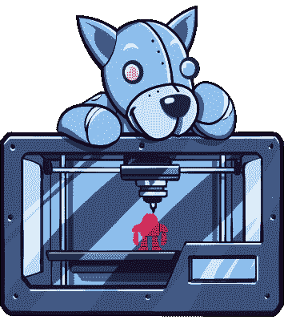

# 本周与 Tindie 和 Hackaday 在纽约的一系列会面

> 原文：<https://hackaday.com/2017/09/18/a-slew-of-nyc-meetups-with-tindie-and-hackaday-this-week/>

对于 Tindie 和 Hackaday 来说，这是非常忙碌的一周。我们要去纽约，我们计划了很多活动。

[首先是每月的黑客聚会](https://hackaday.io/event/27093-hackaday-nyc-x-kickstarter)。这一次，我们将与 Kickstarter 合作举办一场创客大会前的聚会。我们将在 Kickstarter 的总部举办这个活动，我们已经安排了一系列令人印象深刻的演讲者来谈论辅助技术。这些发言者包括:

*   NYU 能力项目的安妮塔·佩尔和 r·卢克·迪布瓦
*   ELIA 生命技术公司的 Andrew Chepaitis

在 Hackaday x Kickstarter meetup 的甲板上还有来自 [WearWorks](http://www.wear.works/) 的现场演示，他们正在开发触觉导航设备 WAYBAND 和来自 [Elia Frames](http://www.theeliaidea.com/) 的触觉阅读系统。

Hackaday x Kickstarter meetup 将于 9 月 21 日星期四下午 6:30 开始。[这是回复](https://www.meetup.com/MakeIt-NYC/events/242653432/)的链接。

这个周末也是纽约世界创客大会，Tindie 将会展示 Tindie 社区开发的所有精彩的小东西。

届时，来自 Tindie 的[Jasmine]和[Brandon]将登台亮相，当然，我们也邀请 Tindie sellers 在整个周末造访我们的展位，展示他们的产品。

同样在世界创客大会上的还有[舒莉]、[夏娜]和我。我们将向观众投掷全新的 Tindie 贴纸，并发放 Tindie 闪亮徽章。如果你曾经想展示你对 DIY 硬件的热情，*现在你可以用一个电子闪亮的翻领别针。焊接起来，听 Benchoff 合理化，为什么它不需要一个限流电阻！太有趣了！*