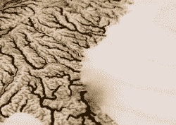
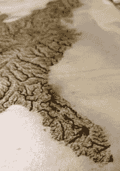

# 美国被照亮的水路

> 原文：<https://hackaday.com/2017/09/20/the-illuminated-waterways-of-the-united-states/>

redditor [i-made-a-thing]最近转向激光切割机的方式，他需要一个项目，并在 Etsy 上偶然发现了一些水道地图，开始制作美国所有水道的照明地图。【T2

地图本身是在他当地的工作室用 1/4 英寸的胶合板激光切割出来的。问题是，较小的河流和支流在[我制作的东西]想要的比例下太窄了，所以他最终花了几个小时在 Photoshop 中准备图像，这样较大的河流将被激光切割——而不是断裂——而其余的将被蚀刻在表面上。在通过制作一些杯垫来测试这一过程后，他准备开始真正的交易。

 激光切割出车尾的河流，最大限度地减少了完成的车头的烧伤痕迹，但确实花了一些时间来确保两边完美地对齐。为了防止环氧树脂粘到他正在制作的任何东西上，[我制作了一个东西]使用了涂有凡士林的三聚氰胺切菜板，以便于分离。分两次灌注环氧树脂，并用打火机戳破所有气泡，他最终不得不打磨掉地图表面多余的部分，发誓要用胶带粘住任何不打算在未来涂覆的部分。

[i-made-a-thing]用彩色胶合板将地图框起来，将两者粘合在一起，然后涂上最后一层透明的环氧树脂，使成品看起来更加均匀。贴在 LED 灯带上的光线透过地图的某些部分，被厚厚的卡片纸挡住了。成品——以光为边界——看起来很美。

至于地图，我们之前已经展示过一些激光切割的杰姆，以及一张曼哈顿的[活点地图](https://hackaday.com/2017/04/19/manhattan-marauders-map/)。

[通过 [/r/DIY](https://www.reddit.com/r/DIY/comments/70nvpl/illuminated_waterways_of_the_united_states_map/)