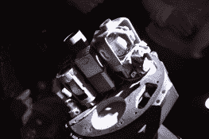
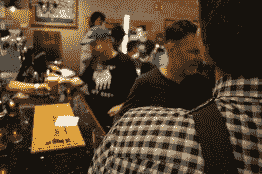
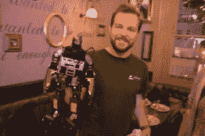

# 哈卡戴在伦敦的聚会很有趣

> 原文：<https://hackaday.com/2017/09/18/hackadays-london-meetup-was-a-corker/>

在伦敦市中心的侯爵康华里酒吧楼上，大约 75 名黑客聚集在一起，吃得好，喝得好，总体上很开心。几乎每个参加的人都带了一个包，这意味着除了所有要做的社交活动之外，还有很多要看的。

我和很多人交谈过，他们都说了同样的话:把作家、黑客和其他读者的名字和面孔联系起来是一件很棒的事情。作为一名作家，我终于见到了一些制作过我最喜欢的黑客作品的人，除此之外，还有一些对我来说完全陌生的人。我不知道有多少次我听到“哦*你是那个项目背后的人。我喜欢那部电影。”一个真正的黑客社区*展示出来了。**

最糟糕的时刻之一发生在[Pyrofer]向我展示他的光缆检测器的时候。我刚刚阅读了一个类似项目的评论，他提到他几年前已经制造了一个类似的设备。现在，24 小时后，他拿着啤酒给我看。这是一个很棒的项目，有可移动的激光装置和可爱的小有机发光二极管显示器。它还具有无线充电功能，因为无线充电很酷。

有人(评论里打个招呼！)带了一个和他一起工作的超快的样机。为了完成这项工作，他需要一个六层 PCB，但没有 PCB 公司能在最后期限前及时完成。解决办法？将设计分为两层和四层设计，以便他们能够快速处理，并在中间部分安装表面贴装连接器，用于共享信号。连接器解决了对准问题，以及明显无法在 PCB 夹层内焊接的问题。非常聪明，一个我将不得不尝试的黑客来加强我的家庭蚀刻设计。

就这样过去了。整个晚上都充满了这样的宝石，被桶装麦芽酒和美味的虾和迷你汉堡打断。如果你在那里，请在评论中让我们知道你最喜欢的时刻。如果你不在，那就享受照片廊，并留意我们何时在你的附近。

 [![[mikeselectricstuff]'s electric stuff](img/974f42ceeba4de542c7aca32a1e250e1.png "DSC_0990")](https://hackaday.com/dsc_0990/) [mikeselectricstuff]’s electric stuff [![[Adil Malik]'s fancy power meters](img/06d6abc0680675f57ffd0ffcd628b35f.png "DSC_0981")](https://hackaday.com/dsc_0981/) [Adil Malik]’s fancy power meters  Stickers!  Guidance computer? Analog IMU? [![[Ken Boak] and his MyStorm FPGA Board](img/2bdf06e27730a110aa88d1d4558c88f5.png "DSC_0953_bright")](https://hackaday.com/dsc_0953_bright/) [Ken Boak] and his MyStorm FPGA Board  Debugging by Phonelight [![[mikeselectricstuff] amazes](img/da9ff140dfb449ba80587d0e5950df4f.png "DSC_0946_bright")](https://hackaday.com/dsc_0946_bright/) [mikeselectricstuff] amazes  Bar shot [![[Mitxela]'s LED earring/pendant](img/76c8280cf199d7089447f069fd5d8c2e.png "DSC_0934")](https://hackaday.com/dsc_0934/) [Mitxela]’s LED earring/pendant [![[securelyfitz] keeps state and logic separate](img/3a878f732dc51585cbc9c155e221e0cc.png "DSC_0925")](https://hackaday.com/dsc_0925/) [securelyfitz] keeps state and logic separate [![[Dave], who reversed the IM-Me screen](img/43569c67627e46376b4ebeedb003adb3.png "DSC_0920_bright")](https://hackaday.com/dsc_0920_bright/) [Dave], who reversed the IM-Me screen [![[Fluffyyy]'s Bear and Directional Headphones](img/0d9755a4968dd3ac8e6d464ea7044415.png "DSC_0919_bright")](https://hackaday.com/dsc_0919_bright/) [Fluffyyy]’s Bear and Directional Headphones  Robots! [![[Spencer Owen] and RC 2014](img/eaaeb9aea93e3056d1f4d9db00f16466.png "DSC_0906")](https://hackaday.com/dsc_0906-2/) [Spencer Owen] and RC 2014  The Crew: Jenny, Elliot, Mike, and Pedro

[design spark](http://designspark.com)是 Hackaday UK Unconference 的独家赞助商。