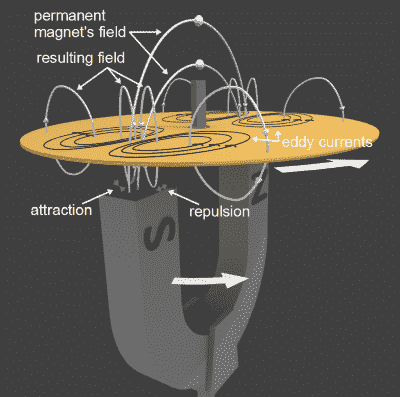
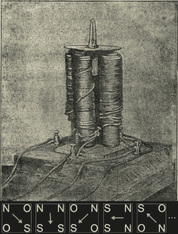
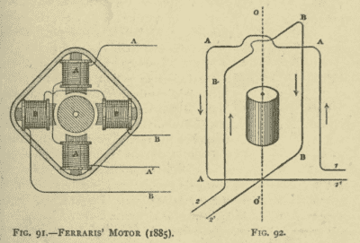
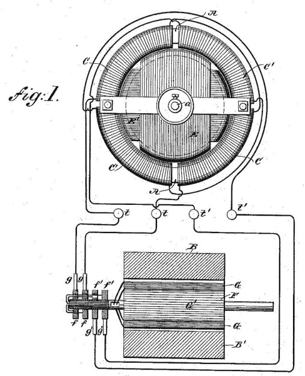

# 发明感应电动机

> 原文：<https://hackaday.com/2017/09/21/inventing-the-induction-motor/>

当你想到谁发明了[感应电机](https://en.wikipedia.org/wiki/Induction_motor)时，你应该会想到尼古拉·特斯拉和伽利略·法拉利。虽然这可能是一个吱吱响的轮子得到油脂的情况。正是这两个人在开发这些发动机的基础设施时争得不可开交。话说回来，特斯拉在发明基础设施背后的大部分技术方面发挥了巨大作用。

尽管他们声称是独立发明的，但没有什么东西是在真空中发明的，在他们之前有一个有趣的小人物和巨人的发展过程；令人惊讶的是，查尔斯·巴贝奇是这些巨人中的一员。所以，让我们从头开始，并按照我们的方式来特斯拉和法拉利。

## 阿拉戈旋转(1824-1831)

感应电机的发明始于 1824 年弗朗索瓦·阿拉戈发表的一系列非常简单的观察结果。他将一根磁罗盘指针水平悬挂在不同材料的圆环中间。然后，他将针旋转 45 度并松开。指针继续来回摆动，摆动的最大角度逐渐减小。阿拉戈数了数在角度减小到 10°之前的摆动次数。用一个木制的环，它需要摆动 145 次，用一个薄的铜环需要 66 次，而用一个结实的铜环只需要摆动 33 次。铜的存在在某种程度上抑制了指针的摆动。

Babbage-Herschel experiment and eddy currents

其他人紧随其后，在 1825 年，查尔斯·巴贝奇和查尔斯·赫歇尔演示了一个实验，他们在一个铜盘下旋转一个磁铁，并使这个盘轻快地旋转。他们还在圆盘上沿径向切开切口，观察到这减弱了效果。试图量化径向狭缝的影响，他们发现，如果他们给无狭缝磁盘的旋转力赋值 100，那么有一个狭缝的磁盘的值是 88，两个是 77，四个是 48，八个是 24。就像阿拉戈的指南针一样，磁性物体再次以某种方式与非铁磁性材料相互作用。

1831 年，法拉第做了自己的实验，并提出了我们今天仍在使用的这一效应的解释。由于磁体和铜盘之间的相对运动，在铜中感应出涡流。这些涡流以这样一种方式形成，从而产生了它们自己的磁场。两个磁场的相互作用会推或拉磁盘，使其随磁铁一起旋转，或者在磁铁不动的情况下减慢速度。

在 1824 年和 1831 年之间，以及随后的几年里，进行了更多的实验，然而，它们都涉及到旋转磁铁或铜盘。下一个重大进展是找到一种方法，在不旋转任何物理对象的情况下旋转磁场。

## Walter Baily (1879)

Baily’s 1879 induction motor and sequence

1879 年 6 月 28 日，沃尔特·贝利展示了他自己的阿拉戈旋转实验。在这篇文章中，他用四块电磁铁代替了永久磁铁。但是，为了产生旋转磁场，它们的磁极性被电交替，而不是旋转电磁体。由两节电池供电的手摇换向器控制流过电磁铁的电流。这种电池和换向器系统意味着流向电磁铁的电流不是正弦波，而是更接近方波，对平稳旋转来说不理想。

磁铁的循环如图所示。字母表示面向圆盘的磁极，O 表示电磁体关闭。箭头显示了从北到南的方向，也可以用铜盘代替，清楚地表明它将如何旋转。这很像现代步进电机的[驱动模式，但请记住，旋转磁场不是拉动永磁体，而是拉动感应涡流产生的磁场。](https://en.wikipedia.org/w/index.php?title=Stepper_motor#Half-stepping)

这让我们看到了现代感应电机和伽利略法拉利的曙光。

## 伽利略·法拉利(1885 年)

Galileo Ferraris motors

1885 年，[伽利略·费拉里斯](https://en.wikipedia.org/wiki/Galileo_Ferraris)演示了一台感应电机，其中也包括使用两对电磁铁来产生旋转磁场，尽管他是独立于贝利完成这项工作的。他的马达更像现代的马达，因为电磁铁包围着一个圆筒。然而，更重要的是，他提出通过提供两个相差 90 度的正弦波交流电来为它创造一个真正的旋转磁场。1888 年，他第一次公开展示了发动机。

此外，在 1888 年 3 月，他发表了通过交流电产生的电动旋转，其中他展示了产生 90°异相电流的方法。参见图 92。这可以通过向电磁体提供来自同一交流电源的支路来实现。一个分支将具有电阻但没有自感，而另一个分支将具有小电阻但高自感。然后这些将馈入线圈的绕组。然后他描述了他在 1885 年是如何成功地做了这些实验的。1889 年 4 月，尼古拉·特斯拉[描述了*分相*的相同方法](https://archive.org/stream/polyphaseelectri00thomuoft#page/98/mode/2up)，但仅用于启动同步电机(稍后将详细介绍同步电机)。

## 尼古拉·特斯拉(1882 或 1887 年)

US patent 382,279 Electro magnetic motor – Figure 1

说到尼古拉·特斯拉，他声称自己在 1882 年的一个下午在公园散步时想到了旋转磁场的想法。但直到 1887 年 11 月，他才申请了他的第一个感应电机专利，而该专利直到 1888 年 5 月才被授予。那是[美国专利 382，279，电磁马达](https://www.google.ca/patents/US382279?dq=382,279&hl=en&sa=X&ved=0ahUKEwj2ruf6ybHWAhWJw4MKHWGBDU0Q6AEIJjAA)。这里显示了该专利图 1。电动机在顶部，交流发电机在底部。

在意大利法拉利和塞尔维亚特斯拉的重叠日期中，存在着一个争议，这个争议一直持续到今天。法拉利在 1885 年制造并展示了他的汽车，但直到 1888 年才公开。而特斯拉在 1882 年就想到了这个想法，但直到 1887 年才申请专利。两人都声称独立提出了旋转磁场的想法，当许多实验者都在用同样的新技术研究类似的问题时，这并不罕见。

特斯拉的专利指出，转子的旋转速度比定子的磁场慢。虽然这不是一个新发现，但它是感应电机的一个有趣且必要的特征。举例来说，为了让磁铁的磁场在像铜这样的材料中感应出电流，它们之间必须有相对运动。如果磁场和铜转子以相同的速度旋转，则没有相对运动，转子将会减速。这种减速产生了一种相对运动，并产生了电流，使转子加速。基本上，当电机首次通电时，即首次施加旋转磁场时，转子开始旋转。它的速度增加，直到感应电流和扭矩与机械负载之间达到平衡。

施加到转子上的磁场速度与感应电流产生的磁场速度之比称为*转差率*。这种速度上的差异就是感应电机通常被称为异步电机的原因。一种速度相同或同步的电机被称为[同步电机](https://en.wikipedia.org/wiki/Synchronous_motor)。

特斯拉专利图 1 中电机的另一个有趣特征是，特斯拉在闭合回路中使用铜线圈，而不是在转子中使用铜板。你可以看到转子由两部分组成，相互成 90 度固定。这两个部件的主体是软铁，但每个都有一个线圈缠绕。这些线圈是简单的闭合回路，正是在这些线圈中感应出电流，并由此形成磁场。

## 结束我们自己的循环

虽然这是感应电机的发明，但这绝不是其发展的终结。我们可以讨论绕线式电机与鼠笼式电机、不同的启动方法、速度控制等等。这是电气时代的开端，电网如雨后春笋般遍布世界各地，感应电机只是众多新型电气设备中的一种。因此，我们将引导你阅读我们的[布莱恩·科克菲尔德]的文章[，揭开电网的神秘面纱](https://hackaday.com/2017/01/17/the-electrical-grid-demystified/)，或者也许你想读读[尼古拉·特斯拉与托马斯·爱迪生的碰撞](https://hackaday.com/2017/01/25/tesla-vs-edison/)，或者关于[爱迪生参与发明灯泡](https://hackaday.com/2017/03/20/how-many-inventors-does-it-take-to-invent-a-light-bulb/)。