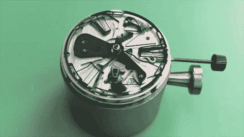
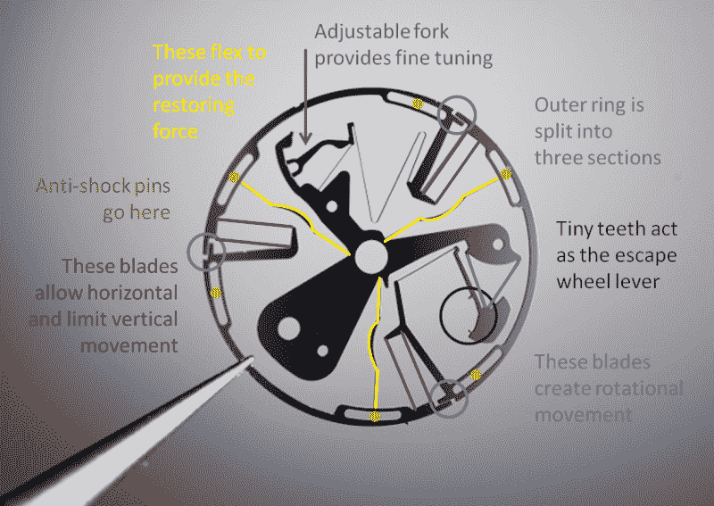

# Zenith 的新手表振荡器正在掀起波澜

> 原文：<https://hackaday.com/2017/10/09/zeniths-new-watch-oscillator-is-making-waves/>

瑞士制表商 Zenith 创造了自 1675 年游丝发明以来，被许多机械表狂热分子称为机械表精度的最大改进。[Caliber ZO 342 是一种新型的谐波振荡器，运行频率为 15 赫兹，几乎是大多数手表速度的四倍](https://www.hodinkee.com/articles/zenith-defy-lab-oscillator-introducing)。最酷的部分？它是使用深度反应离子蚀刻(DRIE)由硅制成的，它可以单独替换大约 30 个组件。

在解释 Zenith 的振荡器如何工作以及为什么这是如此令人兴奋的消息之前，重要的是要理解为什么游丝和摆轮在它们是最新的东西时是如此大的进步。这个系统是由荷兰数学家和科学家克里斯蒂安·惠更斯发明的。[惠更斯]之前发明了摆钟，被广泛认为是第一个精确的计时器。

Nice, simple, [public domain](https://commons.wikimedia.org/w/index.php?curid=13750) harmonic motion.

### 干扰力量

摆钟和它的便携式同类机械怀表都使用谐振子。这些依靠扰动力来开始振荡，依靠恢复力来保持振荡与平衡点成比例。

如果你的物理知识生疏了，回想一下课间休息吧。秋千悬挂在操场上，垂直且静止。这是它的平衡点。当你坐下来开始运动时，你提供了干扰力。当你到达弧线的顶点时，重力的恢复力开始起作用，你的挥杆通过平衡回到正弦周期的另一端。

GIF via [Magnus Bosse](https://www.youtube.com/watch?1=&v=RUs1gUUnBws)

钟摆以同样的方式工作。机械表中的游丝和摆轮也是如此，尽管这有点难以想象。

给机械表上发条会使主发条上紧，并储存驱动齿轮的能量。这种力量是通过游丝、转轮和擒纵机构之间的协同工作来实现的。

直到现在，机械表的机芯大部分都是由金属制成的。正因为如此，许多因素可能并且确实会影响它们的精度。磁力、温度，甚至一天中手表机芯的位置都会对精确度产生不利影响。

Zenith 用一片硅片取代了最敏感的元件，一举解决了所有这些问题。新振荡器是一个扁平的单件装置，取代了游丝、摆轮和擒纵杆。如果你算上所有的珠宝和零件，ZO 342 口径总共替换了大约 30 件。

### 干扰硅

那么，这个抽象的扁平封装振荡器是如何工作的呢？嗯，基本细节有点模糊。搜索会产生“拓扑振荡”和“硅晶片拓扑的构象振荡”等术语。在我们看来，这就像是硅泉公司的营销代言人。

在上图中，有两颗深蓝色的小牙齿。这些齿与擒纵轮啮合，提供干扰力。有三个用黄色突出显示的超薄硅刀片，充当弹簧并提供恢复力。

紫色突出显示的较短的一对叶片产生旋转运动来驱动齿轮。红色叶片将振荡器的三个波瓣连接在一起。这些叶片允许水平运动，同时限制垂直运动或振幅。

The most flamboyant of the Zenith Defy Lab limited series of watches that feature the Caliber ZO 342 oscillator. Image via [Hodinkee](https://www.hodinkee.com/articles/zenith-defy-lab-oscillator-introducing)

### 旗舰手表像宇宙飞船一样建造

几周前，ZO 342 机芯在名为 Zenith Defy Lab 的新款腕表中首次亮相。似乎一种新型振荡器还不够，Defy 实验室的外壳是由一种叫做 Aeronith 的新型复合材料制成的。近距离观察，Aeronith 有点像古老的银色沥青。这是因为它是由填充有轻质聚合物的开孔泡沫铝制成的。这个过程产生了一种比碳纤维更轻的材料。

令人惊讶的是，这款手表的起价仅为“区区”3 万美元。还不去掏钱包吗？无论如何，所有的十个都已经被预定了。休息之后，Zenith 为 Defy Lab 制作的钟表色情挑逗视频是免费的。

 [https://www.youtube.com/embed/Dv-NzmPJW3A?version=3&rel=1&showsearch=0&showinfo=1&iv_load_policy=1&fs=1&hl=en-US&autohide=2&wmode=transparent](https://www.youtube.com/embed/Dv-NzmPJW3A?version=3&rel=1&showsearch=0&showinfo=1&iv_load_policy=1&fs=1&hl=en-US&autohide=2&wmode=transparent)

通过 [Hodinkee](https://www.hodinkee.com/articles/zenith-defy-lab-oscillator-introducing) 的主图像

通过[r/工程色情](https://www.reddit.com/r/EngineeringPorn/comments/707u55/zenith_defy_lab_with_a_revolutionary_new/)