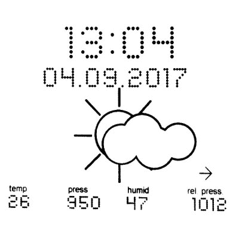

# 带有 E-Ink 显示器的 Arduino 气象站

> 原文：<https://hackaday.com/2017/09/27/an-arduino-weather-station-with-an-e-ink-display/>

对于我们北半球的读者来说，冬天的寒风正在迅速逼近，因此似乎应该以气象站项目为特色。享受你的夏天吧，南方的读者们！

【Fandonov】已经创建了[一个气象站项目](https://github.com/fandonov/weatherstation)，其核心是 Arduino Uno，面向世界的是 Waveshare 电子墨水显示器，正如[其文章](https://github.com/fandonov/weatherstation/blob/master/english_description.pdf) (PDF)所描述的，它提供了对这些显示器的一些古怪行为和天气预报算法的深入了解。

硬件遵循一个简单的公式，除了 Arduino 和显示器，它拥有一个 Adafruit 传感器板和一个硬件时钟。尽管从软件角度来说，有一些技巧可以给显示器提供一种其他修补者可能会发现有用的可缩放字体，将字符绘制为填充圆形图元的矩阵。

这篇文章介绍了仅基于本地读数而不是专业气象学家使用的大范围大量数据的预测。这里的[是 Zambretti 算法](https://web.archive.org/web/20110610213848/http://www.meteormetrics.com/zambretti.htm)，它获取读数和关于它们是上升还是下降的信息，并从查找表中返回预测。

我们都知道，即使是专业的天气预报也充满了不准确性，但这仍然是一个有趣的项目，非常值得再看一眼。与此同时，我们在过去报道了大量的气象站，有几个有趣的是这个[使用经典的 TI99/4A 家用电脑](https://hackaday.com/2017/04/30/ti-994a-weather-station/)，这里更相关的是，[这个使用电子纸徽章](https://hackaday.com/2014/01/08/from-epaper-badge-to-weather-station/)。

谢谢[菲尔]的提示！