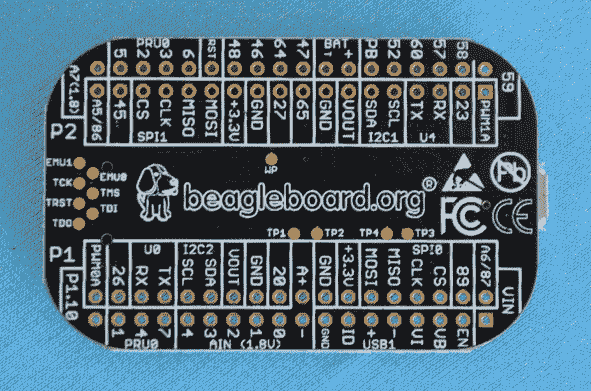
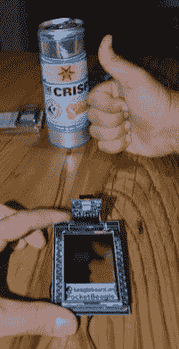
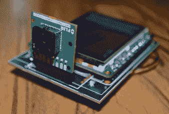
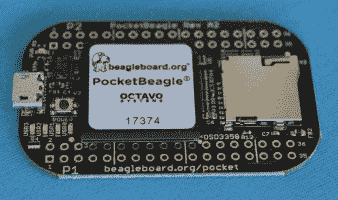
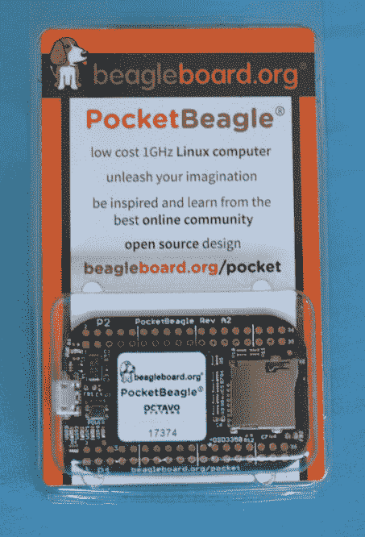
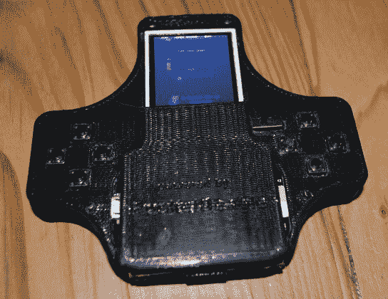
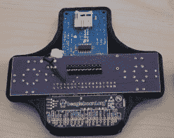
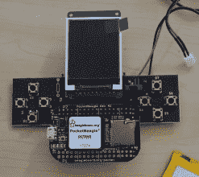

# 25 美元的袖珍猎犬

> 原文：<https://hackaday.com/2017/09/23/the-tiny-25-pocketbone/>

这是一两天前宣布的，但现在这只袖珍猎犬已经在本周末纽约的世界创客大会上首次真实亮相。这是一台非常非常小的 Linux 电脑，小到可以放在钥匙链上，或者放在 Altoids 迷你罐里。只要 25 美元，从 Mouser 和 Digikey 上的股票列表来看，还有很多可供选择。

PocketBeagle 的规格或多或少完全符合你对任何 BeagleBone 的期望。有一个运行在 1GHz 的 ARM Cortex-A8，512 MB 的内存和 SD 卡存储。I/O 是 8 路模拟输入、最多 44 个数字 GPIOs、最多 3 个 UARTs、2 条 I2C 总线、2 条 SPI 总线和 4 路 PWM 输出。所有这些都集成在 Octavo Systems 的 OSD3358 片上系统中。

这并不是我们第一次看到 Octavo Systems 的“片上小猎犬”——在发布之前，小猎犬负责人[Jason Kridner]在 Eagle 中制作了一个[pocket bone，随后不久[Michael Welling]的](https://oshpark.com/shared_projects/GWqtFu43)[在 KiCad](https://hackaday.com/2017/04/15/an-even-smaller-beaglebone/)中也做了类似的努力。PocketBeagle 已经存在几个月了，但现在它可以被不想处理焊接 BGA 封装的黑客所利用。

这个版本的 PocketBeagle 是你能得到的最接近开源的版本，[Eagle 和 KiCad](https://github.com/beagleboard/pocketbeagle/wiki) 中提供了设计文件。PocketBeagle 的一个有趣特性是默认启用哪些引脚、总线和外设。BeagleBone 的*杀手锏*一直是[PRUs——可编程实时单元](https://hackaday.com/2014/06/22/an-introduction-to-the-beaglebone-pru/)——支持大量的 led 阵列、CNC 机器的快速步进器和 DMA 愚蠢行为。PocketBeagle 上 pru 的引脚是默认设置的，不需要修改配置、模块或驱动程序。

当然，如果没有一些演示和例子，一个新的开发板一文不值。对于 Maker Faire，[Jason]带来了两个演示。第一个实际上是一个 PacMan 街机游戏——只是一个简单的 3D 打印外壳，一个屏幕和两个由轻触开关制成的 d-pad。它玩吃豆人，而且只玩吃豆人，但它足以证明 PocketBeagle 的 Linux 特性。

    Flir Demo  The deadbugged Flir demo        The PacMan machine    

[Jason]带来的另一个演示是一个简单的 FLIR 热图像传感器，连接到 SPI TFT。这是一个微型热成像传感器，具有足够好的分辨率和刷新率，刷新率很好，这没有什么不可思议的，但它是这种非常小、非常便宜的单板计算机的一个很好的演示。