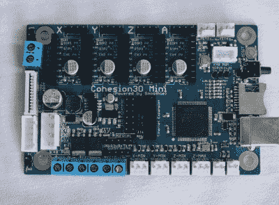
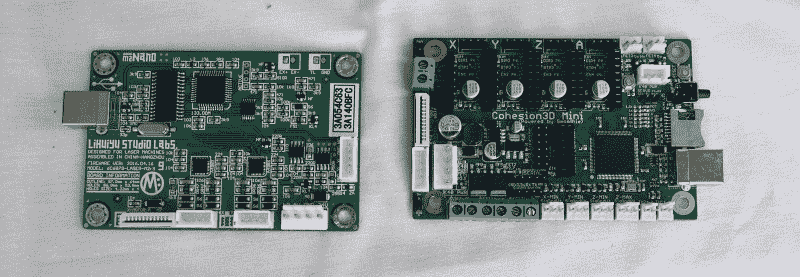

# 制造者集会上的激光冰沙

> 原文：<https://hackaday.com/2017/09/24/laser-smoothies-at-maker-faire/>

今年的创客大会上，激光切割机风靡一时。Dremel 宣布了一款 40W 的激光切割机，但要到明年这个时候才能购买，还没有价格，因此不值得进一步提及。Glowforge 全力以赴，但 Glowforge 最有趣的方面——位于激光器正下方的紧凑型过滤系统——尚未发现。看起来激光是下一个 3D 打印机。

当然，那些了解内情的人已经使用激光切割机很多年了，而且还有价格不到一千美元的台式二氧化碳激光切割机可供选择。当然，我说的是无处不在的 K40 激光器，你可以从易贝或全球速卖通买到这种机器，价格相当于一台普通的非品牌 3D 打印机。不过，K40 也有不好的一面:控制电子设备和软件是出了名的糟糕。不过，解决了这个问题，你就有了真正壮观的东西。

The Cohesion3D Mini

在今年的 Maker Faire 上，Cohesion3D 的 Ray Kholodovsky 展示了他的用于数控机床和激光切割机的 Smoothie 衍生控制板。值得注意的是[他的 K40 升级版](http://cohesion3d.com/cohesion3d-mini-laser-upgrade-bundle/)将易贝专用激光切割机变成了 32 位专业机器。这是在你的工作室开始发射激光的最便宜的方式。

我们在去年的展会上见到了[Ray],当时他正在演示他的用于 3D 打印机和 CNC 机器的思慕雪衍生板。这些都是微型的、成本相对较低的主板，使用的是[smooth view are](http://smoothieware.org/)，这是一个开源的 32 位 CNC 控制系统，具有极强的可扩展性和非常强大的功能。基本上，如果你正在建造一台普通的 DIY 3D 打印机，RAMPS 或 RAMBO 就可以了。如果你正在做一些*怪异*的东西，比如具有奇怪运动学的 3D 打印机、五轴铣床，或者你想要在激光切割机上进行令人敬畏的雕刻，思慕雪就是你要去的地方。

The stock board found in a K40 (left) and the Cohesion3D Mini (right). The Cohesion3D Mini is a drop-in replacement for the stock K40 board.

Cohesion3D 板是 K40 激光器控制板的直接替代产品。由于所有的 K40 激光切割机都是一样的，它们实际上只有一个电源和一个数控龙门，这是 K40 升级的一站式商店。可怕的电子产品不见了，你不必使用 Corel，花一百美元，你就有了类似专业激光切割机的东西。

K40 激光已经存在好几年了，但直到最近才有一些非常有趣的黑客和 mods 出现，将这种蓝光特殊激光切割机推向半专业领域，供愿意弄脏自己手的人使用。几个月前，[斯科奇]发布了[K40 whisper](https://hackaday.com/2017/07/19/take-control-of-your-cheap-laser-cutter/)，这是一款让股票电子产品变得可以忍受并能够接受正常 SVG 和 DXF 的软件。K40 也被改装[为更大的床](https://hackaday.com/2017/04/24/laser-surgery-expanding-the-bed-of-a-cheap-chinese-laser-cutter/)，而 [LaserWeb](https://hackaday.com/2016/07/17/open-source-laser-cutter-software-gets-major-update-new-features/) 已经处理软件方面的事情大约两年了。K40 黑客场景看起来很棒，Hackaday 已经有了一个“我刚买了一个 K40，现在怎么办？”正在制作中的系列。廉价激光切割机的情况正在好转，而思慕雪升级版就是最好的选择。