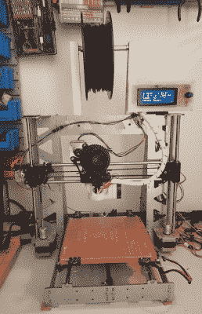
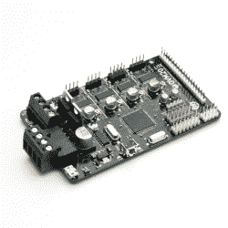
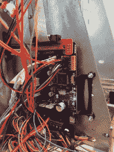
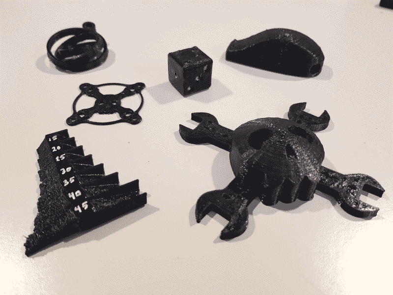

# 翻新旧的 P3Steel

> 原文：<https://hackaday.com/2017/10/04/refurbishing-an-old-p3steel/>

在伦敦会议的余波中，在酒吧里喝着啤酒建立关系网之后，我遇到了哈维尔·瓦雷拉，他是我们在场的众多读者之一。原来我的伊比利亚朋友同事参与了一些有趣的硬件项目，其中之一是 OVM20 Lite 板。我正在寻找一个借口，与我的老普鲁萨鬼混，这是一个完美的借口。P3Steel 3D 打印机刚刚在我的地下室落满灰尘，过去它打印得很好。直到有一天…

基于 Arduino Mega 2560 的 RAMPS 1.4，这在几年前是一个非常标准和便宜的选择(现在仍然是)。我对标准选项的额外修改或升级是一个 LCD 屏幕和 DRV8825 步进驱动器。

事情是这样的，有一天天气很好，照片开始变歪了。不管我怎么努力，它还是歪了。我检查了驱动器的电位计，我回到电机规格，我交换了驱动器，我甚至刷新了另一个固件。如果印刷字体足够大，就会变得一团糟。有时甚至小印刷也失败了。当你花几个小时调试这样的东西时，有一个时间点你开始怀疑一切。是驱动程序过热了吗？如果是这样，为什么以前从未发生过这种情况？可能是电源波动，快寿终正寝了？电路板上的电容器坏了吗？是 RAMPS 的错还是 Arduino 的错？一个马达开始失灵？机械问题？我有一个微调的马林固件，我手动调整和轻微改变，闪烁后我没有备份。回想起来，我实际上检查了很多与当时的问题无关的东西，但我也学到了很多。

与此同时，生活发生了变化，就像有时发生的那样，我没有足够的时间让它重新运转起来。它几乎被遗忘了，被放在一个“我以后再修理”的架子上。顺便说一下，我有很多这样的例子，而且这种趋势似乎只在一个方向上增长。但是我总是想把打印机修好，主要是因为有时候当我在修修补补的时候，我会说“我只要把这一张打印出来，它就会看起来棒极了…哦，等等…”。或者当家里有什么东西坏了，我妻子会说“你就不能把那个蜂蜜打印出来吗？”，我回答说“我可以，但是…”。只是很悲伤。

我见到了 Javier Varela 并了解了 [OVM20 Lite 板](https://hackaday.io/project/27565-ovm20-lite)。这是一款由优质组件制成的多功能 Arduino Mega + RAMPS 1.4，100%兼容 Marlin。它更光滑，因为所有组件都在一个四层板中，并且已经集成了 DRV8825 驱动程序。明显的缺点是，如果一个驱动程序烧坏了，它不容易被取代。规格几乎是我家里有的，我认为这值得一试，只需更换我的旧 Prusa 上的电子设备，然后尝试一下。毕竟，它实际上可以解决我的打印问题，而且不会花很多时间。

我订购了一个，发行价是 39 欧元，包括 4 个驱动器耗散器，我觉得很公平。OVM20 Lite 板感觉类似于斜坡，更换过程非常简单。我只是小心地从我的斜坡上断开一组电缆，并连接到 OVM20。总的来说，我估计大约花了 15 分钟。

下一步，驱动器电压校准。驱动电位计不是过于敏感，所以它们比我的那些更容易校准。我的首选方法是将万用表接地，并使用鳄鱼夹将我的钢螺丝刀连接到正极，同时转动电位计。我注意到的一件事是，当床加热和休息时，电压是不同的。我在旧板上和新板上都有这个。也许一些读者可以分享为什么会发生这种情况，以及如何进行校准，床加热是开还是关？

该板预装了 Marlin v1.1.1 固件，我认为没有必要更改它。我有一台旧笔记本电脑，我想把它专门用于 3D 打印机，所以我把它清除了，安装了 Linux Mint 和 Repetier。我以前用 Slic3r 和 Printrun 打印，但由于我在更换硬件，我也决定更换软件，看看会发生什么。我以前从未用过 Repetier，但适应起来并不难。我只是决定尝试一下，不配置任何只是为了好玩的东西。很明显，认为它只会打印任何有意义的东西是一厢情愿的想法。它没有。我的细丝是 3 毫米，默认是 1.75 毫米，所以我最后得到了一个黑色的塑料斑点。我能期待什么？对我来说，这只是一个懒惰的，几乎是自杀的举动。我改变了灯丝的厚度，再试一次。

它还活着！

使用几乎所有默认设置打印了一个小的 2×2 六面模具，结果相当不错。喷嘴是 0.4 毫米，我正在打印 0.2 毫米的层，使用 PLA 丝在 205 摄氏度和加热床在 65 摄氏度，冷却。填充率约为 20%，我觉得这个比例有点低，有时会弄乱顶层，就像你在 HaD 标志上看到的那样。这真的离完美很远，我终于可以再次开始我的调整过程，但它是打印，它不再歪斜。另一方面，我的一些 PLA 细丝是完全易碎的和不可用的。它们没有被妥善保存。当我试图把它们放入进给器时，一些是好的，而另一些坏了。我认为他们失去了太多的湿度，因此他们很容易打破，但我可能是错误的。给它们重新保湿会很酷，但我不知道这是否可能。

我画了一个支撑板的草图，你可以在这里找到。我打印的第一个版本让板子挂得有点低，第二个版本，也就是网上的，高了 1 厘米。对于我的 LCD 的 USB 连接器和电缆来说稍微好一点。然后，我又印了一些东西。我已经很久没有这样做了，我的旧 3D 打印机回来了，这是非常值得的！

以下是我写这篇文章时打印的一些材料:

左下角的突出部分是颠倒的，以显示仍然需要的校准。乔利扳手的扳手清楚地表明，20%的填充是不够的。第一个芯片在那里，旁边是一个 40 毫米的风扇保护器。右上角是一个哨子，看起来不错，但不是很好用。

它远非完美，我肯定需要调整得更好，但是，嘿，这是一个开始！你呢？你有一台需要细心呵护的旧 3D 打印机吗？