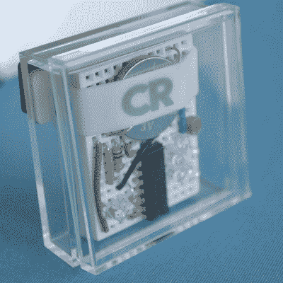
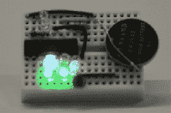
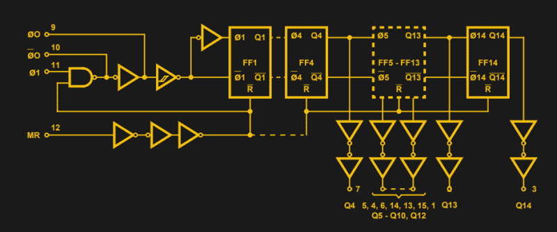
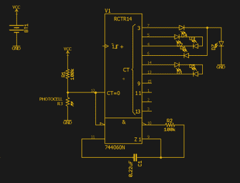
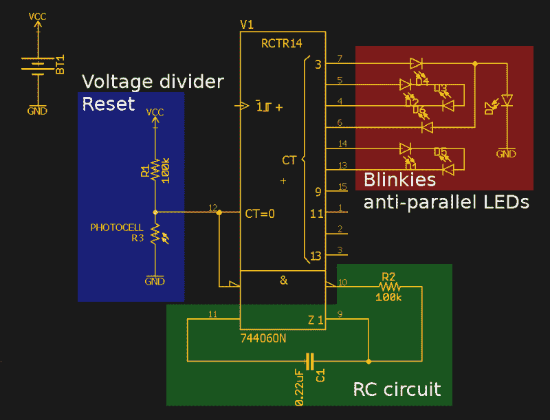

# 使用试验板徽章进行电子教学

> 原文：<https://hackaday.com/2017/10/03/teaching-electronics-with-a-breadboard-badge/>

在过去的一年中，用于会议的自制电子徽章的生产出现了爆炸式增长。这就是 badge life——定制硬件的创造，制造业的试炼，以及电子会议徽章上堆积如山的闪亮 led。这是硬件的演示场景，所有酷孩子都在参与其中。

在今年纽约的世界创客大会上，消费者报告的人颁发了一个全新的徽章。这个徽章远远超出了简单的赃物，如果你真的好好看看它，你会看到在面包板和电线渲染的魔力。

《消费者报告》的试验板徽章很简单，显然是为了向孩子们介绍电子世界而设计的，比如老式的收音机小屋、“100 合 1 电子项目”工具包。与我们见过的大多数“初学者徽章”不同，这不是一个只将几个 led 和一个电池座焊接到 PCB 上的徽章。这是一个试验板徽章。这是用 74 系逻辑黑客。这是《消费者报告》给出的一项令人印象深刻的工程。没人预见到这一天的到来。我不认为 Maker Faire 的任何人意识到现在有一种可行的方法来创建试验板徽章。

 《消费者报告》摊位上赠送的徽章，表面上看，极其简单。这个外壳是一个 2 英寸见方的聚碳酸酯小盒子，带有磁性背衬，佩戴者可以把它贴在翻领上。徽章的其余部分只是一个小的无焊试验板，一个 74HC4060 芯片，七个 led，两个电阻，一个电容和一个光敏电阻，以及一个 CR2032 电池。如果你正确地组装徽章——是的，有指导和教师帮助孩子们——你会得到一个闪闪发光的徽章。把试验板放在围栏里，你就可以在集市上戴着你的手工艺品了。

尽管这在上周末的 Maker Faire 上相对没有引起注意，但这是近年来最具创新性的可穿戴电子产品之一。它不仅有黑桃 blinky，这也是一个徽章，可以用来教授电子学的基础知识。施密特触发器？这个徽章上有。RC 振荡器？就在那里，伙计。想了解电子经济学吗？这是一个如何用最少的 BOM 构建一个伟大徽章的工作示例。

### 简单的电路分析

The Consumer Reports Breadboard badge in action

虽然这条线路看起来很复杂，有很多复杂的电线和闪光灯，但事实并非如此。这个试验板徽章是围绕一个单一的 74 系列逻辑芯片，即 *74HC4060 带振荡器的 14 级二进制计数器构建的。*该芯片的输出只是一个二进制计数器。将几个发光二极管连接到这个芯片的输出端，你就有了一个以二进制计数的电路。你可以通过自由运行一个 CPU 来提升你的街头信誉，但这超出了这个徽章的范围。这个二进制计数器芯片的输入只是一个时钟输入和一个主复位引脚。当主机复位为低电平时，二进制计数器在时钟输入的下降沿上升。当主机复位为高电平时，所有输出均为低电平。

Logic Block Diagram for the 4060 Binary Counter. Source: TI datasheet

A schematic of the Consumer Reports breadboard badge

根据上面的描述，这是一个容易布线的电路。二进制计数器上的许多位给你带来了美丽的闪光，但仍有一个悬而未决的问题:是什么产生了时钟？74HC4060 不仅仅是一个计数器；这是一个带振荡器的计数器。4060 上还有两个输出将驱动 RC 电路。4060 可以使用单个电容和电阻来驱动时钟，而不是晶体，因为晶体只会增加套件的成本。这就是降低成本和真正的工程。给主复位引脚添加一个微小的光传感器，你就有了一个关闭电路的便捷方法——你需要做的只是盖上光传感器。

通过对原理图的合理重建，我们可以了解这个徽章实际上是如何工作的，以及为什么这是我见过的最具教育意义的电子徽章。以复位电路为例。这只是一个光敏电阻和一个 100kω电阻连接成一个分压器，其输出直接进入主复位引脚。因为主复位为高电平有效，所以需要用光电池将此引脚连接到 VCC。没问题，[让我们来学习分压器是如何工作的](https://learn.sparkfun.com/tutorials/voltage-dividers)。除非您阅读芯片的数据手册，否则这个徽章中的 RC 电路会有点迟钝，但基本思想只是一个串联的电容和电阻。您想了解逻辑系列以及如何吸电流和源电流吗？这很好，因为这个徽章是作为反平行发光二极管运行的。由于这是一个二进制计数器，任何一对引脚都会同时有一个低电平引脚和一个高电平引脚。将一些发光二极管反平行连接到这些引脚上，你就有了一对显示有趣图案的闪光灯。

The annotated Consumer Reports blinky badge

从教育学的角度来看，这个徽章是*惊人的* 。把这个给一个 10 岁的孩子，在说明中包括一些关于这个电路如何工作的描述，最终，你会发现一个 11 岁的孩子对电子学的理解比一个大二学生对电路 I 的理解更好。用这个徽章教电子学的缺点是你需要一个老师。Maker Faire 上的消费者报告展台在这方面非常失败——基本上只有一排人在收集徽章，展台上只有几张会议桌。很遗憾，但是还有改进的空间。

### 会议徽章的巨变

一般来说，有两种类型的会议徽章。第一个非常简单，实际上只不过是几个发光二极管和一块电池。官方的 [Maker Faire 学习焊接技能徽章](https://www.makershed.com/products/learn-to-solder-skill-badge-kit)就属于这一类，我为 DEF CON、Maker Faire、开放硬件峰会以及我们今年参加的任何其他会议设计的 [Tindie I Can Solder 徽章](https://hackaday.io/project/26056-tindie-blinky-led-badge-v1)也是如此。这些是简单的，自己动手做的徽章。这些徽章没什么大不了的，因为你把它们给了那些可能一开始就不会焊接的人。

第二类电子会议徽章没有限制。在这里，我说的是[和！XOR 的 Bender 徽章](https://hackaday.io/project/19121-andxor-dc25-badge/log/66783-dc25-badge-post-mortem)、 [SHACamp 2017 徽章](https://hackaday.com/2017/08/14/hands-on-with-the-shacamp-2017-badge/)、软件定义的无线电徽章以及可佩戴的 CNC 机器。这些徽章是预先组装好的，这是有原因的:没有人会在会议期间真正完成构建。当然，也有例外，比如 DC 暗网和今年 SHACamp 徽章的 [perfboard 版本，但这些都是例外，而不是规律。](https://hackaday.com/2017/08/19/make-a-badge-when-there-is-no-badge-yet/)

这个试验板徽章是辉煌的，因为它适合在中间。大多数设计师在设计一个令人讨厌的闪闪发光的徽章时，会首先依靠微控制器，或者，如果你是我，采取无技术的方法，在 Tindie 徽章中扔一些“闪光 RGB led[”。《消费者报告》徽章是用逻辑芯片制作的，用最少的电路获得最大的效果。它的*如此*简单，*如此*好，你不能不为之折服。](https://hackaday.io/project/26056-tindie-blinky-led-badge)