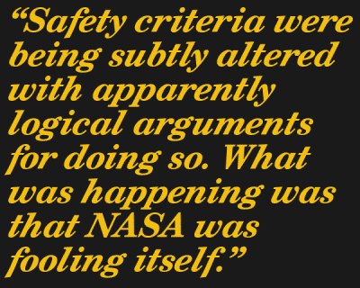

# 你应该读的书:费曼的挑战者灾难报告附录

> 原文：<https://hackaday.com/2017/10/02/books-you-should-read-feynmans-appendix-to-the-challenger-disaster-report/>

这并不是一本书，但是理查德·费曼的《挑战者号灾难报告 附录 *[仍然是你应该读的。它不是特别长，但它是有教育意义和相关的，不仅仅是作为批判性思维的一个例子，而是作为一个提醒不要愚弄自己；无论是个人还是组织层面。可悲的是，虽然从导致和围绕挑战者号灾难的事件中学到了很多，但三十年后，我们许多人仍然可以在自己的职业生活中找到许多相同的东西。不存在单一的神奇解决方案，因为这些问题很微妙，而且经常伪装成正常现象。](https://science.ksc.nasa.gov/shuttle/missions/51-l/docs/rogers-commission/Appendix-F.txt)*

## 费曼和挑战者号灾难

理查德·费曼(1918-1988)是诺贝尔奖获得者，也是他那个时代最著名的科学家之一。1986 年，他勉强同意加入罗杰斯委员会，该委员会的任务是调查挑战者号灾难。挑战者号航天飞机在发射一分多钟后爆炸，机上所有人遇难。该委员会的工作是找出哪里出了问题，是如何发生的，以及如何防止它再次发生。

费曼当时接受了与癌症相关的手术，他最初不愿意加入委员会，原因很简单:他不想去华盛顿附近的任何地方，也不想与政府有任何关系。至于航天飞机本身，他会读到关于它上升和下降的报道，但让他有点困扰的是，他从未在任何科学杂志上看到任何在航天飞机上进行的实验的结果，因此他没有太注意它。最终，他加入了委员会，并在这个过程中改变了自己。航天飞机及其相关系统是当时(有时甚至超越)技术极限的工程壮举。他没有充分意识到在航天飞机上工作的大量人员，以及他们奉献努力的巨大规模。他开始意识到这场事故是一个多么可怕的打击，并下定决心尽自己所能提供帮助。

结果表明，灾难的原因是固体火箭助推器的一个部件上的 O 型圈发生了故障，但这只是灾难的近因。真正的问题是 NASA 管理层降低标准和接受越来越多的错误的文化，正如费曼所说，“工程师们从下面尖叫着*救命！*和*这是红色警报！*“这表明管理层和工作工程师之间几乎难以置信地缺乏沟通，这本身就是一个线索，表明在组织层面上到底出了什么问题。

## 这到底是怎么回事？

这种情况不是一下子发生的；它随着时间的推移而增长。NASA 充满了富有献身精神的人，但在组织层面上，当涉及到飞行准备的认证时，它已经形成了一种逐渐降低严格性的文化。接受飞行风险的一个常见论点是，同样的风险以前飞行过，没有失败，这一事实被接受为再次接受它的安全性的一个论点。结果，明显的弱点和问题被反复接受。这不仅限于导致挑战者号灾难性失败的固体火箭助推器上的 O 型圈。向更低标准的缓慢转变在其他领域也是屡见不鲜；安全标准被微妙地改变了，这显然是合乎逻辑的。发生的事情是美国国家航空航天局在愚弄自己。

## 愚弄自己在今天仍然发生

我们从挑战者号灾难和类似的案例中学到了很多东西，但是 30 多年后，人们和组织仍然在同样的基本问题上挣扎，并以糟糕的决策环境告终。没有简单的解决办法，但至少有可能更多地了解应该注意什么。并不总是有某个特定的损坏部分需要责备或更换，也不总是有某个人特别有错。出错的事情可能是微妙的和众多的，它创造的环境可能看起来实际上是正常的。

费曼经常断言，你永远不要愚弄自己。一旦你成功地不欺骗自己，就更容易不欺骗别人。费曼观察了 NASA 愚弄自己的几种方式，其中一个共同点是缺乏沟通。

例如，管理层自信地估计航天飞机故障的概率为十万分之一，而工程部门估计接近百分之一或两百分之一，并且热切地为每一次飞行祈祷。

费曼在委员会的经历让他努力思考这种情况是如何发生的。他突然意识到，美国国家航空航天局的“大奶酪”有一点鱼腥味。每次委员会与更高级别的经理谈话时，他们总是说他们对下面的问题一无所知。假设上级没有说谎，那么一定有什么原因导致下级的问题没有补偿他们。费曼怀疑这归结于糟糕的沟通，因为管理和工程从根本上有不同的优先事项和目标。当底层的工程师说“不，不！我们不能这样做，除非这个，因为这意味着某某！”高层不想听到这样的谈话，很快态度开始改变，你得到一个抑制坏消息的环境。费曼在*[中描述了这个过程，你在乎别人怎么想？](https://en.wikipedia.org/wiki/What_Do_You_Care_What_Other_People_Think%3F)*:

> 也许他们不会明确地说“不要告诉我”，但他们不鼓励交流，这是一回事。这不是写下了什么，或者谁应该告诉谁什么的问题；这是一个问题，当你*告诉某人某个问题时，他们是否*乐于*听到这个问题，他们会说“告诉我更多”，以及“你试过某某吗？”或者他们是否会说“好吧，看看你能做些什么”——这是一种完全不同的氛围。如果你试图沟通一两次却被拒绝，很快你就会决定“让它见鬼去吧”*

这就是费曼的理论:由于高层做出的承诺与底层的现实不一致，沟通变得缓慢并最终被堵塞；这就是为什么美国宇航局的高层实际上可能不知道他们下面的问题。我不禁想起了所有的现代情况，技术人员被留下来思考如何兑现销售或高管做出的不切实际的承诺，以某种方式度过混乱，但下一周又不得不重新做一遍，我想知道费曼是否在金钱上是正确的。

有两件事是肯定的:人们和组织今天仍然以类似的方式愚弄自己，缺乏沟通始终是一个因素。但愚弄别人总是从愚弄自己开始，当谈到这一点时，费曼有明确的建议:“第一个原则是你不能愚弄自己——而你是最容易被愚弄的人。在你没有愚弄自己之后，就很容易不去愚弄别人。在那之后，你只需要以传统的方式诚实。”

*注:有本妥妥的书和这篇文章有关。"[你在乎别人怎么想吗？理查德·费曼的《T2》的后半部分讲述了费曼在罗杰斯委员会工作的经历。](https://en.wikipedia.org/wiki/What_Do_You_Care_What_Other_People_Think%3F)*