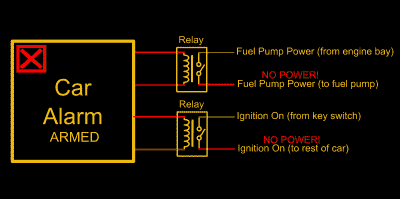
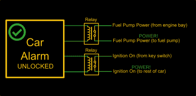
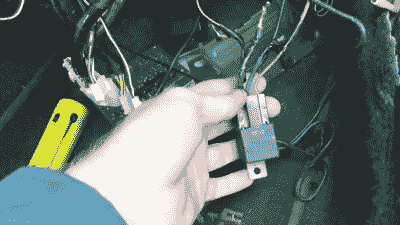
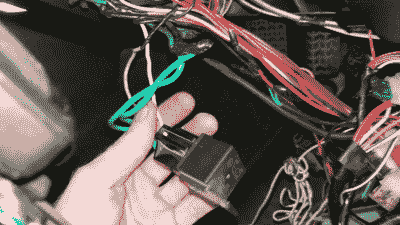
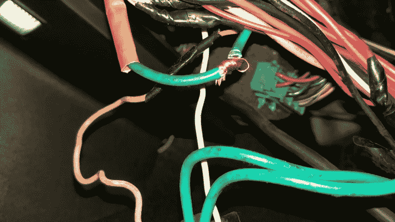

# 售后汽车报警器的克星

> 原文：<https://hackaday.com/2017/10/10/the-bane-of-aftermarket-car-alarms/>

大约在 1913 年，一个不知名的丹佛囚犯首次发明了这种不起眼的汽车报警器，它的历史几乎和汽车本身一样长。对于注重安全的驾车者来说，它们很有意义。汽车报警器的噪音会引起注意，这是潜在小偷最不希望看到的事情，内置的防盗装置通常会阻止汽车移动，而没有耗时的解决方法。两者都是对盗窃的巨大威慑。

亲爱的读者，你可能会惊讶地发现，我认为售后汽车报警器是现代汽车上最令人发指的装置之一。结合设计不良、制造廉价、仅由最没有天赋或漠不关心的人装配来使用烙铁这三个邪恶的缺点，它们是我本人拒绝接受的一个祸害。

正是我自己的马自达遭遇了汽车报警系统。购买汽车两天后，密钥卡失效，因此汽车无法启动。由于阀门弯曲，我的另一辆车已经无法使用了，我需要去工作，所以我认为作为一个有能力的黑客，我可以很快让它瘫痪。

在短期内，我能够找到一些新的密钥卡，让系统恢复运行，但在那一刻，我知道我希望它永远消失。幸运的是，这对于普通黑客来说很容易实现。这个指南并不是为了帮助潜在的小偷——所描述的方法需要时间和耐心，而不是让你的车在 60 秒内消失。我主要是为成千上万初露头角的汽车爱好者写这篇文章，他们买了自己梦想中的二手车，却发现自己漂亮的库存线路被好心的傻瓜们砍成了碎片。

### 继电器联锁的故事

绝大多数的汽车报警器和防盗器都以一种非常简单的方式阻止发动机启动。有各种各样的电线，一旦切断，就会使汽车无法行驶。比如你把跑燃油泵的电线剪断，发动机就得不到燃油，不能运转。切断从点火开关到汽车电气系统其余部分的电线，整个汽车就会断电。

Diagrams indicating typical alarm operation in both the armed and unlocked states. Credit: Lewin Day

安装汽车报警器时，这些重要的电线被切断。每一端都连接到一个继电器，由汽车报警器控制。当汽车报警器检测到正确的遥控钥匙或其他信号时，它会关闭继电器并允许汽车启动。如果汽车报警器检测到有人试图启动汽车，而没有首先解除系统，它将打开继电器，不再允许电流流动。以我的车为例，继电器连接到点火开关和燃油泵继电器，整辆车就完全没电了，除了现在闪烁的警报。哦，通常警笛会响，你的邻居会讨厌你。

那么，我们如何着手解除汽车警报呢？在大多数情况下，这很简单，只需识别被切断的电线，拆除继电器，然后将切断的电线重新拼接在一起。这在理论上听起来很容易，但大多数安装的劣质本质和由此产生的绝对电线面条会使它变得非常困难。预计会遇到用胶带缠绕在一起的裸线、完全不绝缘的焊点，或者令人畏惧的 Scotchlok (TM)连接器。

This relay was used to cut power to the fuel pump. The green wires were spliced inline with the fuel pump’s 12 V line. The red and yellow wires are the relay’s coil wires, controlled by the car alarm. Credit: Lewin Day

### RTFM(如果可以)——然后夹住电线

我从谷歌搜索开始我的工作。您的结果会有所不同，因为销售售后报警的“安全”公司可能不希望系统的细节容易被发现。我很幸运，找到了同一家公司生产的类似报警器的手册，手册上说报警器会从点火开关的 ON 位置切断燃油泵电源和 12V 线。经过一番挖掘，我找到了这两个继电器。为了安全起见，我拔掉了电池，开始工作。

切断燃油泵的继电器被埋在司机的侧踢板中，在地毯下形成了一个难看的肿块。继电器有两根粗大的绿色导线，连接到为燃油泵供电的蓝色电线上。我冒昧地切断了继电器，并把蓝线的两端扭在一起。

This nasty fella was tucked up under the steering column, spliced into the circuit coming from the ignition switch in the ON position. Credit: Lewin Day

接下来，我抓住了埋在转向柱下的第二个继电器。连接到点火开关的电线上，当被警报触发时，它完全关闭汽车的电子设备。我又一次切断了继电器，将原来的电线重新缠绕在一起。在测试我的作品之前，我小心翼翼地确保裸线没有短路。

钥匙快速一转，汽车就发动了！我成功地移除了汽车报警器的防盗装置。剩下要做的就是把电线焊接起来。

我再也不用担心我的车会因为失败的钥匙链或过于敏感的警报而报废。我决定暂时保留报警器的其余部分，没有直接放入垃圾箱的控制盒。接下来的几周，我将慢慢剥离其余的警报硬件，这些硬件与倾斜传感器、制动开关和门锁相连接。

The wires were twisted back together for testing, before being soldered in a linesman splice and covered with heatshrink. Credit: Lewin Day

处理这项工作让我的车重新上路，知道我的车不再受一个喜怒无常的电子垃圾的摆布真是太好了。查看下面的视频，了解我自己解除警报的更多细节。当然，我们也很乐意在评论中听到你的汽车电气噩梦的故事！黑客快乐。

 [https://www.youtube.com/embed/oT73cAB9soU?version=3&rel=1&showsearch=0&showinfo=1&iv_load_policy=1&fs=1&hl=en-US&autohide=2&wmode=transparent](https://www.youtube.com/embed/oT73cAB9soU?version=3&rel=1&showsearch=0&showinfo=1&iv_load_policy=1&fs=1&hl=en-US&autohide=2&wmode=transparent)

